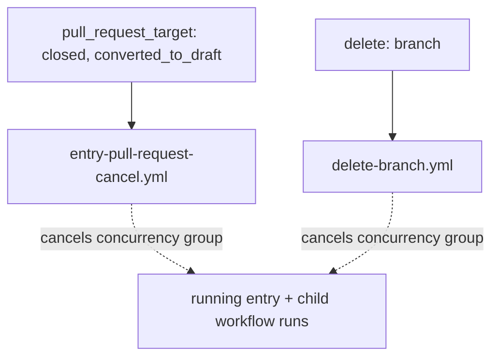
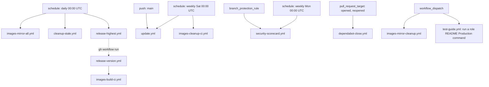

# Workflow Dependency Map

How the workflows under `.github/workflows/` trigger and call each other.
Solid arrows: `workflow_call` (`uses:`) or job `needs`. Dotted arrows:
indirect coupling (CLI dispatch, shared concurrency group). Per-workflow
inputs and descriptions: [workflows.md](../../docs/contributing/tools/github/actions/workflows.md).

## CI pipeline

```mermaid
flowchart TB
    push["push: main, feature/**, hotfix/**, fix/**"] --> epl["entry-push-latest.yml"]
    pr["pull_request: opened, synchronize, reopened, ready_for_review"] --> eprc["entry-pull-request-change.yml"]
    dispatch["workflow_dispatch"] --> eman["entry-manual.yml"]

    epl --> orch["ci-orchestrator.yml"]
    epl -->|"version tag on main"| relv["release-version.yml"]
    eprc --> orch
    eprc -->|"fork PRs: privileged prebuild"| imgbuild["images-build-ci.yml"]
    eprc -->|"fork PRs: privileged prebuild"| imgmirror["images-mirror-missing.yml"]
    eman --> orch

    subgraph orchestrator["ci-orchestrator.yml jobs"]
        plan["plan: run-summary table"]
        waitfork["wait-fork-prereq-run"] --> forkready["fork-prereqs-ready"]

        lintwf["lint.yml: make lint + hadolint"] --> qualitygate["code-quality-gate"]
        testwf["test.yml: make test"] --> qualitygate
        codeql["security-codeql.yml"] --> qualitygate

        qualitygate --> buildci["build-ci-images: images-build-ci.yml"]
        buildci --> dns["test-dns.yml"]
        mirror["images-mirror-missing.yml"]

        dns --> snprio["test-deploy-single-node-priority"]
        mirror --> snprio
        buildci --> swarmprio["test-deploy-swarm-priority"]
        mirror --> swarmprio

        snprio -->|"all priority jobs green"| snreg["test-deploy-single-node"]
        swarmprio -->|"all priority jobs green"| snreg
        snprio -->|"all priority jobs green"| swarmreg["test-deploy-swarm"]
        swarmprio -->|"all priority jobs green"| swarmreg
        dns --> snreg
        mirror --> snreg
        buildci --> swarmreg
        mirror --> swarmreg

        swarmreg --> smoke["test-runner-smoke.yml"]

        qualitygate --> instmake["test-install-make.yml"]
        qualitygate --> instpkgmgr["test-install-pkgmgr.yml"]
        instmake --> instgate["test-install-gate"]
        instpkgmgr --> instgate

        qualitygate --> devenv["test-development: test-environment.yml"]
        mirror --> devenv

        buildci --> testguide["test-guide.yml"]
        mirror --> testguide

        snprio --> donegate["done"]
        swarmprio --> donegate
        snreg --> donegate
        swarmreg --> donegate
        smoke --> donegate
        instgate --> donegate
        devenv --> donegate
        testguide --> donegate
    end

    snprio --> singlenode["test-deploy-single-node.yml"]
    snreg --> singlenode
    singlenode --> deploycompose["test-deploy-compose.yml"]
    singlenode --> deployhost["test-deploy-host.yml"]
    swarmprio --> deployswarm["test-deploy-swarm.yml"]
    swarmreg --> deployswarm
```

`test-deploy-single-node-priority` and `test-deploy-swarm-priority` run only
when the orchestrator's `priority` input is set; with it empty they are
skipped and the regular deploy jobs start directly. The regular jobs receive
the priority ids as `blacklist`, so each role deploys in exactly one line.

## Cancellation

## Scheduled and standalone

Also manually dispatchable: `images-mirror-all.yml`, `images-cleanup-ci.yml`,
`cleanup-stale.yml`, `update.yml`, `release-highest.yml`, `release-version.yml`,
`lint.yml`, `test.yml`, `test-deploy-swarm.yml`, `test-dns.yml`,
`test-environment.yml`, `test-runner-smoke.yml`.
