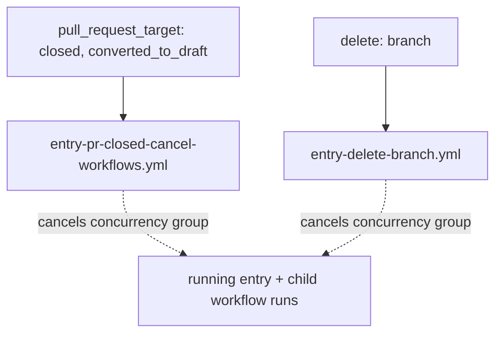
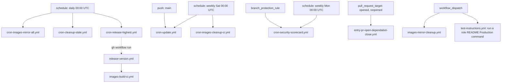

# Workflow Dependency Map

How the workflows under `.github/workflows/` trigger and call each other.
Solid arrows: `workflow_call` (`uses:`) or job `needs`. Dotted arrows:
indirect coupling (CLI dispatch, shared concurrency group). Per-workflow
inputs and descriptions: [workflows.md](../../docs/contributing/tools/github/actions/workflows.md).

## CI pipeline

```mermaid
flowchart TB
    push["push: main, feature/**, hotfix/**, fix/**"] --> epl["entry-push-latest.yml"]
    pr["pull_request: opened, synchronize, reopened, ready_for_review"] --> eprc["entry-pr-change-orchestrate.yml"]
    dispatch["workflow_dispatch"] --> eman["entry-manual-steer.yml"]

    epl --> orch["ci-orchestrator.yml"]
    epl -->|"version tag on main"| relv["release-version.yml"]
    eprc --> orch
    eprc -->|"fork PRs: privileged prebuild"| imgbuild["images-build-ci.yml"]
    eprc -->|"fork PRs: privileged prebuild"| imgmirror["images-mirror-missing.yml"]
    eman --> orch

    subgraph orchestrator["ci-orchestrator.yml jobs"]
        waitfork["wait-fork-prereq-run"] --> forkready["fork-prereqs-ready"]

        lintwf["lint.yml: make lint + hadolint"]
        testwf["test.yml: make test"]
        codeql["cron-security-codeql.yml"]
        buildci["build-ci-images: images-build-ci.yml"] --> dns["test-dns.yml"]
        mirror["images-mirror-missing.yml"]
        seq["sequencing: serial or parallel, per line"]

        subgraph prio["priority line, skipped without a priority input"]
            swarmprio["test-deploy-swarm-priority"]
            swarmprio -->|"serial"| composeprio["test-deploy-compose-priority"]
            composeprio -->|"serial"| hostprio["test-deploy-host-priority"]
            snprio["test-deploy-single-node-priority: parallel"]
        end

        subgraph reg["regular line"]
            swarmreg["test-deploy-swarm"]
            swarmreg -->|"serial"| composereg["test-deploy-compose"]
            composereg -->|"serial"| hostreg["test-deploy-host"]
            snreg["test-deploy-single-node: parallel"]
        end

        lintwf --> prio
        testwf --> prio
        dns --> prio
        mirror --> prio
        seq --> prio
        prio -->|"all priority jobs green"| reg

        swarmreg --> smoke["test-runner-smoke.yml"]
        prio --> report["report-main-failures"]
        reg --> report

        instmake["test-install-make.yml"]
        instpkgmgr["test-install-pkgmgr.yml"]
        mirror --> devenv["test-workspace: test-workspace.yml"]
        buildci --> testguide["test-instructions.yml"]
        mirror --> testguide

        prio --> donegate["done"]
        reg --> donegate
        seq --> donegate
        smoke --> donegate
        instmake --> donegate
        instpkgmgr --> donegate
        devenv --> donegate
        testguide --> donegate
    end

    snprio --> singlenode["test-deploy-single-node.yml"]
    snreg --> singlenode
    singlenode --> deploycompose["test-deploy-compose.yml"]
    singlenode --> deployhost["test-deploy-host.yml"]
    composeprio --> deploycompose
    composereg --> deploycompose
    hostprio --> deployhost
    hostreg --> deployhost
    swarmprio --> deployswarm["test-deploy-swarm.yml"]
    swarmreg --> deployswarm
```

The priority line runs only when the orchestrator's `priority` input is set;
with it empty every priority job is skipped and the regular line starts
directly. The regular jobs receive the priority ids as `blacklist`, so each
role deploys in exactly one line.

## Deploy-line sequencing

A **line** is one half of a run: the priority line (`⭐`, the roles named in
`priority`) or the regular line (`🔁`, everything else). Each line deploys up
to three **modes**: swarm, compose, host. The lines are always sequential
relative to each other; this section is about the order *inside* one line.

### Why the order exists

GitHub cancels a job that has sat queued for 24 hours. That clock starts when
the job is queued, not when the run starts, and a `needs:` edge delays queueing
until the dependency completes. A line that starts all three modes at once
queues its whole matrix in one go, so with more roles than runner slots the
tail of that matrix waits past the cut and dies unrun. Deploying the modes one
after the other restarts the clock per mode.

Serialising costs wall-clock, so it is only worth it above a certain size. The
run does not pay it on a small diff.

### The decision

The `sequencing` job resolves the effective whitelist (the same
`scripts/github/resolve/effective_whitelist.sh` the discover steps use) and
calls `cli.meta.ci.sequencing` once per line, emitting `serial` or `parallel`
as a job output.

Job counts are taken on the row basis each mode actually runs on: swarm
selections are `role#variant` tokens that map 1:1 onto jobs, compose and host
selections are whole roles whose variants pack into bundles
(`utils.github.variant.bundles`). The count deliberately omits the
runner-storage filter that `scripts/meta/resolve/apps.sh` applies inside
GitHub Actions, so it can only overestimate — erring towards the sequential
layout, which cannot be cancelled.

| `sequencing` input | Behaviour |
|---|---|
| `auto` (default) | `serial` above `INFINITO_CI_SEQUENTIAL_THRESHOLD` jobs in that line, `parallel` at or below it |
| `serial` | forced; skips the count entirely |
| `parallel` | forced; skips the count entirely |

The threshold lives in [`default.env`](../../default.env) as
`INFINITO_CI_SEQUENTIAL_THRESHOLD`. Both lines are decided independently: a
small priority line can run parallel while the regular line behind it runs
serial.

### The two layouts

Serial order is **swarm, then compose, then host** — heaviest mode first, so
the longest queue drains while the run is youngest.

- **parallel** — `test-deploy-swarm-priority` plus
  `test-deploy-single-node-priority`, which fans compose and host out
  together. This is the layout the pipeline had before sequencing existed.
- **serial** — `test-deploy-swarm-priority` →
  `test-deploy-compose-priority` → `test-deploy-host-priority`, each chained
  on the previous through `needs:`.

The regular line mirrors this with the unsuffixed job names.

A `needs:` edge is static, so a workflow cannot make one conditional. Both
layouts therefore exist as separate jobs and the `sequencing` output skips
one of them. Because a skipped dependency otherwise skips its dependents, the
serial jobs carry `always()` plus explicit `needs.<job>.result` checks on the
real gates. The swarm job depends on no sequencing decision at all: it leads
in either layout.

### Stopping on failure

`mode_fail_fast` (default `true`) decides whether a serial line stops at its
first failed mode:

| Value | Behaviour |
|---|---|
| `true` | swarm fails → compose and host of that line are skipped |
| `false` | every mode deploys and reports; the run still ends red |

`skipped` counts as passed, so a mode absent from `modes` never blocks the
chain. The parallel layout ignores the switch — with no order there is nothing
to stop. The setting is a checkbox on `entry-manual-steer.yml`; the other entry
points take the default.

### Job budget

`cli.meta.ci.slots` divides the run's 256-job cap between the deploy
matrices and reads the orchestrator to do it, so every deploy caller —
including the serial twins — must be listed in its `_DEPLOY_CALLERS`.
A caller missing there is charged a guessed dynamic-matrix estimate instead
of its single discover job.

## Cancellation

```mermaid
flowchart TB
    prclose["pull_request_target: closed, converted_to_draft"] --> eprcancel["entry-pr-closed-cancel-workflows.yml"]
    branchdelete["delete: branch"] --> delbranch["entry-delete-branch.yml"]
    eprcancel -.->|"cancels concurrency group"| runningci["running entry + child workflow runs"]
    delbranch -.->|"cancels concurrency group"| runningci
```

## Scheduled and standalone

```mermaid
flowchart TB
    daily["schedule: daily 00:00 UTC"] --> mirrorall["cron-images-mirror-all.yml"]
    daily --> stale["cron-cleanup-stale.yml"]
    daily --> relhighest["cron-release-highest.yml"]
    weekly["schedule: weekly Sat 00:00 UTC"] --> updatewf["cron-update.yml"]
    weekly --> cleanupci["cron-images-cleanup-ci.yml"]
    weeklymon["schedule: weekly Mon 00:00 UTC"] --> scorecard["cron-security-scorecard.yml"]
    branchprot["branch_protection_rule"] --> scorecard
    pushmain["push: main"] --> updatewf
    prtarget["pull_request_target: opened, reopened"] --> depclose["entry-pr-open-dependabot-close.yml"]

    relhighest -.->|"gh workflow run"| relver["release-version.yml"]
    relver --> imgbuildci["images-build-ci.yml"]
    manual["workflow_dispatch"] --> mirrorcleanup["images-mirror-cleanup.yml"]
    manual --> deploywf["test-instructions.yml: run a role README Production command"]
```

Also manually dispatchable: `cron-images-mirror-all.yml`, `cron-images-cleanup-ci.yml`,
`cron-cleanup-stale.yml`, `cron-update.yml`, `cron-release-highest.yml`, `call-release-version.yml`,
`call-lint.yml`, `call-test.yml`, `call-test-deploy-swarm.yml`, `call-test-dns.yml`,
`test-workspace.yml`, `test-runner-smoke.yml`.
