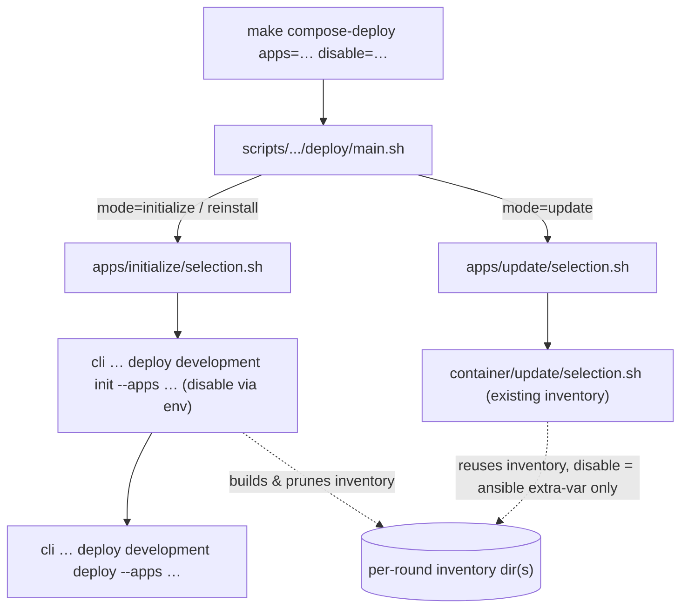
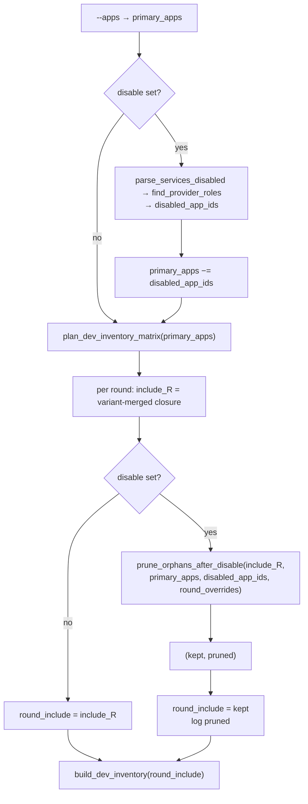
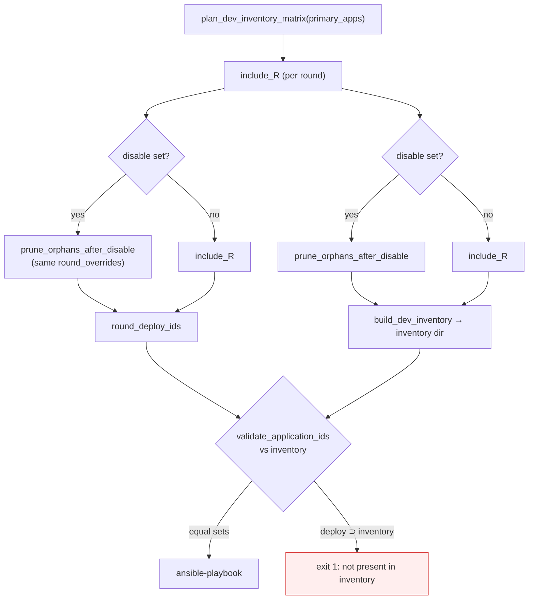
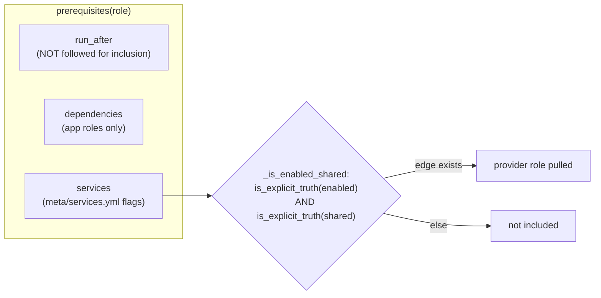
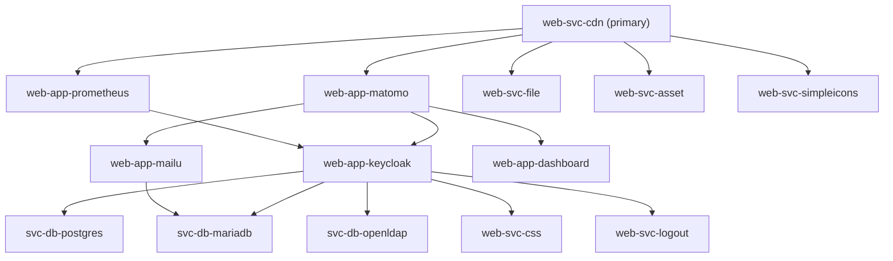
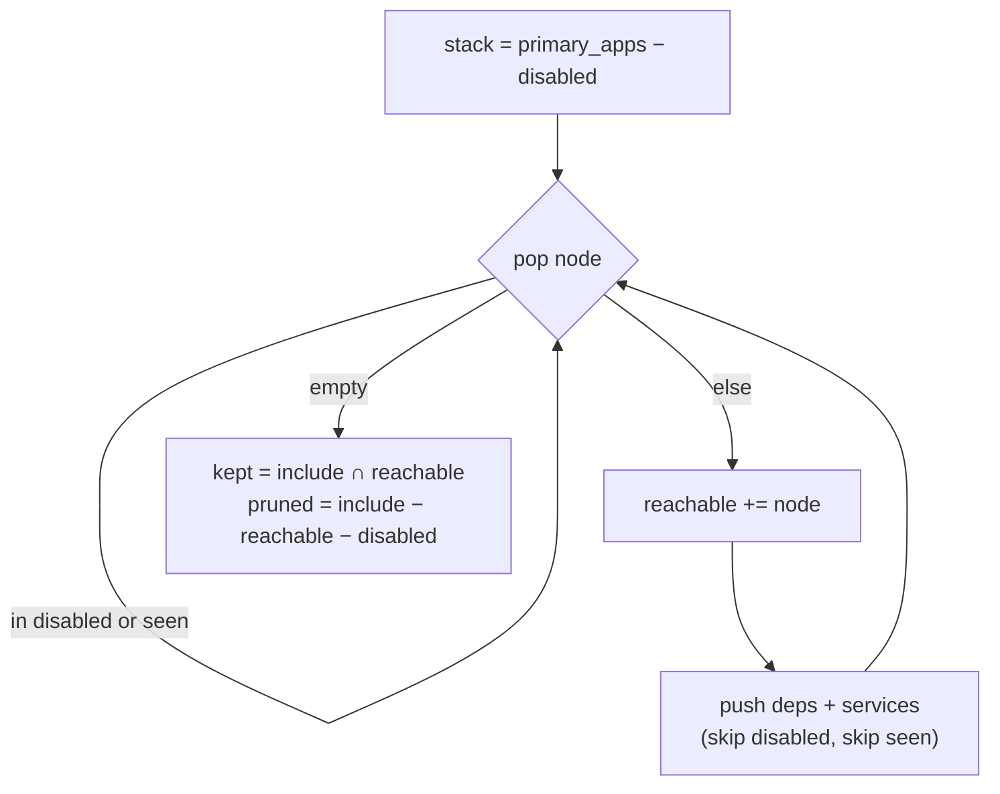
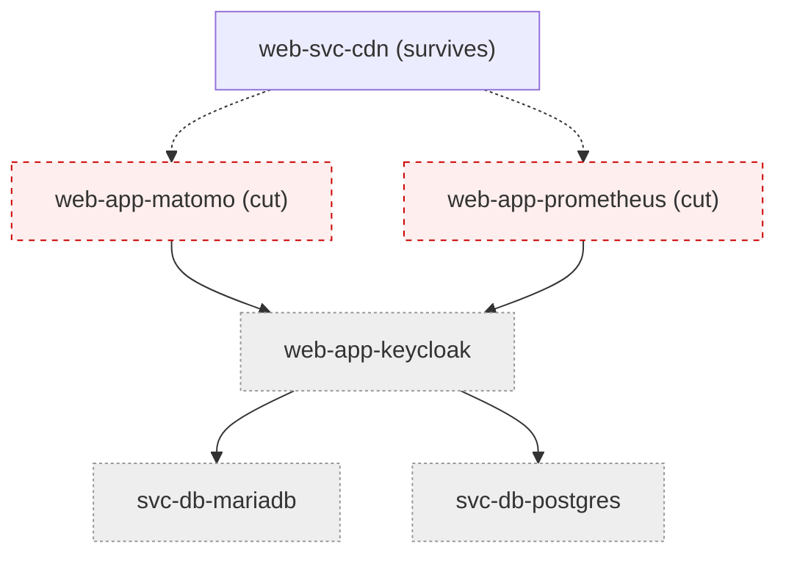
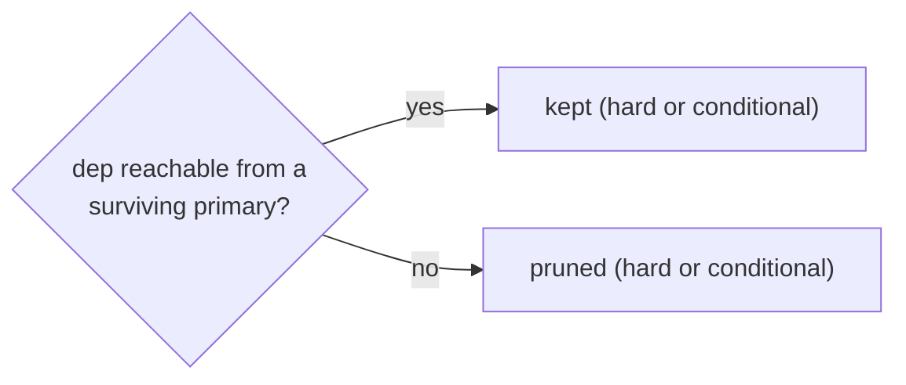

# Development matrix deploy

Iterates per-role variants against a development inventory. See below for
how the include set is resolved and where `disable=` prunes it.

## Include resolution, `disable`, and orphan pruning

How a primary app list becomes the per-round inventory include set, and
where `disable=` prunes the transitive closure.

## Deploy entry points

- `initialize` / `reinstall` rebuild the inventory through `init.py`; this
  is the only path that prunes the include set. `deploy` re-derives the
  same pruned set for its deploy ids (see below).
- `update` reuses the existing inventory; `disable` reaches ansible as an
  extra-var that renders services disabled, but does not touch the include.

## init.py: plan then prune

## deploy/cli.py: re-derive the same include

`init.py` writes the inventory; `deploy/cli.py` decides which application
ids to hand to `cli.administration.deploy.dedicated`. Both derive their
per-round set from the same `plan_dev_inventory_matrix` closure and MUST
apply the same `prune_orphans_after_disable` cut with the same
round-merged services map. `validate_application_ids` rejects any id that
is absent from the inventory, so a deploy-side set wider than the
init-side set aborts the run before the first role deploys.

Both sides pass `primary_apps` (not the round closure) as the BFS seed and
the variant-merged services map for that round, so the reachability walk
sees the same topology the inventory baked.

## Closure resolution (per round)

`plan_dev_inventory_matrix` → `_resolve_round_include` runs
`CombinedResolver(follow_run_after=False)` over each primary app and unions
the results.

`is_explicit_truth` treats **both** forms as truth at resolve time:

| `enabled` / `shared` value            | resolve-time truth |
| ------------------------------------- | ------------------ |
| literal `true`                        | yes                |
| `"{{ '<role>' in group_names }}"`     | yes                |
| literal `false`                       | no                 |

So a conditional `"{{ 'web-app-matomo' in group_names }}"` edge pulls its
provider into the static closure regardless of whether `web-app-matomo` is
actually selected. The closure is the co-deploy superset.

## Example: `web-svc-cdn` closure

`web-svc-cdn`'s only truthy service roots are `matomo` and `prometheus`
(both conditional). Everything else hangs beneath them.

## Orphan pruning (`prune_orphans_after_disable`)

BFS from surviving primary apps over `dependencies` + `services` edges,
cutting every role in `disabled_app_ids`. Reachable → `kept`; the rest of
`include_R` (disabled roots excluded) → `pruned`.

`disable=matomo,prometheus` on `web-svc-cdn` cuts both roots; the whole
subtree beneath them is unreachable from the surviving primary (`cdn`), so
`kept = (web-svc-cdn,)`.

## Reachability, not syntax

Pruning walks whatever edges the resolver reports; it never inspects
`enabled` for the hard-vs-conditional distinction. A literal `enabled:
true` dependency (e.g. `web-app-keycloak → svc-db-postgres`) is kept only
while its declaring node stays reachable. If the declaring node is cut or
orphaned and no surviving node pulls the dependency, it is pruned too.

## Scope

| Path                     | include pruned? | `disable` effect                  |
| ------------------------ | --------------- | --------------------------------- |
| compose `initialize` / `reinstall` | yes | named roots + orphaned closure    |
| compose `update`         | no              | ansible extra-var only            |
| compose CI matrix (`legacy_resolver` direct) | no | co-deploy superset, no prune |
| swarm (`utils.tests.swarm.derive_includes`) | yes | named roots + orphaned closure |

The swarm path applies the same cut through the `blocked` parameter of
`applications_if_group_and_all_deps`; `disable` roles are cut from the dep
walk, so orphaned providers never enter the provisioned inventory and
`swarm_deploy_targets` (bounded by inventory presence) cannot re-add them.
