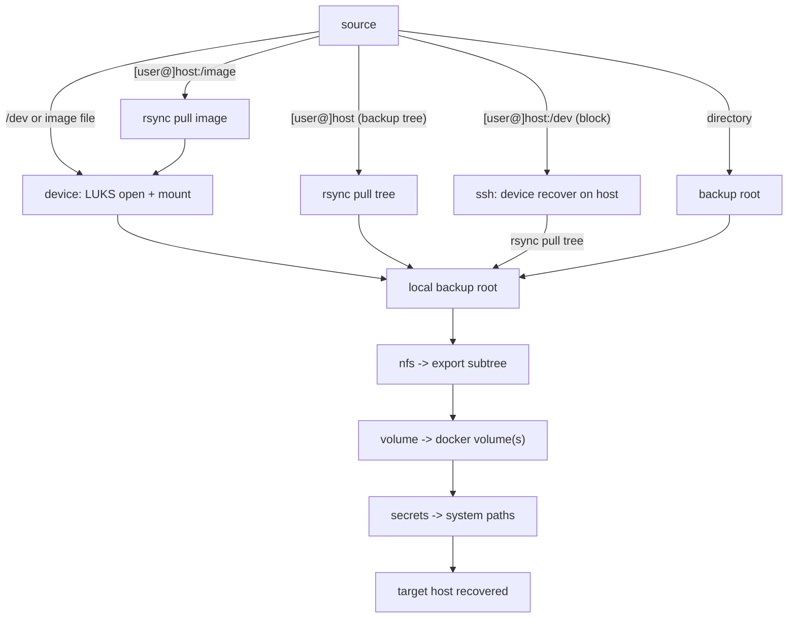

# recover

Uniform recovery for the `svc-bkp-*` backup roles. One command wraps each
role's `files/recover.py` behind a single grammar and drives a full
disaster recovery in the correct order.

## Usage

```
infinito administration recover <type> <source> <target> [--preview] [--no-safety-backup]
# equivalently: python3 -m cli.administration.recover ...
```

- `<type>`: `device` | `nfs` | `volume` | `secrets` | `full`
- `<source>`: see [Source grammar](#source-grammar)
- `<target>`: host to restore onto

The complete model is machine-readable in [`schema.yml`](schema.yml).

## Flow



## Types

| type | restores | source |
|---|---|---|
| `device` | LUKS device/image → local backup root | `<device>[:subpath][:gen][:/restore-dir]` |
| `nfs` | snapshot → NFS export subtree | files-dir or `[user@]host:/path` |
| `volume` | snapshot → docker volume | `.../<volume>/files` or host |
| `secrets` | snapshot → host secret paths | `<generation>/files` |
| `full` | every backup-stored type, in order | backup-root, host, or device |

## Source grammar

A colon suffix on `<source>` is classified by shape:

- `:/absolute/path` → restore destination (overrides the default target)
- `:relative` → device on-device snapshot subpath
- `:YYYYMMDDHHMMSS` → device generation (14 digits, default: newest)
- a source **not** starting with `/` → remote `[user@]host[:/path]`, rsync-pulled (`nfs` / `volume` / `full`)
- `[user@]host:/dev/...` → a device on the host, recovered over ssh then pulled; `[user@]host:/image` → the image is pulled and recovered locally (`device` / `full`)

The device LUKS passphrase is prompted interactively on a terminal, or read
from stdin when piped (`printf '%s' "$pass" | recover device ...`).

## full

`recover full <source> <target>` recovers every type present in the backup,
in order, adapting to the source:

- **device** (`/dev/sdb1`, image file) → device step first (restores the tree to its restore-root), then `nfs → volume → secrets`
- **host** (`[user@]host`) → rsync-pull the whole backup tree, then `nfs → volume → secrets`
- **backup-root** (a directory) → discover + recover `nfs → volume → secrets` directly

Under the root it recovers the newest generation of each repo
(`backup-nfs-to-local`, `backup-docker-to-local`, `backup-secrets-to-local`),
expanding `volume` per docker volume.

## Safety

Each recover mirrors a snapshot with `rsync -a --delete` and first runs the
role's backup unit as a rollback point. `--no-safety-backup` skips that
(only when the target holds nothing worth saving: fresh host / empty /
disposable). `--preview` prints the exact commands without running them.

## Layout

| file | responsibility |
|---|---|
| `recoverers.py` | abstract `Recoverer` + one subclass per type, source parsing/validation |
| `full.py` | `full` orchestration: resolve source, discover repos, recover in order |
| `paths.py` | standard filesystem layout (backup root, export state, secrets, mount) |
| `__main__.py` | argparse entry + dispatch |
| `schema.yml` | the recovery schema |

## Examples

```
recover nfs     /backup/HASH/backup-nfs-to-local/GEN/files host01
recover volume  /backup/HASH/backup-docker-to-local/GEN/matomo_data/files host01
recover secrets /backup/HASH/backup-secrets-to-local/GEN/files host01
recover device  /dev/sdb1:usb-backup:20260710153000:/tmp/restored host01
recover nfs     user@srchost:/backup/HASH/backup-nfs-to-local/GEN/files host01
recover full    /var/lib/infinito/backup host01
recover full    user@srchost host01
recover full    /dev/sdb1:usb-backup host01
recover device  user@srchost:/dev/sdb1:usb-backup host01
recover device  user@srchost:/backup/usb.img:usb-backup host01
```
