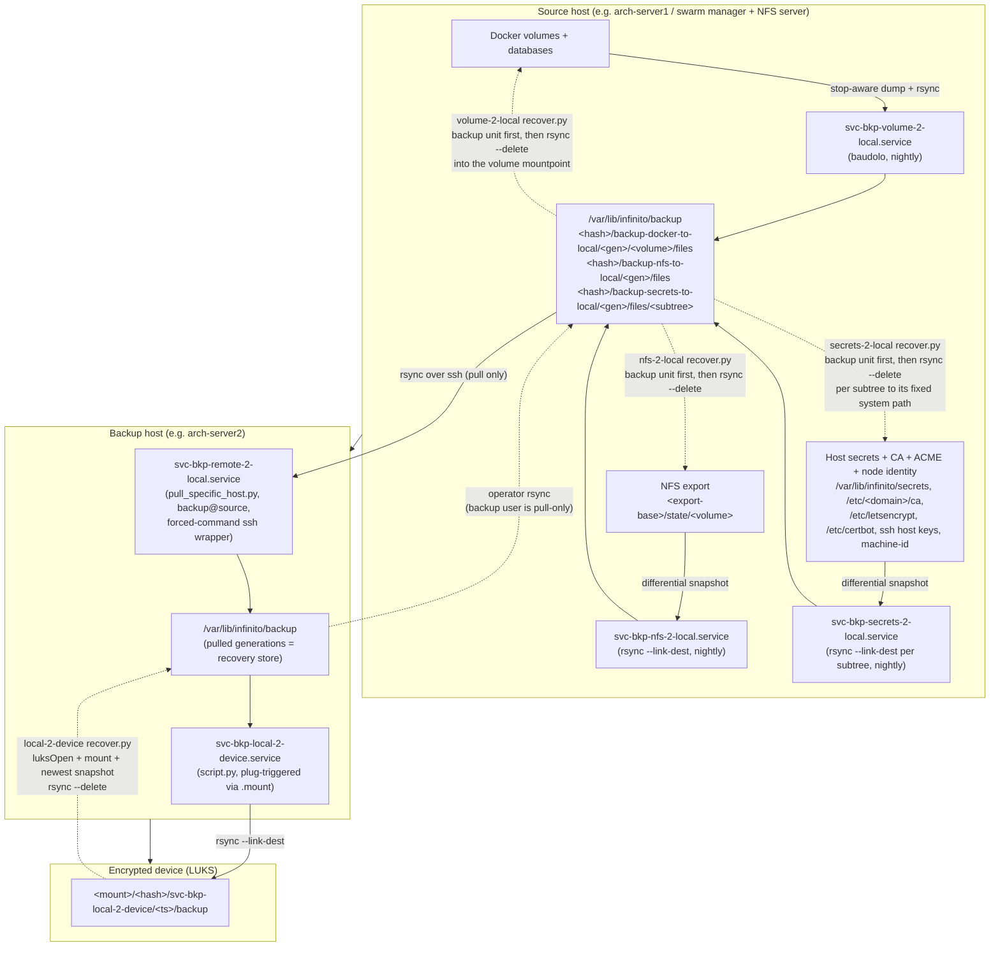
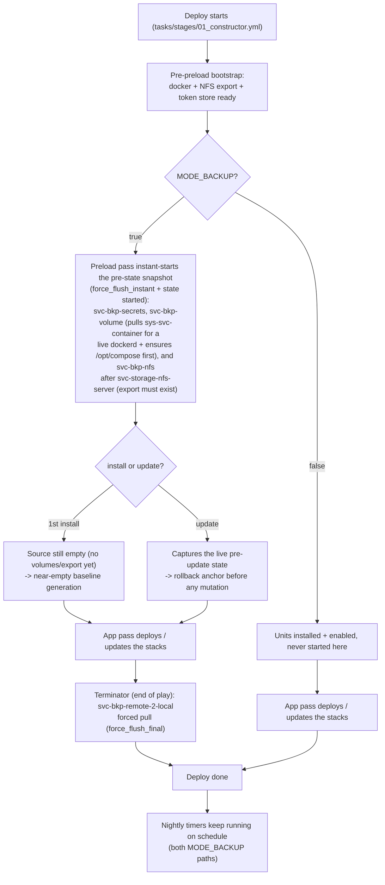

# Backup and Recover Schema (svc-bkp-* role family)

End-to-end flow of the backup chain and its recover counterparts. Solid
arrows run on schedule (systemd units + pull); dashed arrows are the
recover direction (`files/recover.py` of each role, enforced by
`tests/lint/ansible/roles/test_bkp_roles_have_recover.py`). The swarm
test pipeline exercises the full chain in
`scripts/tests/deploy/swarm/routine/backup/base.sh`.

Per-role recover procedures live in each role's `## Recover` README
section; `svc-bkp-remote-2-local` documents its one-way opt-out in
`files/recover.py.nocheck`.

## Deploy-time trigger flow

When the backup units actually run during a deploy, keyed on `MODE_BACKUP`
and whether this is a first install or an update. The nightly systemd
timers fire independently of every path below.

A failing pre-state snapshot aborts the deploy (no `suppress_flush`):
no update proceeds without a successful backup of the state it is about
to change. `svc-bkp-local-2-device` is never started at deploy time (no
device present); it stays plug-triggered via its `.mount` unit.
