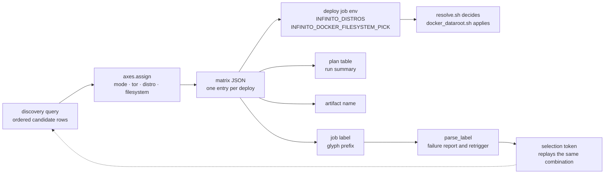
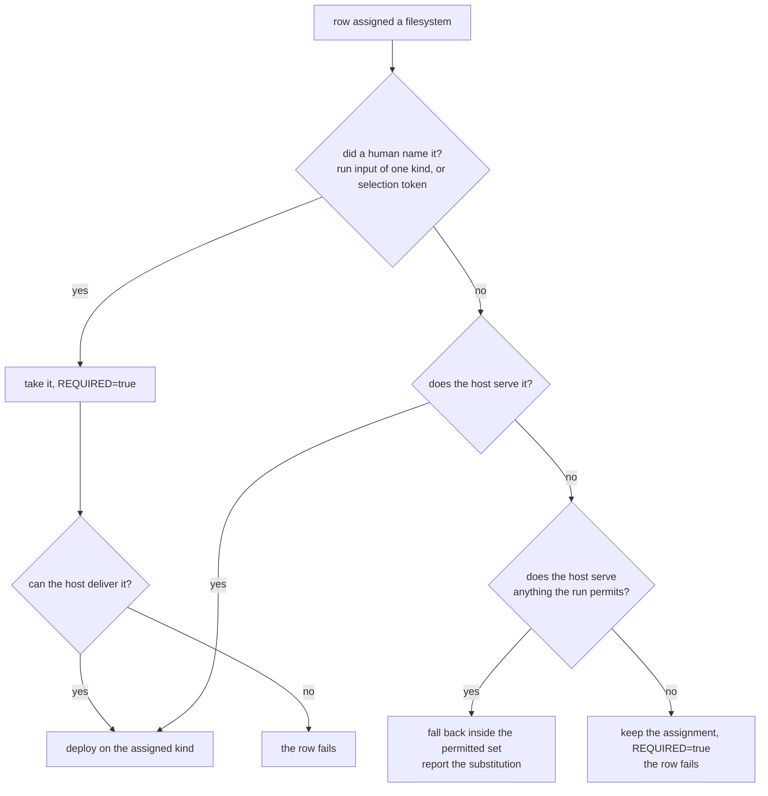

# 0001: Distro and filesystem are deploy-matrix axes 🧭

**Status:** accepted

## Context 🎯

The CI deploy matrix turns the role catalogue into deploy jobs.
Each row is one `role#variant` selection, and each row must state everything that makes its deployment reproducible, because a red job is only useful if an operator can replay exactly it.

Two properties decide what a deploy actually exercises and neither is a property of the role: the distribution the node runs, and the filesystem the docker data root sits on.
The snapshot mode of `svc-bkp-volume-2-local` engages only on btrfs and zfs, and package behaviour differs per distribution family, so a run that proves a role on one combination proves little about the others.

A run-wide choice cannot cover them.
Five distributions and three filesystems are fifteen combinations, and a sweep that fixes one pair for all of its rows would need fifteen sweeps to say anything about the rest, while reporting green the whole time.

## Decision ✅

`distro` and `filesystem` are axes of the matrix row, assigned per row by [axes.py](../../../utils/github/variant/axes.py), exactly as `mode` and `tor` already are.

- **Assignment reads the row's position like an odometer.** The distro is the low digit and the filesystem the high one, so consecutive rows walk every pairing instead of a diagonal through it. Turning both on the position directly covers only `n` of the `n x m` pairs whenever the two pools are the same length, and the sweep number does not unlock it, because it shifts both by the same amount.

  Three distros and three filesystems make the difference visible:

  | Position | 0 | 1 | 2 | 3 | 4 | 5 | 6 | 7 | 8 | Pairs reached |
  |---|---|---|---|---|---|---|---|---|---|---|
  | Both on the position | a·1 | b·2 | c·3 | a·1 | b·2 | c·3 | a·1 | b·2 | c·3 | 3 of 9 |
  | Odometer | a·1 | b·1 | c·1 | a·2 | b·2 | c·2 | a·3 | b·3 | c·3 | 9 of 9 |

- **Assignment is deterministic, never random.** It follows the row's index in the global discovery order and the sweep number, so re-running a sweep reproduces the run. Discovery order itself is stabilised by `INFINITO_DISCOVERY_SEED`, which CI sets to the run id, so the plan table, the discover job and every chunk block of one run agree without passing state between them.
- **The axes are part of a row's identity.** They appear in the job label as glyphs, in the plan table as columns, and in the artifact name. Two rows that differ only in distro are two deploys and MUST NOT share an artifact name.
- **The axes are selectable.** `%distro` and `/filesystem` narrow a `whitelist` or `priority` token the same way `@mode` and `+tor` do. A retrigger reads the distro back off a failed job's title, so a red row returns on the distribution it died on. It does not read the filesystem back: the title states the kind the matrix assigned, which a deploy may have fallen back from, and writing it into a token would state it as named by a human and make it binding.
- **The pools are narrowable per run.** The `distros` and `filesystem` inputs default to empty, which means every declared value. Narrowing is for chasing one distribution or one filesystem.

One row is decided once and then read by three consumers that MUST agree on it:

The dotted edge is the property the axes exist for: a red job's title carries enough to rebuild the selection that reproduces it.

### The filesystem is a preference unless a human names it 🗄️

The matrix hands every row exactly one filesystem, so the value a deploy job sees is always narrow.
Reading that narrowness as a demand would turn every condition the applying step is built to tolerate into a red row: a loop device it could not claim, a pool another job still holds, a kernel without the module.

An entry therefore carries `enforce_filesystem`, true when a human left the row no choice: a `/filesystem` selection token, or a run whose `filesystem` input names exactly one kind.

| `enforce_filesystem` | A host that cannot serve the assigned kind |
|---|---|
| false | falls back inside what the run permits, and reports the substitution in the step summary |
| true | fails the row |

A run that permits two or more kinds is a preference, not a demand.
The matrix has already narrowed each row to one kind out of that pool, so falling back to another kind the run allowed stays inside what the operator asked for, while failing the row does not.
A run whose whole permitted pool is unservable fails rather than leaving the pool.

A fallback MUST stay inside the permitted set, and a run whose whole permitted set is unservable MUST fail rather than leave it.
The job title and the artifact name carry the kind the matrix assigned; the step summary carries the effective one.

Every path either deploys on the assigned kind, reports the substitution, or fails.
None of them substitutes in silence.

## Consequences 📉

- Across the rows a sweep deploys, every distribution and every filesystem is exercised instead of one pair, at no extra job count.
- The redundancy cut does not follow the axes. `covered_by` is a role-level claim discovery computes from the service closure, so the row that covers a cut row now usually lands on a different distribution: on a full sweep, 6 of 44 cut rows share their coverer's distro. The cut therefore asserts that the services were exercised, not that they were exercised on that row's distribution. Reaching a cut row on its own axes means naming it on the priority line, which is what `⭐` exists for.
- A job title states its whole combination, which lets `--failed` replay the mode, onion state and distribution, and makes a plan table row comparable to the job it predicts.
- Both pools feed the assignment, so narrowing `distros` to one value pins every row to it rather than reducing the run.
- Two selection tokens that pin different axes of one row can resolve to the same deploy. They collapse into one entry, and the stronger `enforce_filesystem` claim survives the collapse.
- The resume offset a retrigger computes names a `role#variant` and carries no axes, because every axis rotates with the sweep number and a retrigger receives a fresh one.
- CI images MUST exist for every declared distribution on every run, since any row may draw any of them.

## Alternatives weighed 🔀

| Alternative | Why it lost |
|---|---|
| Keep a run-wide distro, drawn once before the orchestrator starts | One sweep proves one distribution and claims nothing about the other four, while reporting green. |
| Keep the per-distro loop inside each deploy job | Multiplies every job's wall clock by the number of distributions and forces a shared time budget that silently skips the tail. |
| Make the assigned filesystem binding in every case | Promotes each transient condition the applying step tolerates into a red row, on every deploy job of every sweep. |
| Leave the filesystem a preference in every case | A run that names a kind to chase a filesystem-dependent path could go green on a different one. |
| Draw the axes at random per row | A red job could not be reproduced by re-running its sweep, which is the property the whole rotation exists to provide. |

## See also 🔗

- [README.md](../../../.github/workflows/README.md) for the selection-token grammar and the per-axis rotation table.
- [variants.md](../../contributing/design/variants.md) for what a `role#variant` row is.
- [deployment-modes.md](../../contributing/design/deployment-modes.md) for the `mode` axis.
