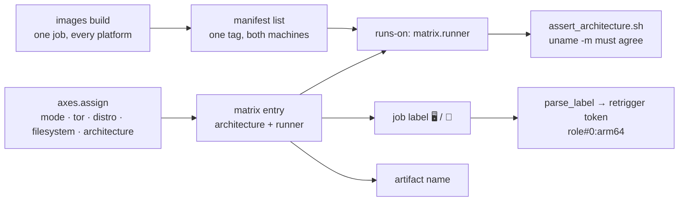

# 0002: The CPU architecture is a deploy-matrix axis 🏗️

**Status:** accepted

## Context 🎯

[0001](0001-ci-deploy-matrix-axes.md) made the distribution and the filesystem
axes of the matrix row, because a run that fixes one value for all of its rows
proves one combination and claims nothing about the others while reporting
green.

The CPU architecture is the same kind of property and was not covered at all.
Every deploy job ran on `ubuntu-latest`, so every sweep proved amd64 and said
nothing about arm64, while the project ships roles whose upstream images, wheels
and binaries differ per architecture. A role that cannot run on arm64 was
indistinguishable from one nobody had ever tried there.

It differs from the other four in one way that decides the design: a job can
install a distribution and build a filesystem, but it cannot acquire a CPU. The
architecture arrives with the runner, which means the matrix has to choose the
machine, not just a value the job applies to itself.

## Decision ✅

`architecture` is an axis of the matrix row, assigned per row by
[axes.py](../../../utils/github/variant/axes.py) next to `mode`, `tor`,
`distro` and `filesystem`.

- **It rotates on the row's position directly, not as a third odometer digit.**
  The distro/filesystem odometer exists because two pools of equal length walked
  on the same index cover only `n` of `n x m` pairs. Two architectures against
  five distros are coprime, and against the fifteen distro/filesystem positions
  too, so the fast rotation reaches every pairing anyway. Making it the slowest
  digit would be actively wrong: a role with four rows would sit on one
  architecture forever, and the axis exists precisely so a role's own variants
  split over both.

  | Position | 0 | 1 | 2 | 3 | 4 | 5 |
  |---|---|---|---|---|---|---|
  | distro | arch | debian | ubuntu | fedora | centos | arch |
  | architecture | amd64 | arm64 | amd64 | arm64 | amd64 | arm64 |

- **The matrix carries the runner label, and `runs-on` reads it.** The entry
  gains `architecture` and `runner`;
  [pools.py](../../../utils/github/variant/pools.py) owns the mapping
  (`amd64` → `ubuntu-latest`, `arm64` → `ubuntu-24.04-arm`). An architecture
  without a label is a build error rather than a row that lands on the wrong
  hardware with an empty `runs-on`.

- **The job proves the machine before it deploys.**
  [assert_architecture.sh](../../../scripts/github/runner/assert_architecture.sh)
  compares `uname -m` against the assigned value and fails the row on a
  mismatch. Without it, a label that stops resolving to arm64 hardware would
  report every arm64 row green from an amd64 machine, which is the exact failure
  the axis exists to rule out.

- **A role may narrow the pool.** `meta/services.yml.<primary_entity>
  .architectures` lists what the role can run on, next to `modes`, because both
  state a capability rather than a testing preference. The row draws from the
  intersection with the run's pool; an empty intersection aborts the matrix.

- **CI images are built in one job, one image per distro for every
  architecture.** [push.sh](../../../scripts/image/push.sh) passes the whole
  pool to a single `docker buildx build --platform`, so the plain `<tag>` is a
  manifest list from the start and no per-architecture tag exists. The job runs
  on an amd64 runner and executes the other architectures through the QEMU
  handlers `tonistiigi/binfmt` registers. Every consumer pulls the plain tag
  and gets the image matching its machine.

- **It is part of a row's identity.** The glyph is in the job label, the value
  in the artifact name, the column in the plan table, and `:arm64` narrows a
  selection token the way `%distro` and `/filesystem` do. A retrigger replays
  it, unlike the filesystem: the title states the machine the job actually ran
  on, not a preference it could have fallen back from.

## Consequences 📉

- Every sweep exercises both architectures across the catalogue instead of
  proving amd64 and claiming nothing, at no extra job count.
- A role whose upstream images are amd64-only must say so in
  `meta/services.yml`, or half its rows fail on the image pull. That failure is
  loud and names the role, which is the intended way to discover the gap.
- The CI image build stays one job, but every foreign-architecture layer runs
  under emulation. A cold arm64 layer that compiles (the zfs userland on Arch
  and Fedora) takes several times its native duration; the shared build cache
  tag holds both platforms, so only changed layers pay it.
- The plain image tag becomes a manifest list. Anything that inspects the tag
  expecting a single image manifest sees an index instead.
- arm64 runner capacity becomes a dependency of the deploy matrix. A pool
  without capacity queues those rows rather than failing them.

## Alternatives weighed 🔀

| Alternative | Why it lost |
|---|---|
| Keep a run-wide architecture chosen by an input | One sweep proves one architecture and claims nothing about the other, which is the defect 0001 was written against. |
| Make the architecture the slowest odometer digit | A role with few rows would never leave its first architecture, and per-role spread is the point of the axis. |
| Build each architecture natively on its own runner and merge the tags | Two jobs per build and a per-architecture tag next to every image, which the registry cleanup then had to protect as children of the plain tag. |
| Let the deploy job pick its own architecture | It cannot: the CPU comes with the runner, which is chosen before the job starts. |
| Trust the runner label instead of asserting `uname -m` | A label that silently stops resolving to arm64 turns the whole axis into a green lie. |

## See also 🔗

- [0001](0001-ci-deploy-matrix-axes.md) for the distro and filesystem axes this
  extends.
- [README.md](../../../.github/workflows/README.md) for the token grammar and
  the per-axis rotation table.
