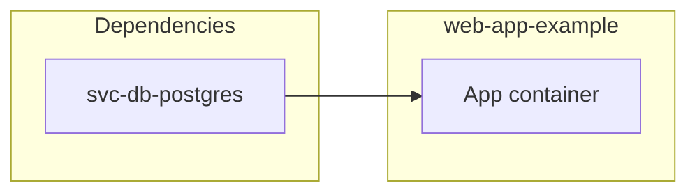

# Role README 📄

Every Ansible role MUST contain a `README.md` at the role root.
This page defines the required structure and content rules.
For general documentation rules (links, writing, emojis, RFC 2119 keywords), see [documentation.md](../../../documentation.md).

## Structure 📋

Role README files MUST follow this section order.
Optional sections MAY be omitted when they add no value for the role.

### 1. Title (required) 🏷️

The H1 heading MUST be the human-readable name of the application or service, not the role ID.

```markdown
# Nextcloud
```

### 2. Description (required) 📖

A short paragraph that describes what the **software** is. You MUST NOT describe what the role does here.
Link the software name to its official website on first use.

```markdown
## Description

[Nextcloud](https://nextcloud.com/) is a self-hosted file sync and share platform …
```

### 3. Overview (required) 🗺️

A short paragraph that describes what the **role** does: what it deploys, configures, and integrates.
Reference any companion documentation files (e.g. `Administration.md`) here using file-name link text.

```markdown
## Overview

This role deploys Nextcloud using Docker Compose …
For administration details see [Administration.md](./Administration.md).
```

### 4. Cosmos (required) 🌌

A `## Cosmos` section MUST contain a single Mermaid `flowchart` that places the role in the Infinito.Nexus cosmos. Group the nodes with `subgraph`s into three families:

- **Capabilities** — the containers/components this role deploys (from `meta/services.yml`).
- **Dependencies** — the central services and sibling roles it consumes (the `enabled: "{{ '<role>' in group_names }}"` service flags, plus `run_after` and any `meta/main.yml` `dependencies`).
- **Cosmos** — the outward reach: federation peers, external networks bridged in, upstream projects.

Draw only what the role metadata declares; do not invent services. Mermaid node ids MUST NOT be reserved words (`call`, `end`, `click`, `class`, `graph`, `style`, `subgraph`).

````markdown
## Cosmos


````

### 5. Features (required) ✨

A bulleted list of the most important capabilities.
Each item MUST start with a **bold** label followed by a colon and a short explanation.

```markdown
## Features

- **Self-hosted:** Run the application under your own domain …
- **LDAP Integration:** Authenticate users via a central directory …
```

### 6. Use Cases (optional) 🎯

Use this section for the concrete scenarios the role is a good fit for, when they are not obvious from Description and Overview.
Omit it for roles where the use cases are self-evident.

### 7. Developer Notes (optional) 🔧

Link to role-local documentation files such as `Administration.md`, `Installation.md`, or `Development.md`.
You MUST use file-name link text. Never use the full path.

```markdown
## Developer Notes

See [Administration.md](./Administration.md) for live container inspection and LDAP configuration.
```

### 8. Further Resources (optional) 🔗

A list of external links relevant to the software or the deployment.
Link text MUST be a descriptive label or the domain name. Never use the full URL.

```markdown
## Further Resources

- [Nextcloud Official Website](https://nextcloud.com/)
- [Nextcloud Admin Manual](https://docs.nextcloud.com/…)
```

### 9. Credits (required) 🙏

Always the last section. MUST follow this fixed format:

```markdown
## Credits

Implemented by **[Author name](Author URL)**.
Part of the [Infinito.Nexus Project](https://s.infinito.nexus/code) and maintained by [Kevin Veen-Birkenbach](https://www.veen.world).
Licensed under the [Infinito.Nexus Community License (Non-Commercial)](https://s.infinito.nexus/license).
```

`Author name` MUST equal `galaxy_info.author` in the role's `meta/main.yml` (the author single point of truth). It MAY be wrapped in a Markdown link as shown, or left as plain bold text (`Implemented by **Author name**.`) when no author URL applies.

## Formatting Rules 📏

- Role README files MUST NOT use emojis in headings.
  Emojis in role READMEs interfere with automated tooling that parses heading text.
- Body text MAY use emojis where they improve readability.
- All headings MUST use sentence-case (capitalize only the first word and proper nouns).
- Link text MUST follow the link rules in [documentation.md](../../../documentation.md).
