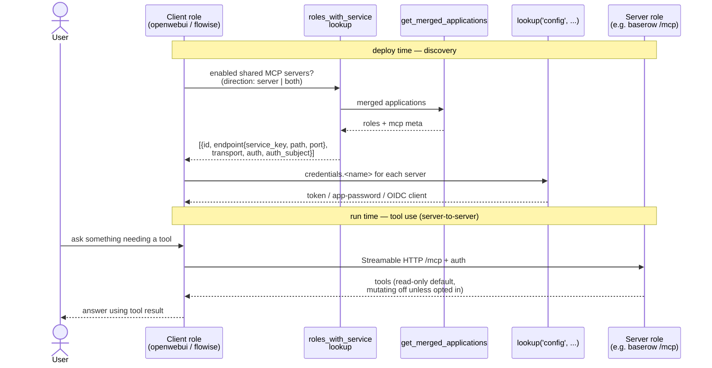

# 025 - MCP Role Integration

> **Revalidation required:** [035 - MCP Proxy Expansion and Application Interconnection](035-mcp-proxy-expansion.md) records the exhaustive 169-role audit and supersedes this document where this document assumes an empty baseline, treats metadata as enforcement, or marks client provisioning and end-to-end authorization complete. Checked items below describe the original implementation slice and MUST NOT be read as proof that the stricter identity, revocation, transport, restart, proxy, and real-tool-call criteria in requirement 035 are complete.

## User Story

As a platform administrator of Infinito.Nexus, I want every role with a documented Model Context Protocol (MCP) surface to expose or consume MCP through the platform's standard service, identity, proxy, and test contracts so that AI clients can use application data and actions safely without one-off per-role wiring.

## Background

MCP is a client-server protocol for connecting AI hosts to external tools, resources, and prompts.
Several roles in this repository deploy applications whose upstream projects document MCP support.
The current tree contains 18 role-local `mcp:` blocks, but metadata presence does not prove endpoint compatibility, least-privilege credentials, application-scoped user authorization, client provisioning, or an end-to-end tool call.

The integration MUST distinguish two directions:

- MCP server roles expose application capabilities through an authenticated MCP endpoint.
- MCP client roles connect to enabled MCP servers and present their tools to users through an AI surface.

The implementation MUST prefer native upstream MCP support.
Plugin, sidecar, or marketplace MCP servers MAY be used only when the upstream project documents them as supported or when the role README documents the risk and the operator explicitly enables the integration.

## Confirmed Decisions

These choices are settled at requirement creation time and bound the implementation. Re-opening any of them MUST be recorded in the implementing PR.

1. **Implementation precedence.** `native` > `plugin` > `sidecar` > `adapter` > `external`. A lower-precedence path is allowed only when the higher one is unavailable or cannot enforce the required security boundary, and the role README documents why. Adapter instances follow requirement 035 and are isolated per provider application or trust domain.
2. **Discovery reuses existing infrastructure.** Client roles discover servers through the existing [`roles_with_service`](../../plugins/lookup/roles_with_service.py) lookup (backed by `utils.cache.applications.get_merged_applications`), extended to filter by `services.mcp.direction` and to surface endpoint metadata. No new generated repository-wide application dictionary is introduced.
3. **Secrets reuse the credentials mechanism.** MCP tokens, app-passwords, and OAuth client secrets are declared in each role's [`meta/secrets.yml`](../../roles/web-app-baserow/meta/secrets.yml) `credentials:` block and read via `lookup('config', application_id, 'secrets.credentials.<name>')`. No new secret store is introduced.
4. **MCP state is a variant axis.** Roles that gain an MCP surface MUST express the enabled/disabled split through `meta/variants.yml` so CI matrix runs cover both states.
5. **Lint reuses the suppression model.** New MCP lint rules live under [`tests/lint/ansible/services/`](../../tests/lint/ansible/services/) and honour the existing `# nocheck:` marker convention (see [suppression docs](../contributing/actions/testing/suppression.md)).
6. **First slice.** The first end-to-end slice is `web-app-baserow` (server) plus `web-app-openwebui` (client).
7. **The role tree is the audit.** Every fact about a role's MCP surface lives in its own `meta/services.yml`; no separate artifact duplicates it.
8. **Every MCP implementation ships a Playwright test.** Each role that gains an MCP surface MUST add a matching Playwright spec under `roles/<role>/files/playwright/` that exercises its MCP surface (a server role's authenticated endpoint, a client role's configured-server list). No MCP role is considered implemented until its Playwright test is present and green.
9. **Authorization subject.** MCP integrations prefer user-scoped authorization. Service-account or administrator-scoped MCP credentials are allowed only for read-only default tool sets, or when the role README documents the upstream limitation and the operator explicitly enables mutating tools.

## Initial Upstream Survey

The following roles have an MCP surface confirmed from upstream or project-owned documentation at requirement creation time.
Each row is an implementation candidate, not proof that the current role already exposes MCP.

| Role | MCP direction | Source | Initial notes |
|---|---|---|---|
| [web-app-openwebui](../../roles/web-app-openwebui/) | Client | [Open WebUI MCP docs](https://docs.openwebui.com/features/extensibility/mcp/) | Native MCP client support requires Open WebUI `v0.6.31+` and uses Streamable HTTP. The role currently pins `version: main`, which MUST be replaced with an explicit MCP-capable tag before MCP is enabled. |
| [web-app-flowise](../../roles/web-app-flowise/) | Client | [Flowise Tools and MCP](https://docs.flowiseai.com/tutorials/tools-and-mcp) | Flowise supports Custom MCP. Production deployment MUST NOT enable arbitrary stdio commands by default. |
| [web-app-nextcloud](../../roles/web-app-nextcloud/) | Server | [Nextcloud Context Agent docs](https://docs.nextcloud.com/server/latest/admin_manual/ai/app_context_agent.html) | The Context Agent app exposes an MCP endpoint below the Nextcloud AppAPI proxy and uses app-password authentication. |
| [web-app-gitlab](../../roles/web-app-gitlab/) | Server | [GitLab MCP server docs](https://docs.gitlab.com/user/gitlab_duo/model_context_protocol/mcp_server/) | Surveyed as tier-gated to Premium or Ultimate. Reading the source disproved it: see the tier criterion below. |
| [web-app-mattermost](../../roles/web-app-mattermost/) | Server | [Mattermost MCP Server docs](https://docs.mattermost.com/agents/mcpserver/README.html) | The production-safe path MUST follow Mattermost's documented Agents and MCP deployment guidance. |
| [web-app-openproject](../../roles/web-app-openproject/) | Server | [OpenProject MCP Server docs](https://www.openproject.org/docs/system-admin-guide/integrations/mcp-server/) | OpenProject documents an MCP endpoint under `/mcp` and OAuth application setup. |
| [web-app-baserow](../../roles/web-app-baserow/) | Server | [Baserow MCP Server docs](https://baserow.io/user-docs/mcp-server) <!-- nocheck: url — page is live (HEAD+GET 200); baserow.io edge intermittently 404s CI runner IPs --> | Baserow documents a native built-in MCP server. |
| [web-app-jenkins](../../roles/web-app-jenkins/) | Server | [Jenkins MCP Server plugin](https://plugins.jenkins.io/mcp-server/) | Jenkins support is plugin-based and MUST be pinned like other Jenkins plugins. |
| [web-app-moodle](../../roles/web-app-moodle/) | Server | [Moodle MCP plugin](https://moodle.org/plugins/webservice_mcp) | Moodle support is plugin-based and MUST be version-compatible with the pinned Moodle LTS release. |
| [web-app-gitea](../../roles/web-app-gitea/) | Server | [Gitea MCP package](https://pkg.go.dev/gitea.com/gitea/gitea-mcp) | Gitea support appears as a project-owned MCP package. The implementation MUST verify release, packaging, and auth maturity before enabling it. |

The following roles have an upstream MCP path that this deployment cannot use.
Each declares a `services.mcp` block carrying only `blocker`, `source_url` and `notes`, with `enabled` and `shared` false, so the role stays out of discovery while the audit still reports why it is not integrated:

- [web-app-jira](../../roles/web-app-jira/) and [web-app-confluence](../../roles/web-app-confluence/): `blocker: hosted_only`. Atlassian documents the [Rovo MCP Server](https://support.atlassian.com/atlassian-rovo-mcp-server/docs/getting-started-with-the-atlassian-remote-mcp-server/) for Atlassian Cloud only.
- [web-app-wordpress](../../roles/web-app-wordpress/): the `hosted_only` classification is stale. The official WordPress MCP adapter is a plugin candidate and MUST be pinned, source-audited, restricted to reviewed Abilities with permission callbacks, and tested against the deployed WordPress version before the blocker is removed.
- [web-app-odoo](../../roles/web-app-odoo/): `blocker: unreviewed_third_party`. Self-hostable third-party add-ons exist, but no Odoo Core server has been confirmed. A module MUST pass source, license, maintenance, authentication, and per-model/per-operation review before selection.
- [web-app-discourse](../../roles/web-app-discourse/): the `hosted_only` classification is stale. The project-owned server is a pinned HTTP-sidecar candidate that MUST run read-only by default with a restricted User API key and separate client-facing authentication.
- [web-app-openproject](../../roles/web-app-openproject/): `blocker: licence`. The MCP server ships in the product but is Enterprise-only, and upstream's own request specification asserts a 404 on Community Edition, which is what this role deploys.

## Target Schema

### Shared MCP service flag

Every MCP-capable role MUST expose a role-local `mcp` service block in `meta/services.yml`.
The block MUST be absent from roles that have no upstream MCP surface at all. A role whose upstream surface exists but cannot be served by this deployment MUST carry a block declaring `blocker` instead of `direction`, so the audit reports the reason rather than an absence.

```yaml
mcp:
  enabled: false
  shared: false
  direction: server        # server, client, or both
  transport: streamable_http
  exposure: internal       # internal by default; public requires explicit role documentation
  auth: oidc               # oidc, app_password, basic_auth, bearer_token, upstream_session, or none
  auth_subject: user        # user, service_account, administrator, or none
  implementation: native   # native, plugin, sidecar, or external
  source_url: https://example.invalid/docs/mcp
  minimum_version: "1.0"
  notes: Upstream caveats a deployment must respect.
```

Rules:

- `enabled` MUST default to `false` in role defaults. Integrated roles MUST use variants to verify both `enabled=false` and `enabled=true` states.
- The MCP surface ships disabled by default and is independent of the host role's `lifecycle`: a `beta` host role MUST NOT imply that its MCP surface is stable. An MCP surface is only considered validated once its acceptance criteria are met end to end.
- `shared` MUST mean that other Infinito.Nexus roles MAY discover and consume the MCP endpoint through the applications lookup.
- `direction` MUST distinguish MCP clients from MCP servers so client roles can discover only server roles.
- `transport` MUST default to `streamable_http` for server deployments. Stdio MAY exist only for local development and MUST NOT be enabled in a deployed web role by default.
- `exposure` MUST default to `internal`. Public MCP endpoints MUST have explicit authentication, rate limiting, proxy coverage, and README documentation.
- `auth: none` MUST fail lint unless the endpoint is bound to localhost or an internal-only network and the role README documents why authentication is impossible upstream.
- `auth_subject` MUST be `user` where upstream supports per-user authorization. `service_account` and `administrator` MUST keep mutating tools disabled by default.
- `source_url`, `minimum_version` and `notes` MUST carry the upstream provenance of the surface. They live in the role because the role owns them; the audit artifact derives its provenance columns from here and MUST NOT keep a second copy.

### MCP endpoint metadata

Server roles MUST publish enough metadata for client roles and tests to discover the endpoint.
The `endpoint` and `tools` keys below are part of the **same** role-local `mcp` block as the shared service flag above; the two snippets are split only for readability and MUST be merged into one `mcp:` mapping in `meta/services.yml`.

```yaml
mcp:
  endpoint:
    service_key: baserow   # references services.<service_key>
    path: /mcp
    port_key: http        # references services.<service_key>.ports.local.<key>
  tools:
    read_only_default: true
    mutating_tools_enabled: false
```

Rules:

- The endpoint path MUST be relative to the role's canonical HTTPS origin unless the role uses an internal-only sidecar.
- `service_key` MUST name an existing top-level service entry in the same `meta/services.yml`, and `port_key` MUST name an existing key under `services.<service_key>.ports.local`.
- For `implementation: native` exposed under `/mcp` on the role's existing HTTP port, no new port is added. For `implementation: sidecar` or `external`, the role MUST register a dedicated service entry and local port so the central collision check covers it, and MUST NOT reuse the application's primary HTTP port.
- Mutating tools MUST be disabled by default when upstream supports tool filtering or scopes.
- When mutating tools cannot be disabled, the integration MUST require explicit operator opt-in before `mcp.enabled=true`.

### Server metadata (`meta/server.yml`)

MCP changes the role's HTTP surface, so each server role MUST keep its [`meta/server.yml`](../../roles/web-app-baserow/meta/server.yml) contract consistent with the new endpoint.

Rules:

- **Routing.** MCP MUST be served from the role's existing `domains.canonical` origin under the `mcp.endpoint.path`. A dedicated MCP subdomain MUST NOT be added unless upstream cannot serve MCP under a path, in which case the new domain MUST be registered in `domains.canonical` and documented in the role README.
- **Status codes / health.** An authenticated MCP endpoint returns a non-2xx status (e.g. `401`/`406`) to unauthenticated probes. The role MUST NOT let the MCP path break the platform uptime/status-code check: either the health probe targets an unauthenticated `mcp.endpoint.health_path`, or the MCP path is excluded from the canonical `status_codes` check. The chosen approach MUST be explicit in `server.yml`.
- **Networks.** For `implementation: sidecar` or `external`, the MCP container MUST attach to the role's existing `networks.local` subnet and MUST NOT introduce a new top-level network.
- **CSP.** MCP Streamable HTTP runs server-to-server (the client role's backend connects to the server role), so a server role MUST NOT need a new browser `csp` `connect-src` entry for MCP. If an implementation does require a browser-side MCP fetch, the added `connect-src` source MUST be documented in the role README.

### MCP client discovery

Client roles such as `web-app-openwebui` and `web-app-flowise` MUST discover enabled shared MCP server roles through the merged applications data.
They MUST NOT hard-code the candidate list in templates.

The discovery path MUST reuse the existing [`roles_with_service`](../../plugins/lookup/roles_with_service.py) lookup rather than a new template-side scan. That lookup currently selects roles on `services.<name>.{enabled, shared}` and returns `{id, canonical_domain, canonical_url}`. For MCP it MUST be extended so that:

- selection additionally filters on server-capable roles (`direction: server` or `direction: both`), so client roles never offer a client-only role as a target;
- each returned entry also carries the endpoint metadata a client needs to connect, at least `service_key`, `path`, resolved port, `transport`, `auth`, and `auth_subject`, sourced from the role's `mcp.endpoint` block.

The lookup MUST remain backed by `utils.cache.applications.get_merged_applications` and MUST NOT introduce a generated repository-wide application dictionary.

### How it works

A client role discovers enabled shared server roles through the lookup, resolves the per-server credential, then connects server-to-server to each `/mcp` endpoint over Streamable HTTP. No candidate list is hard-coded and no browser-side fetch is involved.



Direction gates the wiring: a `server` role only exposes `/mcp`, a `client` role only consumes, a `both` role does either. Implementation precedence is `native > plugin > sidecar > external`; a `sidecar`/`external` server gets its own service entry and port rather than reusing the app's primary HTTP port.

## Acceptance Criteria

### Repository-wide audit

The audit is the role tree itself: every fact about a role's MCP surface lives in its own `meta/services.yml`, so a separate artifact would be a copy that can go stale. `grep -l '^mcp:' roles/*/meta/services.yml` enumerates the integrated roles.

- [x] Every role with an `application_id` has an explicit audit disposition as required by requirement 035. Absence of an `mcp` block is not accepted as evidence that the role was reviewed.
- [x] A role whose upstream path exists but is unreachable here declares the precise blocker instead of being silently absent, and MUST NOT also declare a served surface. Lint enforces both. Each of the nine `blocked` roles now carries a row naming its reason token and the concrete obstacle, drawn from the per-role guidance the requirement already held; [test_mcp_blocked_reasons.py](../../tests/lint/repository/documentation/test_mcp_blocked_reasons.py) fails when a blocked role has no row, when its token is outside the documented vocabulary, or when it ships an enabled MCP surface anyway.
- [x] A test asserts that every role declaring a served surface gates it on the role's MCP-enabled flag, so switching MCP off removes the endpoint rather than leaving it reachable.
- [ ] A grep for `mcp` before implementation is recorded in the implementing PR to show the baseline was empty.

### Shared contract

- [x] [`docs/contributing/design/role/services/`](../contributing/design/role/services/) documents the `mcp` service block, its fields, defaults, and allowed values.
- [x] Role-meta lint under [`tests/lint/ansible/services/`](../../tests/lint/ansible/services/) rejects invalid `services.mcp.direction`, `services.mcp.transport`, `services.mcp.exposure`, `services.mcp.auth`, `services.mcp.auth_subject`, and `services.mcp.implementation` values, and honours the `# nocheck:` suppression convention for documented exceptions.
- [x] Role-meta lint rejects `services.mcp.enabled=true` when `services.mcp.auth=none` and `services.mcp.exposure` is not internal-only.
- [x] Role-meta lint rejects `services.mcp.auth_subject` values of `service_account` or `administrator` unless `services.mcp.tools.mutating_tools_enabled=false`, or the role carries an explicit documented exception.
- [x] The [`roles_with_service`](../../plugins/lookup/roles_with_service.py) lookup, extended for `direction in [server, both]` and endpoint metadata, returns the connection data client roles need for enabled shared MCP server roles, without adding a generated repository-wide application dictionary.

### Routing, health & networking (`meta/server.yml`)

- [x] MCP is served under the role's existing `domains.canonical` origin at `mcp.endpoint.path`; any new MCP subdomain is justified by an upstream limitation and registered in `domains.canonical`.
- [x] Enabling MCP does not break the platform uptime/status-code check. That check probes a role's canonical domain, not its individual paths, so an MCP surface mounted below that domain leaves it untouched; no per-endpoint health path is declared, because nothing would read one.
- [x] `implementation: sidecar` or `external` MCP containers attach to the role's existing `networks.local` subnet and add no new top-level network.
- [x] No MCP server role adds a browser `csp` `connect-src` entry unless a browser-side MCP fetch is required and documented in the role README.

### Security contract

- [x] No deployed role launches arbitrary user-provided stdio MCP commands by default.
- [x] Every MCP server endpoint is protected by OIDC, app-password, bearer-token, upstream-session auth, or an explicitly documented internal-only exception.
- [x] MCP credentials follow their origin. A secret this deployment generates (an endpoint key, a shared app secret) is declared in the role's [`meta/secrets.yml`](../../roles/web-app-baserow/meta/secrets.yml) `credentials:` block and consumed via `lookup('config', application_id, 'secrets.credentials.<name>')`. A credential the application itself issues (an API token, a personal access token, an app password) MUST NOT be declared there, because the vault cannot generate it; it is minted against the running instance and persisted through `sys-token-store` under the consuming user. Either way the value is never written into `README.md`, Playwright traces, or non-secret env vars.
- [x] Every MCP server role documents whether calls execute as the requesting user, a service account, or an administrator, and the implementation verifies the real provisioned identity. The lookup named here has since been replaced: `lookup('mcp_credential')` resolves the provider's declared `mcp.credential.owner`, `tests/lint/ansible/services/test_mcp_no_administrator_token.py` forbids that owner from being `administrator` and forbids task code from reading `users.administrator.tokens`, and all 24 server roles declare `auth_subject: service_account` against a role-scoped `mcp-<application_id>` account. The deploy-time probe authenticates *as* that owner before asserting the tool contract, so a token belonging to anyone else fails the deploy.
- [x] Every MCP server role declares an application-scoped `mcp` RBAC role, and each client enforces the corresponding server grant. Open WebUI MAY resolve or create its unpredictable local group identifier by group name and apply `access_grants` through the API, but unscoped `roles: [mcp]`, wrong-application membership, last-group removal, and post-restart reconciliation MUST be fixed and tested as defined by requirement 035. All four hold: `granted_roles` drops an `APPLICATION_SCOPED_ROLES` name declared unscoped (`test_rbac_scoped.py::test_an_unscoped_scoped_role_grants_nothing_anywhere`); a scoped grant reaches only its own application, and another provider's group id does not enable a connection (`test_mcp_tool_server_connections.py`); `reconcile_members` sets a group to exactly the entitled set rather than relying on the claim sync (`test_provision_mcp_grants.py::test_a_group_that_lost_its_last_member_is_emptied`); and the grant travels in `TOOL_SERVER_CONNECTIONS`, so a restart restores it. The declaration itself is held by [test_mcp_server_rbac_role.py](../../tests/lint/ansible/services/test_mcp_server_rbac_role.py).
- [x] Public MCP exposure enforces proxy routing, TLS, request-size, response-size, timeout, concurrency, stream-duration, and rate limits with explicit tested values. **Partly done, and auditing which limits were real found two that were not.** Every role declares seven limits and the adapter validates all seven at contract load, but only five were ever applied: request size, response size, timeout, page size and result items. `concurrent_requests` and `stream_seconds` appeared nowhere except the required-key list. `concurrent_requests` is now enforced, because `ThreadingHTTPServer` starts a thread per connection and asks no contract, so the surplus is refused with `too_many_concurrent_requests` rather than queued, and the slot is given back on the failure path as well as the success path. `stream_seconds` has nothing to bound inside the adapter, which reads a size-capped body and holds no stream open; it belongs at the edge, on the surfaces that do stream. What remains is the edge itself: nothing in the deployment applies any of these at the reverse proxy, and the repository has no rate or connection limiting at all, so the two enabled public surfaces reach their upstream with only the platform's global defaults. **The edge now applies them.** [`templates/mcp/zones.conf.j2`](../../roles/sys-svc-proxy/templates/mcp/zones.conf.j2) renders one `limit_req_zone` and one `limit_conn_zone` per role, and [`tasks/utils/mcp_edge_limits.yml`](../../roles/sys-svc-webserver-core/tasks/utils/mcp_edge_limits.yml) writes them as `mcp-<app>.conf` into the http-level include directory, in the shape `web-app-prometheus` already uses for `lua_shared_dict`. The file is per role and written by the role that owns the surface, so a later round deploying a different application cannot drop another application's zones — a single round-scoped file would have. [`templates/mcp/vhost.conf.j2`](../../roles/sys-svc-proxy/templates/mcp/vhost.conf.j2) then decides what the application's own vhost does with the declared `mcp.endpoint.path`. A surface that is `enabled` and `exposure: public` gets a location carrying the four `limit_*` directives, with `request_bytes` as `client_max_body_size`, `timeout_seconds` as `proxy_send_timeout` and `stream_seconds` as `proxy_read_timeout` and `send_timeout`, which are now parameters of the shared location snippet rather than the fixed `900s` it hard-coded. That is where `stream_seconds` finally bites: the adapter holds no stream, the proxy does.

Anything else gets `return 404`, and finding that out was worth the deploy. With `mcp.enabled` false, Baserow's canonical vhost still answered `401 Endpoint not found.` on `/mcp/<key>/sse`, because the image mounts the MCP app on the ASGI root unconditionally and the flag only governs whether an endpoint record is provisioned. A refused credential is still a surface, which is what the disabled-state assertion says and why it failed. The same routing has a sharper edge while MCP is *on*: the adapter narrows fourteen upstream tools to four, and a publicly routed native path walks straight past it to all fourteen for anyone holding the endpoint key. `web-app-homeassistant` had the same shape, an `exposure: internal` surface reachable on its public vhost. Both now 404 there and stay reachable on the container network, which is what `internal` was always supposed to mean.

Two decisions are worth naming. The rate is `concurrent_requests` requests per second with an equal burst and `nodelay`, rather than an eighth declared limit: a client allowed N calls in flight, each bounded by `timeout_seconds`, cannot sustain more than N/s unless every call returns instantly, so the rate is derived from the contract instead of being a number invented per role and drifting from it. And a refusal answers `429` rather than nginx's default `503`, because a client that should back off must not read the refusal as an outage. The location strips a trailing slash from the declared path so a request to the path without it cannot walk past the limits.

Scope is the three roles declaring `exposure: public`, which is the criterion's own scope: an internal surface is reached over the container network and never traverses the proxy. Of the seven limits, `response_bytes` stays with the adapter, since nginx caps a request body but not a proxied response body. [`test_mcp_edge_limits.py`](../../tests/unit/python/roles/sys-svc-proxy/templates/test_mcp_edge_limits.py) renders both templates against each role's real declaration and asserts the zone names are unique per role and per kind, that the directives reference the zones the zone file declares, and that the set of roles it covers is exactly the set declaring `exposure: public`, so a fourth public surface fails the test rather than reaching the edge unlimited.

- [x] Mutating MCP tools are blocked by enforceable upstream scopes or a `tools/call` policy allowlist. A `mutating_tools_enabled: false` metadata value without runtime enforcement does not satisfy this criterion. Adapter-backed surfaces are covered by the adapter, which refuses an unnamed tool and refuses a mutating one while mutations are off, on `tools/call` itself rather than at load time. Two of the enabled native surfaces carry a real upstream scope: Moodle's token reaches only the five read functions its external service lists, behind a role holding one capability, and Home Assistant's account is pinned to the read-only group on every run rather than only at creation. Two do not, and auditing them is what closed this criterion. Baserow's `MCPEndpoint` model carries `name`, `key`, `created`, `user` and `workspace` and no scope of any kind, while `CoreHandler.create_workspace` makes the endpoint's owner a workspace administrator, so its declared `create_rows`, `update_rows` and `delete_rows` were served and callable under a declaration that said mutations were off. Nextcloud's app password is likewise bounded only by its own account. The gap is closed at the one place that is enforceable for a native server: a surface now names its mutating tools, every client's include list is the allowlist minus that set, and no admitted client is offered a tool the provider calls mutating. Both agents needed the include list itself first: Hermes registers every tool when `tools.include` is absent, which it documents as its backward-compatible default, and OpenClaw's `toolFilter` was never written at all.
- [x] Role READMEs document the data and action surface exposed to MCP clients.

### MCP server roles

- [x] [web-app-baserow](../../roles/web-app-baserow/) exposes its native MCP server when `services.mcp.enabled=true`, uses a verified least-privilege identity and read-only tool contract, and verifies at least one deterministic tool call through each selected client. **The least-privilege half cannot hold as built.** `provision_mcp.py` creates the endpoint owner's workspace with `CoreHandler().create_workspace`, which makes that account the workspace ADMIN, and Baserow 2.3.3 knows only `ADMIN` and `MEMBER` (`backend/src/baserow/core/models.py`) — both write table data, so there is no read-only workspace role to demote to. The declared `mutating_tools_enabled: false` therefore bounds nothing, and `create_rows`, `update_rows` and `delete_rows` sit in the served allowlist. Decided fix: front the native endpoint with the `mcp_passthrough` adapter, whose contract simply omits the three write tools, so a client calling one is refused with `DENY_UNKNOWN_TOOL` rather than writing into the MCP workspace. `passthrough.py` refuses to load a contract that lists a mutating tool while mutations are off — "advertising a tool that cannot run is worse than not having it" — so omission is the mechanism, and `filter_upstream_tools` narrows the upstream `tools/list` by name, which means the contract needs no tool schemas of its own. **The blocker that reverted this twice is now removed.** Baserow serves the classic HTTP+SSE transport, where a GET opens the response stream and the stream announces a second URL as the request channel, while the adapter only ever spoke Streamable HTTP, which answers a POST on the same request. `files/python/sse.py` adds that client, with a reader thread because the answer to a POST regularly arrives before the POST returns, and the contract selects it through `upstream_transport`, defaulting to `streamable_http` so no existing provider changes. **That wiring is now in place.** The role deploys a `baserowmcp` sidecar whose contract serves the four read tools of [tools.json](../../roles/web-app-baserow/files/mcp/tools.json), pinned by `schema_sha256`, and lists the ten it refuses under `tools.upstream_serves`, so a version bump that enables one shows up as contract drift instead of as a silently widened surface. The endpoint key reaches the sidecar as `ADAPTER_UPSTREAM_PATH_KEY` and is spliced in by `policy.upstream_url`, which percent-encodes it, so it never enters the rendered contract. `tasks/utils/mcp.yml` rebuilds the sidecar and runs the adapter probe against it with `list_databases`, which is the deterministic tool call, on every deploy. Baserow was the last role declaring `endpoint.key_credential`, and that field is now gone from the schema, the `roles_with_service` projection and the discovery plugin: a URL segment cannot be scoped per consumer or revoked alone, so a provider that authenticates that way belongs behind an adapter rather than in a client's rendered configuration. The remaining clause, the call arriving from each selected client rather than from the probe, is the end-to-end criterion below.

**The migration is blocked on a transport gap, and the credential half of it is already built.** The adapter presented its upstream credential only as a header (`ADAPTER_UPSTREAM_KEY` → `Authorization: Bearer …`) while Baserow keys its endpoint by URL segment, so `policy.upstream_url` now splices an optional `ADAPTER_UPSTREAM_PATH_KEY` and `ADAPTER_UPSTREAM_PATH_SUFFIX` into the upstream URL, delivered through the same `upstream.env` file. With neither variable set it returns the base URL unchanged, which is why the fourteen existing providers are untouched.

What still blocks it is the transport. `server.py` speaks streamable HTTP upstream: `post_upstream` POSTs JSON-RPC to one URL and reads the reply, optionally SSE-framed. Baserow serves the older HTTP+SSE transport, where the client opens the stream and posts to the endpoint that stream announces — the shape `roles/test-e2e-cli/files/shared/mcp/contract.py` implements for `transport: sse` ("the stream is the response channel and the endpoint it announces is the request channel"). Fronting Baserow therefore needs that client transport in the adapter, or evidence that Baserow 2.3.3 also accepts a plain streamable-HTTP POST, which only a running instance can settle. A second consequence is waiting behind it: `web-app-n8n` speaks only `sse`, so it drops out of `allowed_consumers` the moment the surface becomes `streamable_http`.

- [x] [web-app-gitlab](../../roles/web-app-gitlab/) exposes GitLab MCP only when the operator confirms the required tier/license and the endpoint is reachable at the documented self-managed path. **There is no tier to confirm, and believing there was one is what kept this open.** The survey above recorded Premium-or-Ultimate from the marketing page; the source says otherwise. `lib/api/mcp/base.rb` sits in the CE tree, not `ee/`, and at the pinned `v19.3.1` its `mcp_denial_reason` returns `:instance_setting_disabled` unless `Gitlab::CurrentSettings.mcp_server_enabled?`, with no licence check on that path — `app/models/application_setting.rb:836` declares `mcp_server_enabled: [:boolean, { default: true }]`. So a stock CE instance serves the endpoint, and the role's `-ce` images can reach it. `minimum_version` moves from `18.0` to `19.0`: the route first appears at `v18.3.0` but is gated there by the per-user `mcp_server` feature flag, while `v19.0.0` defines `feature_available?` as an unconditional `true` in CE. The gate that replaces the operator's tier confirmation is a measurement rather than a declaration: `tasks/utils/mcp.yml` asserts the probe both authenticated and returned a non-empty `tools=` count, so an instance whose operator turned `mcp_server_enabled` off, or whose token lost the `mcp` scope, fails the deploy and says which of the two it was. Reachability at the documented self-managed path is the same probe, against `/api/v4/mcp`.
- [x] [web-app-gitea](../../roles/web-app-gitea/) either ships the project-owned MCP server with pinned packaging and authenticated access or is reclassified with a documented blocker.
- [x] [web-app-jenkins](../../roles/web-app-jenkins/) installs and pins the MCP Server plugin, exposes only authenticated Jenkins tools, and documents the tool scope.
- [x] [web-app-mattermost](../../roles/web-app-mattermost/) deploys the documented production-safe Mattermost MCP path and verifies that the endpoint respects Mattermost authentication.
- [x] [web-app-moodle](../../roles/web-app-moodle/) installs a Moodle-version-compatible MCP plugin and verifies token-scoped access through Moodle web services.
- [x] [web-app-nextcloud](../../roles/web-app-nextcloud/) installs and configures the required Nextcloud apps for Context Agent MCP and verifies the AppAPI proxy endpoint with app-password authentication.
- [x] [web-app-openproject](../../roles/web-app-openproject/) carries the `licence-gated` classification with its blocker recorded, because the MCP server ships only in the Enterprise edition while this role deploys Community. It is integrated, with the `/mcp` endpoint behind the role's existing auth model, only once an Enterprise token is an operator-supplied precondition.

### MCP client roles

- [x] [web-app-openwebui](../../roles/web-app-openwebui/) registers only compatible authorized servers, applies exact application-group grants, and restores connection state and grants after restart with `ENABLE_PERSISTENT_CONFIG=false`. `mcp_tool_server_connections` drops a server whose auth is neither delegated nor bearer-presentable, emits exactly one `group`/`read` grant naming the provider's own Open WebUI group id, and enables the entry only when that id is known — so the env the container restarts from carries the grant rather than waiting for the next deploy.
- [x] [web-app-flowise](../../roles/web-app-flowise/) uses the authenticated `/api/v1/custom-mcp-servers` registry, stores custom headers encrypted, authorizes and verifies the expected tools, and provisions a managed flow that executes a deterministic tool. Streamable HTTP requires a proven bridge or source-audited upgrade. Globally disabling `HTTP_SECURITY_CHECK` alone is not an integration. The deployed pin is 3.1.4, not the 3.1.3 this criterion named. Two corrections came out of auditing that tag. The registry entry's tool set was compared against a contract the role always passed as empty, so the check could not fail; it now compares against the provider's declared allowlist, which the discovery snapshot carries. The managed flow pointed a `customMCP` node at an input named `customMCPServerId`, which exists on no node at this tag, and the node that does take a registry id is `customMcpServerTool` through `mcpServerId`; the flow is now an Agentflow whose Tool node calls one named tool with fixed arguments, so no model decides whether the call happens. `HTTP_SECURITY_CHECK=false` is set, which upstream documents as replacing the built-in deny list rather than removing it, and `HTTP_DENY_LIST` keeps loopback, link-local, cloud metadata, multicast and reserved space denied. The deploy now proves that list is live by pointing a throwaway entry at loopback and at the metadata address and failing unless both are refused.
- [x] Client roles render MCP connection configuration from role metadata and secrets, not from hard-coded role names.
- [x] Client roles whose upstream offers an administrator-visible list of configured MCP servers expose it in Playwright coverage. A client without such a surface instead has its configured servers proven at deploy time, and its README states which of the two applies.

### Ambiguous and external-only roles

- [x] [web-app-jira](../../roles/web-app-jira/) and [web-app-confluence](../../roles/web-app-confluence/) remain disabled for MCP unless a self-hosted Atlassian MCP path is documented or the role explicitly integrates with Atlassian Cloud as an external connector.
- [x] [web-app-wordpress](../../roles/web-app-wordpress/) is audited for a maintained MCP plugin and is integrated only after the plugin's update cadence, license, authentication, and tool scope are documented. The plugin is [WordPress/mcp-adapter](https://github.com/WordPress/mcp-adapter), which bridges the Abilities API to MCP. **Maintained:** owned by the WordPress organisation, not archived, last pushed 2026-08-28. **Cadence:** eight releases between 2025-08-14 and 2026-08-13; the role pins `v0.5.0` (2026-04-15) while `v0.6.1` is current, so the pin trails by two minor versions and is the first thing to revisit. **Licence:** GPL-2.0. **Authentication:** a WordPress application password held in the token store, behind `is_user_logged_in()` and a per-ability permission callback. **Tool scope:** the role registers three read abilities of its own — `infinito/search-posts`, `infinito/get-post`, `infinito/list-categories` — rather than exposing core or third-party abilities, and `files/playwright/addons/infinito-mcp-abilities.spec.js` asserts that exactly those are reachable and that an anonymous `tools/list` is refused. The surface ships `enabled: false`, so it is an operator opt-in.
- [x] [web-app-odoo](../../roles/web-app-odoo/) is audited for a maintained MCP add-on and is integrated only after the add-on's update cadence, license, authentication, and tool scope are documented. The audit was carried out and its outcome is that no add-on qualifies, so the role ships no MCP surface. Odoo SA publishes none, and a search of the OCA organisation returns zero MCP repositories, so no vendor-backed or community-governed option exists. The leading third party is [`ivnvxd/mcp-server-odoo`](https://github.com/ivnvxd/mcp-server-odoo). **Cadence:** active, `v0.8.0` on 2026-08-26 after `v0.7.1`, `v0.7.0`, `v0.6.0` and `v0.5.2` since 2026-04. **Licence:** MPL-2.0. **Authentication:** an Odoo API key or a username and password, over XML-RPC. **Tool scope:** mutating by design, advertised as create, update and manage, against the read-only default this project requires of every surface. Three findings disqualify it rather than the licence or the cadence. Its contributor list is 197 of 231 commits from one author with no organisational backing, so a single maintainer holds an ERP-wide data path. Its production access control lives in a second module distributed through the Odoo Apps store rather than a pinnable source tag, which the source-pinning rule cannot accommodate. Its module-free fallback is labelled upstream as YOLO mode for development and testing only. The role therefore stays blocked under `unreviewed_third_party`, and re-review is warranted if Odoo SA or the OCA publishes a server.
- [x] [web-app-discourse](../../roles/web-app-discourse/) is audited against current Discourse guidance before any MCP server is enabled. The audit was carried out against [`discourse/discourse-mcp`](https://github.com/discourse/discourse-mcp) at tag `v0.3.1`, and its outcome is that no MCP server is enabled. The project passes every sourcing test: it is owned by the Discourse organisation, MIT licensed, last pushed 2026-08-25, pinnable by tag and published as `@discourse/mcp`, and its safety posture matches this project's, since writes need an explicit `--allow_writes` and `--read_only false` is deprecated to a no-op. Authentication is available as a restricted User API key that any user can generate, which is the narrower of the two supported credentials and takes precedence over an admin key. What disqualifies it is its transport. The HTTP mode is single-session by construction, which upstream asserts in its own suite at the selected tag: `src/test/transport.test.ts:463` is titled `HTTP transport enforces one stateful client and requires the initialized session`, line 489 asserts a second initialize is refused with `already initialized`, line 190 asserts the health endpoint reports `session_model: 'single_client'`, and line 503 asserts a session close leaves the process in an explicit restart-required state answering `503`. A surface here is reached by several declared consumers through one endpoint and is probed at deploy time, so the probe alone would consume the only session and leave the sidecar needing a restart before the first consumer connected. The default stdio transport carries the same limit in a different shape, one process per client. The role therefore stays blocked under `stdio_only`, and re-review is warranted if upstream gives the HTTP transport concurrent sessions.

### Tests

- [x] Unit or integration tests validate the MCP service schema and reject unsafe defaults.
- [x] Each role that gains an MCP surface expresses the enabled/disabled split as a `meta/variants.yml` axis so the CI matrix exercises both states.
- [x] For each integrated MCP server role, a role-local or shared MCP smoke test confirms that the endpoint advertises tools only after authentication.
- [x] For each integrated MCP client role, Playwright verifies the client's MCP surface: the configured server list where the upstream exposes one, otherwise that the client's own API refuses an unauthenticated caller, so the credential the client holds cannot be reached from outside.
- [x] Every integrated MCP role (server or client) ships a matching Playwright spec under `roles/<role>/files/playwright/` covering its MCP surface, and that spec is green before the role's Acceptance Criterion is marked complete. Held by [test_mcp_playwright_coverage.py](../../tests/lint/ansible/services/test_mcp_playwright_coverage.py), which derives the enabled surfaces from `meta/mcp.yml` and requires a serving role to name the anonymous probe and a consuming role to name either its server list or its own refusal.
- [x] A deployment with `services.mcp.enabled=false` for all roles has no MCP endpoint reachable from the public proxy.
- [ ] A deployment with one MCP server role and one MCP client role executes a deterministic real tool call through the client. Rendering configuration or listing a server does not satisfy this criterion.
- [x] With `services.mcp.enabled=true`, the role's uptime/status-code check still passes, proving the authenticated MCP path does not regress health monitoring.

### Documentation

- [x] Every integrated role README documents the MCP endpoint, auth model, default state, exposed tool categories, and how to disable MCP.
- [x] The role service design docs link to the MCP contract and explain why stdio MCP is not enabled in deployed web roles by default.
- [ ] This requirement file is cross-linked from the implementing PR.

## Validation Apps

The implementation MUST validate the first end-to-end slice with one server role and one client role before sweeping the full candidate set.
The recommended first slice is `web-app-baserow` plus `web-app-openwebui` because both have documented MCP support and avoid license-gated enterprise features.

```bash
INFINITO_APPS="web-app-baserow web-app-openwebui" \
  make deploy-fresh-purged-apps INFINITO_FULL_CYCLE=true
```

After the first slice is green, every integrated role MUST pass its role-local deploy path and any matrix variants affected by MCP.

## Prerequisites

Before starting implementation work, the agent MUST read [AGENTS.md](../../AGENTS.md) and follow all instructions in it.

## Implementation Strategy

1. Create the repository-wide MCP audit and close the classification for every role.
2. Add the shared `services.mcp` schema, the `tests/lint/ansible/services/` lint rules, and the design documentation.
3. Extend the `roles_with_service` lookup for `direction` filtering and endpoint metadata so client roles can discover servers.
4. Implement the smallest end-to-end server plus client slice, preferably `web-app-baserow` to `web-app-openwebui` (pinning Open WebUI to an MCP-capable tag and adding the `mcp` variant axis).
5. Add the shared MCP smoke-test helper and client-side Playwright coverage.
6. Sweep the remaining confirmed server roles one at a time, keeping each role's README, credentials schema, `meta/server.yml` routing/health, and variants aligned.
7. Revisit ambiguous roles only after the confirmed set is green.

## Commit Policy

- The shared schema and first end-to-end slice MAY land together.
- Each additional MCP server role SHOULD land in a focused commit or PR when it can be validated independently.
- The implementing PR MUST not mark any Acceptance Criterion complete until the behavior is verified end to end.
