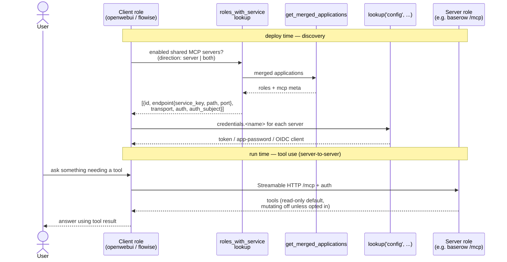

# 025 - MCP Role Integration

> **Revalidation required:** [035 - MCP Proxy Expansion and Application Interconnection](035-mcp-proxy-expansion.md) records the exhaustive 169-role audit and supersedes this document where this document assumes an empty baseline, treats metadata as enforcement, or marks client provisioning and end-to-end authorization complete. Checked items below describe the original implementation slice and MUST NOT be read as proof that the stricter identity, revocation, transport, restart, proxy, and real-tool-call criteria in requirement 035 are complete.

## User Story

As a platform administrator of Infinito.Nexus, I want every role with a documented Model Context Protocol (MCP) surface to expose or consume MCP through the platform's standard service, identity, proxy, and test contracts so that AI clients can use application data and actions safely without one-off per-role wiring.

## Background

MCP is a client-server protocol for connecting AI hosts to external tools, resources, and prompts.
Several roles in this repository deploy applications whose upstream projects document MCP support.
The current tree contains 18 role-local `mcp:` blocks, but metadata presence does not prove endpoint compatibility, least-privilege credentials, application-scoped user authorization, client provisioning, or an end-to-end tool call.

The integration MUST distinguish two directions:

- MCP server roles expose application capabilities through an authenticated MCP endpoint.
- MCP client roles connect to enabled MCP servers and present their tools to users through an AI surface.

The implementation MUST prefer native upstream MCP support.
Plugin, sidecar, or marketplace MCP servers MAY be used only when the upstream project documents them as supported or when the role README documents the risk and the operator explicitly enables the integration.

## Confirmed Decisions

These choices are settled at requirement creation time and bound the implementation. Re-opening any of them MUST be recorded in the implementing PR.

1. **Implementation precedence.** `native` > `plugin` > `sidecar` > `adapter` > `external`. A lower-precedence path is allowed only when the higher one is unavailable or cannot enforce the required security boundary, and the role README documents why. Adapter instances follow requirement 035 and are isolated per provider application or trust domain.
2. **Discovery reuses existing infrastructure.** Client roles discover servers through the existing [`roles_with_service`](../../plugins/lookup/roles_with_service.py) lookup (backed by `utils.cache.applications.get_merged_applications`), extended to filter by `services.mcp.direction` and to surface endpoint metadata. No new generated repository-wide application dictionary is introduced.
3. **Secrets reuse the credentials mechanism.** MCP tokens, app-passwords, and OAuth client secrets are declared in each role's [`meta/schema.yml`](../../roles/web-app-baserow/meta/schema.yml) `credentials:` block and read via `lookup('config', application_id, 'credentials.<name>')`. No new secret store is introduced.
4. **MCP state is a variant axis.** Roles that gain an MCP surface MUST express the enabled/disabled split through `meta/variants.yml` so CI matrix runs cover both states.
5. **Lint reuses the suppression model.** New MCP lint rules live under [`tests/lint/ansible/services/`](../../tests/lint/ansible/services/) and honour the existing `# nocheck:` marker convention (see [suppression docs](../contributing/actions/testing/suppression.md)).
6. **First slice.** The first end-to-end slice is `web-app-baserow` (server) plus `web-app-openwebui` (client).
7. **The role tree is the audit.** Every fact about a role's MCP surface lives in its own `meta/services.yml`; no separate artifact duplicates it.
8. **Every MCP implementation ships a Playwright test.** Each role that gains an MCP surface MUST add a matching Playwright spec under `roles/<role>/files/playwright/` that exercises its MCP surface (a server role's authenticated endpoint, a client role's configured-server list). No MCP role is considered implemented until its Playwright test is present and green.
9. **Authorization subject.** MCP integrations prefer user-scoped authorization. Service-account or administrator-scoped MCP credentials are allowed only for read-only default tool sets, or when the role README documents the upstream limitation and the operator explicitly enables mutating tools.

## Initial Upstream Survey

The following roles have an MCP surface confirmed from upstream or project-owned documentation at requirement creation time.
Each row is an implementation candidate, not proof that the current role already exposes MCP.

| Role | MCP direction | Source | Initial notes |
|---|---|---|---|
| [web-app-openwebui](../../roles/web-app-openwebui/) | Client | [Open WebUI MCP docs](https://docs.openwebui.com/features/extensibility/mcp/) | Native MCP client support requires Open WebUI `v0.6.31+` and uses Streamable HTTP. The role currently pins `version: main`, which MUST be replaced with an explicit MCP-capable tag before MCP is enabled. |
| [web-app-flowise](../../roles/web-app-flowise/) | Client | [Flowise Tools and MCP](https://docs.flowiseai.com/tutorials/tools-and-mcp) | Flowise supports Custom MCP. Production deployment MUST NOT enable arbitrary stdio commands by default. |
| [web-app-nextcloud](../../roles/web-app-nextcloud/) | Server | [Nextcloud Context Agent docs](https://docs.nextcloud.com/server/latest/admin_manual/ai/app_context_agent.html) | The Context Agent app exposes an MCP endpoint below the Nextcloud AppAPI proxy and uses app-password authentication. |
| [web-app-gitlab](../../roles/web-app-gitlab/) | Server | [GitLab MCP server docs](https://docs.gitlab.com/user/gitlab_duo/model_context_protocol/mcp_server/) | GitLab's MCP server is beta and tier-gated to Premium or Ultimate. The role uses GitLab EE, so licensing MUST be operator-gated. |
| [web-app-mattermost](../../roles/web-app-mattermost/) | Server | [Mattermost MCP Server docs](https://docs.mattermost.com/agents/mcpserver/README.html) | The production-safe path MUST follow Mattermost's documented Agents and MCP deployment guidance. |
| [web-app-openproject](../../roles/web-app-openproject/) | Server | [OpenProject MCP Server docs](https://www.openproject.org/docs/system-admin-guide/integrations/mcp-server/) | OpenProject documents an MCP endpoint under `/mcp` and OAuth application setup. |
| [web-app-baserow](../../roles/web-app-baserow/) | Server | [Baserow MCP Server docs](https://baserow.io/user-docs/mcp-server) <!-- nocheck: url — page is live (HEAD+GET 200); baserow.io edge intermittently 404s CI runner IPs --> | Baserow documents a native built-in MCP server. |
| [web-app-jenkins](../../roles/web-app-jenkins/) | Server | [Jenkins MCP Server plugin](https://plugins.jenkins.io/mcp-server/) | Jenkins support is plugin-based and MUST be pinned like other Jenkins plugins. |
| [web-app-moodle](../../roles/web-app-moodle/) | Server | [Moodle MCP plugin](https://moodle.org/plugins/webservice_mcp) | Moodle support is plugin-based and MUST be version-compatible with the pinned Moodle LTS release. |
| [web-app-gitea](../../roles/web-app-gitea/) | Server | [Gitea MCP package](https://pkg.go.dev/gitea.com/gitea/gitea-mcp) | Gitea support appears as a project-owned MCP package. The implementation MUST verify release, packaging, and auth maturity before enabling it. |

The following roles have an upstream MCP path that this deployment cannot use.
Each declares a `services.mcp` block carrying only `blocker`, `source_url` and `notes`, with `enabled` and `shared` false, so the role stays out of discovery while the audit still reports why it is not integrated:

- [web-app-jira](../../roles/web-app-jira/) and [web-app-confluence](../../roles/web-app-confluence/): `blocker: hosted_only`. Atlassian documents the [Rovo MCP Server](https://support.atlassian.com/atlassian-rovo-mcp-server/docs/getting-started-with-the-atlassian-remote-mcp-server/) for Atlassian Cloud only.
- [web-app-wordpress](../../roles/web-app-wordpress/): the `hosted_only` classification is stale. The official WordPress MCP adapter is a plugin candidate and MUST be pinned, source-audited, restricted to reviewed Abilities with permission callbacks, and tested against the deployed WordPress version before the blocker is removed.
- [web-app-odoo](../../roles/web-app-odoo/): `blocker: unreviewed_third_party`. Self-hostable third-party add-ons exist, but no Odoo Core server has been confirmed. A module MUST pass source, license, maintenance, authentication, and per-model/per-operation review before selection.
- [web-app-discourse](../../roles/web-app-discourse/): the `hosted_only` classification is stale. The project-owned server is a pinned HTTP-sidecar candidate that MUST run read-only by default with a restricted User API key and separate client-facing authentication.
- [web-app-openproject](../../roles/web-app-openproject/): `blocker: licence`. The MCP server ships in the product but is Enterprise-only, and upstream's own request specification asserts a 404 on Community Edition, which is what this role deploys.

## Target Schema

### Shared MCP service flag

Every MCP-capable role MUST expose a role-local `mcp` service block in `meta/services.yml`.
The block MUST be absent from roles that have no upstream MCP surface at all. A role whose upstream surface exists but cannot be served by this deployment MUST carry a block declaring `blocker` instead of `direction`, so the audit reports the reason rather than an absence.

```yaml
mcp:
  enabled: false
  shared: false
  direction: server        # server, client, or both
  transport: streamable_http
  exposure: internal       # internal by default; public requires explicit role documentation
  auth: oidc               # oidc, app_password, basic_auth, bearer_token, upstream_session, or none
  auth_subject: user        # user, service_account, administrator, or none
  implementation: native   # native, plugin, sidecar, or external
  source_url: https://example.invalid/docs/mcp
  minimum_version: "1.0"
  notes: Upstream caveats a deployment must respect.
```

Rules:

- `enabled` MUST default to `false` in role defaults. Integrated roles MUST use variants to verify both `enabled=false` and `enabled=true` states.
- The MCP surface ships disabled by default and is independent of the host role's `lifecycle`: a `beta` host role MUST NOT imply that its MCP surface is stable. An MCP surface is only considered validated once its acceptance criteria are met end to end.
- `shared` MUST mean that other Infinito.Nexus roles MAY discover and consume the MCP endpoint through the applications lookup.
- `direction` MUST distinguish MCP clients from MCP servers so client roles can discover only server roles.
- `transport` MUST default to `streamable_http` for server deployments. Stdio MAY exist only for local development and MUST NOT be enabled in a deployed web role by default.
- `exposure` MUST default to `internal`. Public MCP endpoints MUST have explicit authentication, rate limiting, proxy coverage, and README documentation.
- `auth: none` MUST fail lint unless the endpoint is bound to localhost or an internal-only network and the role README documents why authentication is impossible upstream.
- `auth_subject` MUST be `user` where upstream supports per-user authorization. `service_account` and `administrator` MUST keep mutating tools disabled by default.
- `source_url`, `minimum_version` and `notes` MUST carry the upstream provenance of the surface. They live in the role because the role owns them; the audit artifact derives its provenance columns from here and MUST NOT keep a second copy.

### MCP endpoint metadata

Server roles MUST publish enough metadata for client roles and tests to discover the endpoint.
The `endpoint` and `tools` keys below are part of the **same** role-local `mcp` block as the shared service flag above; the two snippets are split only for readability and MUST be merged into one `mcp:` mapping in `meta/services.yml`.

```yaml
mcp:
  endpoint:
    service_key: baserow   # references services.<service_key>
    path: /mcp
    port_key: http        # references services.<service_key>.ports.local.<key>
  tools:
    read_only_default: true
    mutating_tools_enabled: false
```

Rules:

- The endpoint path MUST be relative to the role's canonical HTTPS origin unless the role uses an internal-only sidecar.
- `service_key` MUST name an existing top-level service entry in the same `meta/services.yml`, and `port_key` MUST name an existing key under `services.<service_key>.ports.local`.
- For `implementation: native` exposed under `/mcp` on the role's existing HTTP port, no new port is added. For `implementation: sidecar` or `external`, the role MUST register a dedicated service entry and local port so the central collision check covers it, and MUST NOT reuse the application's primary HTTP port.
- Mutating tools MUST be disabled by default when upstream supports tool filtering or scopes.
- When mutating tools cannot be disabled, the integration MUST require explicit operator opt-in before `mcp.enabled=true`.

### Server metadata (`meta/server.yml`)

MCP changes the role's HTTP surface, so each server role MUST keep its [`meta/server.yml`](../../roles/web-app-baserow/meta/server.yml) contract consistent with the new endpoint.

Rules:

- **Routing.** MCP MUST be served from the role's existing `domains.canonical` origin under the `mcp.endpoint.path`. A dedicated MCP subdomain MUST NOT be added unless upstream cannot serve MCP under a path, in which case the new domain MUST be registered in `domains.canonical` and documented in the role README.
- **Status codes / health.** An authenticated MCP endpoint returns a non-2xx status (e.g. `401`/`406`) to unauthenticated probes. The role MUST NOT let the MCP path break the platform uptime/status-code check: either the health probe targets an unauthenticated `mcp.endpoint.health_path`, or the MCP path is excluded from the canonical `status_codes` check. The chosen approach MUST be explicit in `server.yml`.
- **Networks.** For `implementation: sidecar` or `external`, the MCP container MUST attach to the role's existing `networks.local` subnet and MUST NOT introduce a new top-level network.
- **CSP.** MCP Streamable HTTP runs server-to-server (the client role's backend connects to the server role), so a server role MUST NOT need a new browser `csp` `connect-src` entry for MCP. If an implementation does require a browser-side MCP fetch, the added `connect-src` source MUST be documented in the role README.

### MCP client discovery

Client roles such as `web-app-openwebui` and `web-app-flowise` MUST discover enabled shared MCP server roles through the merged applications data.
They MUST NOT hard-code the candidate list in templates.

The discovery path MUST reuse the existing [`roles_with_service`](../../plugins/lookup/roles_with_service.py) lookup rather than a new template-side scan. That lookup currently selects roles on `services.<name>.{enabled, shared}` and returns `{id, canonical_domain, canonical_url}`. For MCP it MUST be extended so that:

- selection additionally filters on server-capable roles (`direction: server` or `direction: both`), so client roles never offer a client-only role as a target;
- each returned entry also carries the endpoint metadata a client needs to connect, at least `service_key`, `path`, resolved port, `transport`, `auth`, and `auth_subject`, sourced from the role's `mcp.endpoint` block.

The lookup MUST remain backed by `utils.cache.applications.get_merged_applications` and MUST NOT introduce a generated repository-wide application dictionary.

### How it works

A client role discovers enabled shared server roles through the lookup, resolves the per-server credential, then connects server-to-server to each `/mcp` endpoint over Streamable HTTP. No candidate list is hard-coded and no browser-side fetch is involved.



Direction gates the wiring: a `server` role only exposes `/mcp`, a `client` role only consumes, a `both` role does either. Implementation precedence is `native > plugin > sidecar > external`; a `sidecar`/`external` server gets its own service entry and port rather than reusing the app's primary HTTP port.

## Acceptance Criteria

### Repository-wide audit

The audit is the role tree itself: every fact about a role's MCP surface lives in its own `meta/services.yml`, so a separate artifact would be a copy that can go stale. `grep -l '^mcp:' roles/*/meta/services.yml` enumerates the integrated roles.

- [ ] Every role with an `application_id` has an explicit audit disposition as required by requirement 035. Absence of an `mcp` block is not accepted as evidence that the role was reviewed.
- [ ] A role whose upstream path exists but is unreachable here declares the precise blocker instead of being silently absent, and MUST NOT also declare a served surface. Lint enforces both.
- [x] A test asserts that every role declaring a served surface gates it on the role's MCP-enabled flag, so switching MCP off removes the endpoint rather than leaving it reachable.
- [ ] A grep for `mcp` before implementation is recorded in the implementing PR to show the baseline was empty.

### Shared contract

- [x] [`docs/contributing/design/role/services/`](../contributing/design/role/services/) documents the `mcp` service block, its fields, defaults, and allowed values.
- [x] Role-meta lint under [`tests/lint/ansible/services/`](../../tests/lint/ansible/services/) rejects invalid `services.mcp.direction`, `services.mcp.transport`, `services.mcp.exposure`, `services.mcp.auth`, `services.mcp.auth_subject`, and `services.mcp.implementation` values, and honours the `# nocheck:` suppression convention for documented exceptions.
- [x] Role-meta lint rejects `services.mcp.enabled=true` when `services.mcp.auth=none` and `services.mcp.exposure` is not internal-only.
- [x] Role-meta lint rejects `services.mcp.auth_subject` values of `service_account` or `administrator` unless `services.mcp.tools.mutating_tools_enabled=false`, or the role carries an explicit documented exception.
- [x] The [`roles_with_service`](../../plugins/lookup/roles_with_service.py) lookup, extended for `direction in [server, both]` and endpoint metadata, returns the connection data client roles need for enabled shared MCP server roles, without adding a generated repository-wide application dictionary.

### Routing, health & networking (`meta/server.yml`)

- [x] MCP is served under the role's existing `domains.canonical` origin at `mcp.endpoint.path`; any new MCP subdomain is justified by an upstream limitation and registered in `domains.canonical`.
- [x] Enabling MCP does not break the platform uptime/status-code check. That check probes a role's canonical domain, not its individual paths, so an MCP surface mounted below that domain leaves it untouched; no per-endpoint health path is declared, because nothing would read one.
- [x] `implementation: sidecar` or `external` MCP containers attach to the role's existing `networks.local` subnet and add no new top-level network.
- [x] No MCP server role adds a browser `csp` `connect-src` entry unless a browser-side MCP fetch is required and documented in the role README.

### Security contract

- [x] No deployed role launches arbitrary user-provided stdio MCP commands by default.
- [x] Every MCP server endpoint is protected by OIDC, app-password, bearer-token, upstream-session auth, or an explicitly documented internal-only exception.
- [x] MCP credentials follow their origin. A secret this deployment generates (an endpoint key, a shared app secret) is declared in the role's [`meta/schema.yml`](../../roles/web-app-baserow/meta/schema.yml) `credentials:` block and consumed via `lookup('config', application_id, 'credentials.<name>')`. A credential the application itself issues (an API token, a personal access token, an app password) MUST NOT be declared there, because the vault cannot generate it; it is minted against the running instance and persisted through `sys-token-store` under the consuming user. Either way the value is never written into `README.md`, Playwright traces, or non-secret env vars.
- [ ] Every MCP server role documents whether calls execute as the requesting user, a service account, or an administrator, and the implementation verifies the real provisioned identity. The current lookup selects administrator tokens independently of `auth_subject`, so metadata alone does not satisfy this criterion.
- [ ] Every MCP server role declares an application-scoped `mcp` RBAC role, and each client enforces the corresponding server grant. Open WebUI MAY resolve or create its unpredictable local group identifier by group name and apply `access_grants` through the API, but unscoped `roles: [mcp]`, wrong-application membership, last-group removal, and post-restart reconciliation MUST be fixed and tested as defined by requirement 035.
- [ ] Public MCP exposure enforces proxy routing, TLS, request-size, response-size, timeout, concurrency, stream-duration, and rate limits with explicit tested values.
- [ ] Mutating MCP tools are blocked by enforceable upstream scopes or a `tools/call` policy allowlist. A `mutating_tools_enabled: false` metadata value without runtime enforcement does not satisfy this criterion.
- [x] Role READMEs document the data and action surface exposed to MCP clients.

### MCP server roles

- [ ] [web-app-baserow](../../roles/web-app-baserow/) exposes its native MCP server when `services.mcp.enabled=true`, uses a verified least-privilege identity and read-only tool contract, and verifies at least one deterministic tool call through each selected client.
- [ ] [web-app-gitlab](../../roles/web-app-gitlab/) exposes GitLab MCP only when the operator confirms the required tier/license and the endpoint is reachable at the documented self-managed path.
- [x] [web-app-gitea](../../roles/web-app-gitea/) either ships the project-owned MCP server with pinned packaging and authenticated access or is reclassified with a documented blocker.
- [x] [web-app-jenkins](../../roles/web-app-jenkins/) installs and pins the MCP Server plugin, exposes only authenticated Jenkins tools, and documents the tool scope.
- [x] [web-app-mattermost](../../roles/web-app-mattermost/) deploys the documented production-safe Mattermost MCP path and verifies that the endpoint respects Mattermost authentication.
- [x] [web-app-moodle](../../roles/web-app-moodle/) installs a Moodle-version-compatible MCP plugin and verifies token-scoped access through Moodle web services.
- [x] [web-app-nextcloud](../../roles/web-app-nextcloud/) installs and configures the required Nextcloud apps for Context Agent MCP and verifies the AppAPI proxy endpoint with app-password authentication.
- [x] [web-app-openproject](../../roles/web-app-openproject/) carries the `licence-gated` classification with its blocker recorded, because the MCP server ships only in the Enterprise edition while this role deploys Community. It is integrated, with the `/mcp` endpoint behind the role's existing auth model, only once an Enterprise token is an operator-supplied precondition.

### MCP client roles

- [ ] [web-app-openwebui](../../roles/web-app-openwebui/) registers only compatible authorized servers, applies exact application-group grants, and restores connection state and grants after restart with `ENABLE_PERSISTENT_CONFIG=false`.
- [ ] [web-app-flowise](../../roles/web-app-flowise/) uses Flowise 3.1.3's authenticated `/api/v1/custom-mcp-servers` registry for SSE servers, stores custom headers encrypted, authorizes and verifies the expected tools, and provisions a managed flow that executes a deterministic tool. Streamable HTTP requires a proven bridge or source-audited upgrade. Globally disabling `HTTP_SECURITY_CHECK` alone is not an integration.
- [x] Client roles render MCP connection configuration from role metadata and secrets, not from hard-coded role names.
- [x] Client roles whose upstream offers an administrator-visible list of configured MCP servers expose it in Playwright coverage. A client without such a surface instead has its configured servers proven at deploy time, and its README states which of the two applies.

### Ambiguous and external-only roles

- [x] [web-app-jira](../../roles/web-app-jira/) and [web-app-confluence](../../roles/web-app-confluence/) remain disabled for MCP unless a self-hosted Atlassian MCP path is documented or the role explicitly integrates with Atlassian Cloud as an external connector.
- [ ] [web-app-wordpress](../../roles/web-app-wordpress/) is audited for a maintained MCP plugin and is integrated only after the plugin's update cadence, license, authentication, and tool scope are documented.
- [ ] [web-app-odoo](../../roles/web-app-odoo/) is audited for a maintained MCP add-on and is integrated only after the add-on's update cadence, license, authentication, and tool scope are documented.
- [ ] [web-app-discourse](../../roles/web-app-discourse/) is audited against current Discourse guidance before any MCP server is enabled.

### Tests

- [x] Unit or integration tests validate the MCP service schema and reject unsafe defaults.
- [x] Each role that gains an MCP surface expresses the enabled/disabled split as a `meta/variants.yml` axis so the CI matrix exercises both states.
- [ ] For each integrated MCP server role, a role-local or shared MCP smoke test confirms that the endpoint advertises tools only after authentication.
- [ ] For each integrated MCP client role, Playwright verifies the client's MCP surface: the configured server list where the upstream exposes one, otherwise that the client's own API refuses an unauthenticated caller, so the credential the client holds cannot be reached from outside.
- [ ] Every integrated MCP role (server or client) ships a matching Playwright spec under `roles/<role>/files/playwright/` covering its MCP surface, and that spec is green before the role's Acceptance Criterion is marked complete.
- [x] A deployment with `services.mcp.enabled=false` for all roles has no MCP endpoint reachable from the public proxy.
- [ ] A deployment with one MCP server role and one MCP client role executes a deterministic real tool call through the client. Rendering configuration or listing a server does not satisfy this criterion.
- [x] With `services.mcp.enabled=true`, the role's uptime/status-code check still passes, proving the authenticated MCP path does not regress health monitoring.

### Documentation

- [x] Every integrated role README documents the MCP endpoint, auth model, default state, exposed tool categories, and how to disable MCP.
- [x] The role service design docs link to the MCP contract and explain why stdio MCP is not enabled in deployed web roles by default.
- [ ] This requirement file is cross-linked from the implementing PR.

## Validation Apps

The implementation MUST validate the first end-to-end slice with one server role and one client role before sweeping the full candidate set.
The recommended first slice is `web-app-baserow` plus `web-app-openwebui` because both have documented MCP support and avoid license-gated enterprise features.

```bash
INFINITO_APPS="web-app-baserow web-app-openwebui" \
  make deploy-fresh-purged-apps INFINITO_FULL_CYCLE=true
```

After the first slice is green, every integrated role MUST pass its role-local deploy path and any matrix variants affected by MCP.

## Prerequisites

Before starting implementation work, the agent MUST read [AGENTS.md](../../AGENTS.md) and follow all instructions in it.

## Implementation Strategy

1. Create the repository-wide MCP audit and close the classification for every role.
2. Add the shared `services.mcp` schema, the `tests/lint/ansible/services/` lint rules, and the design documentation.
3. Extend the `roles_with_service` lookup for `direction` filtering and endpoint metadata so client roles can discover servers.
4. Implement the smallest end-to-end server plus client slice, preferably `web-app-baserow` to `web-app-openwebui` (pinning Open WebUI to an MCP-capable tag and adding the `mcp` variant axis).
5. Add the shared MCP smoke-test helper and client-side Playwright coverage.
6. Sweep the remaining confirmed server roles one at a time, keeping each role's README, credentials schema, `meta/server.yml` routing/health, and variants aligned.
7. Revisit ambiguous roles only after the confirmed set is green.

## Commit Policy

- The shared schema and first end-to-end slice MAY land together.
- Each additional MCP server role SHOULD land in a focused commit or PR when it can be validated independently.
- The implementing PR MUST not mark any Acceptance Criterion complete until the behavior is verified end to end.
