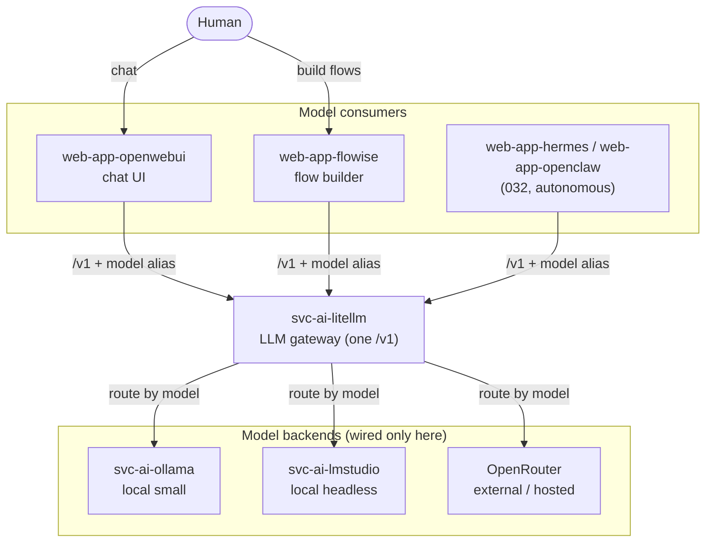

# 031 - LLM Gateway and Model Backends (LiteLLM)

## User Story

As a platform administrator of Infinito.Nexus, I want a single OpenAI-compatible LLM gateway that routes to any model backend (local Ollama, LM Studio, OpenRouter, ...), so that every AI consumer (OpenWebUI, Flowise, and the agent employees in [032](032-agent-employees-firecracker.md)) targets one `/v1` endpoint and I swap or add model backends centrally without touching any consumer.

## Background

AI consumers in this repository each wire their own model provider today: [`web-app-flowise`](../../roles/web-app-flowise/) ships a role-local LiteLLM config, others point directly at [`svc-ai-ollama`](../../roles/svc-ai-ollama/). This duplicates provider wiring and hard-codes backends into consumers.

A single OpenAI-compatible **LLM gateway** ([LiteLLM Proxy](https://docs.litellm.ai/docs/simple_proxy)) fronts every backend: local `svc-ai-ollama`, a new `svc-ai-lmstudio`, OpenRouter, and any other provider LiteLLM supports. Consumers speak only the gateway `/v1` with a model alias; provider selection and routing are gateway config. This requirement promotes the existing Flowise-local LiteLLM pattern to a shared `svc-ai-litellm` role and makes it the one place backends are declared.

This is the **model plane**. The tool plane (MCP) is separate ([025](025-mcp-role-integration.md)); the agent fleet that consumes this gateway is [032](032-agent-employees-firecracker.md).

## Confirmed Decisions

These choices are settled at requirement creation time and bound the implementation. Re-opening any of them MUST be recorded in the implementing PR.

1. **A `svc-ai-litellm` gateway is the single model entrypoint.** It exposes one OpenAI-compatible `/v1` endpoint and routes to backends via its `model_list`. No consumer addresses a provider directly.
2. **`svc-ai-ollama` stays the default local backend behind the gateway.** No new model-serving stack replaces it; it is registered as a `model_list` entry.
3. **A `svc-ai-lmstudio` role is added as a routable backend, x86/GPU node only.** It deploys LM Studio in headless server mode (`lms server`, OpenAI-compatible API) and registers behind the gateway. LM Studio has no arm64 Linux server build, so it MUST be pinned to an x86 (typically GPU) node via placement constraint and MUST NOT be scheduled onto the Raspberry Pi / arm64 agent nodes of [032](032-agent-employees-firecracker.md). LM Studio ships primarily as a desktop GUI; the role MUST use its headless/server mode, and the README MUST document the container caveat (GPU passthrough, licensing/model-download constraints).
4. **Flowise's role-local LiteLLM is refactored into the shared role.** The role-local LiteLLM config and container in `web-app-flowise` (`templates/litellm.config.yaml.j2`, its compose service, related env) are removed; Flowise consumes `svc-ai-litellm` instead. No duplicated LiteLLM deployment remains. Flowise stays green after the refactor.
5. **Consumers carry only gateway URL + model alias.** Switching or adding a backend is a `svc-ai-litellm` config change and MUST NOT require a consumer redeploy.
6. **The gateway is authenticated with per-consumer virtual keys.** LiteLLM virtual keys are issued per consumer (OpenWebUI, Flowise, and each 032 agent); a master key is admin-only. This gives per-consumer rate limiting and revocation. The gateway MUST NOT be reachable unauthenticated even on the internal overlay. Keys live in each consumer role's `meta/schema.yml` `credentials:` block.
7. **`svc-ai-litellm` is headless and internal-only; the admin UI is a separate optional `web-app-litellm` role.** The gateway itself exposes no public domain and no LiteLLM admin UI. A distinct `web-app-litellm` role serves the admin interface behind the proxy with SSO, following the standard `web-app-*` contract. Coupling is asymmetric: `web-app-litellm` REQUIRES the gateway (deploying it forces `svc-ai-litellm` to `enabled: true` + `shared: true`), while `svc-ai-litellm` only OPTIONALLY references the UI (via `group_names`) and runs fine without it.

## Component Roles

Every consumer speaks only the gateway `/v1`; the gateway is the single place backends are wired.

| Component | Role | Interactive? |
|---|---|---|
| [`web-app-openwebui`](../../roles/web-app-openwebui/) | Human chat UI to models (and MCP client per [025](025-mcp-role-integration.md)) | Human, on demand |
| [`web-app-flowise`](../../roles/web-app-flowise/) | No-code builder for LLM apps / agent flows | Human, on demand |
| `web-app-hermes`, `web-app-openclaw` ([032](032-agent-employees-firecracker.md)) | Autonomous agent employees | Autonomous |
| `svc-ai-litellm` | One OpenAI-compatible `/v1`, routes to any backend (headless, internal-only) | — |
| `web-app-litellm` | Optional admin UI for the gateway (proxy + SSO); requires `svc-ai-litellm` | Human, on demand |
| `svc-ai-ollama` | Local small models | — |
| `svc-ai-lmstudio` | Local headless models | — |

## Acceptance Criteria

- [x] A `svc-ai-litellm` role exposes one OpenAI-compatible `/v1` endpoint; its `model_list` routes to at least `svc-ai-ollama`, `svc-ai-lmstudio`, and one external provider (OpenRouter).
- [ ] A `svc-ai-lmstudio` role deploys LM Studio in headless server mode with an OpenAI-compatible API reachable in-cluster, registered behind the gateway.
- [ ] A request to a model alias backed by `svc-ai-lmstudio` returns a completion through the gateway.
- [x] `web-app-flowise` is refactored to consume `svc-ai-litellm`; its role-local LiteLLM config, compose service, and env are removed, no duplicated LiteLLM deployment remains, and Flowise stays green.
- [ ] Switching a consumer's backend requires only a `svc-ai-litellm` config change, verified by re-routing a model alias with no consumer redeploy.
- [ ] The gateway rejects unauthenticated requests; each consumer authenticates with its own LiteLLM virtual key, and revoking one key blocks only that consumer.
- [ ] `svc-ai-litellm` is headless (no admin UI, no public domain); a separate `web-app-litellm` role serves the admin UI behind proxy + SSO, and deploying it forces `svc-ai-litellm` to `enabled: true` + `shared: true`, while the gateway deploys and runs without the UI role.
- [x] `svc-ai-lmstudio` is constrained to an x86 node and is never scheduled onto an arm64/Pi node.
- [ ] The gateway comes up green in both compose and swarm modes.
- [x] A Playwright spec (or equivalent test) verifies a completion round-trips through the gateway.

## Cross-linking

- Implementing PR: _to be linked_.

## See Also

- Agent fleet that consumes this gateway: [032-agent-employees-firecracker.md](032-agent-employees-firecracker.md)
- MCP tool plane: [025-mcp-role-integration.md](025-mcp-role-integration.md)
- Local model backend: [svc-ai-ollama](../../roles/svc-ai-ollama/)
