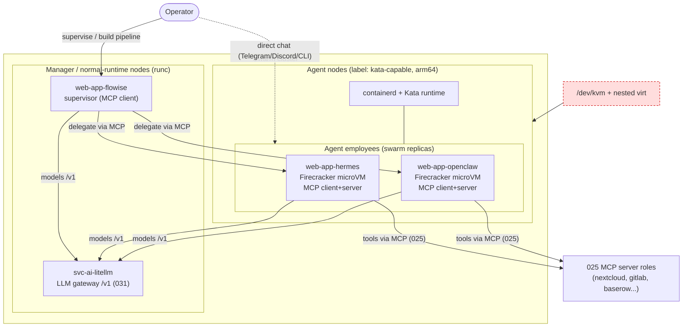
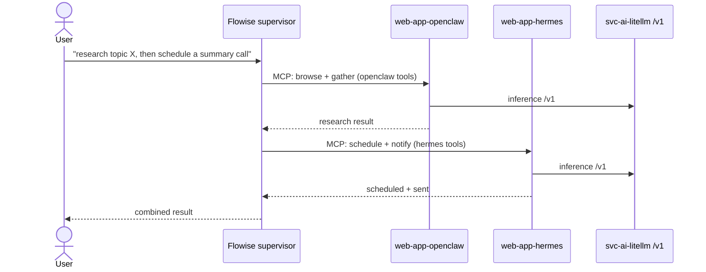
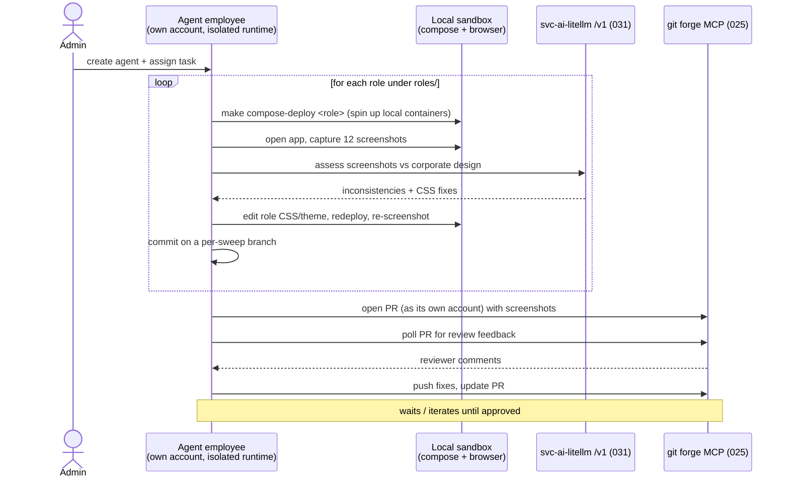
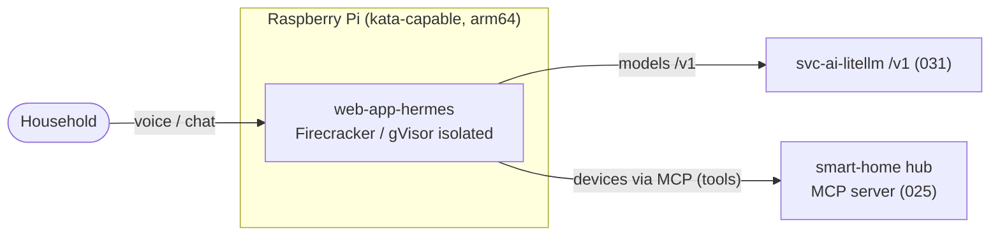
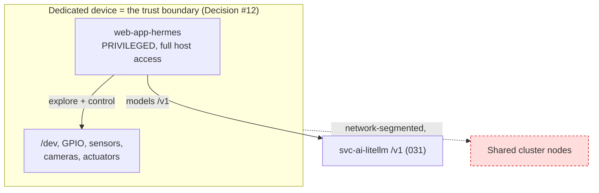
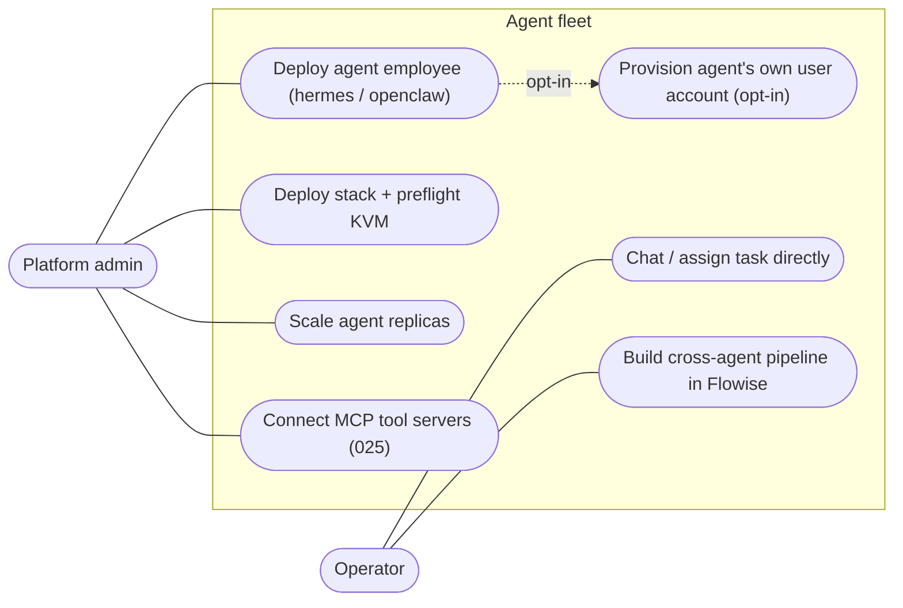
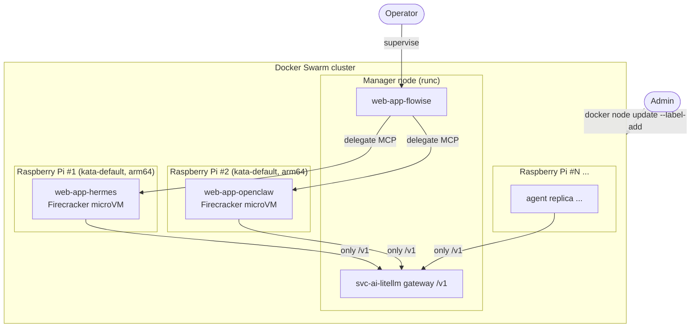

# 032 - Firecracker-Isolated AI Agent Employees with Flowise Supervisor

## User Story

As a platform administrator of Infinito.Nexus, I want to deploy self-hostable AI agent platforms (Hermes Agent, OpenClaw) as Firecracker-isolated, scalable "employees" across my nodes, coordinated by a Flowise supervisor over MCP and routed to models through the [031](031-llm-gateway-model-backends.md) gateway, so that I run a fleet of isolated agents with cross-agent pipelines and kernel-level isolation, without bespoke per-agent wiring.

## Background

The agents are real, self-hostable, open-source platforms, each deployed as its own role:

- **[Hermes Agent](https://hermes-agent.nousresearch.com/)** (Nous Research, MIT). Self-hostable with `local`, `Docker`, `SSH`, `Singularity`, `Modal` backends plus container hardening. Ships an official web dashboard with **self-hosted OIDC** auth (fits the platform SSO), delegates work through **isolated subagents**, has persistent memory, scheduling, vision web browsing, and MCP support (**client since v0.2.0, server since v0.6.0**). Deployed as `web-app-hermes`.
- **[OpenClaw](https://openclaw.ai/)** (open-source, npm/pnpm). Built-in Gateway web dashboard (default port `18789`) plus CLI/TUI, browser control, filesystem sandbox, persistent memory, skills/plugins, and native MCP (`@modelcontextprotocol/sdk`, both client and server). Deployed as `web-app-openclaw`.

Both bring their own agent logic and internal sandboxing. This requirement adds the **isolation and scaling substrate** around them plus a **Flowise supervisor** for cross-agent coordination. Model routing is the [031](031-llm-gateway-model-backends.md) gateway; the MCP tool contract is [025](025-mcp-role-integration.md).

Both platforms run model-generated code, which is untrusted, so a kernel-level boundary is required on top of their in-app sandboxing. [Kata Containers](https://katacontainers.io/) wraps Firecracker behind an OCI runtime, so each agent app stays a normal container spec and only pins `runtime: kata` (Firecracker hypervisor), reusing the existing image pipeline, replicas, healthchecks, and dual-mode machinery. ([E2B](https://github.com/e2b-dev/infra) is the higher-level alternative but brings its own Nomad/Consul orchestration and x86-cloud self-host, which would replace the swarm model; Kata keeps the swarm+Raspberry-Pi story intact.)

Two host- and swarm-level facts constrain the design and are settled below: swarm's stack deploy drops the compose `runtime:` key, and Kata requires `/dev/kvm` (nested virtualization on a virtualized CI runner or Raspberry Pi).

## Confirmed Decisions

These choices are settled at requirement creation time and bound the implementation. Re-opening any of them MUST be recorded in the implementing PR.

1. **Each agent platform is its own role; no generic wrapper.** `web-app-hermes` and `web-app-openclaw` are separate roles reflecting their different stacks (Hermes Docker backend vs OpenClaw npm/pnpm). No speculative "generic agent runner" abstraction. Additional agent platforms become additional roles.
2. **Isolation is Kata + Firecracker on top of in-app sandboxing.** Each agent app runs under `runtime: kata` (Firecracker hypervisor) so untrusted model-generated code is kernel-isolated even if the app's own sandbox is bypassed. No custom VMM, jailer wiring, or bespoke rootfs pipeline. E2B/Beam noted as alternatives in the role README but not adopted.

   No agent needs host access to do agent work: OpenClaw's browser control and filesystem access run inside the guest, and Hermes' subagent execution runs inside the guest, so the agent runtime is fully microVM-isolatable. The only host-level demand is Hermes' web dashboard, which wants `network_mode: host` and a shared host PID namespace solely to display **host** metrics that a microVM cannot expose. That host-monitoring view is severable and MUST NOT pull the agent tier out of the microVM: the agent runtime stays isolated, and the host-metrics dashboard is either run in Hermes' embedded/in-process mode (with reduced host stats) or split out to a separate non-isolated `runc` sidecar.
3. **Swarm parity via node-default runtime.** `docker stack deploy` ignores the compose `runtime:` key. Kata is therefore installed and set as the default (or explicitly selected) containerd runtime on placement-labelled agent nodes; the agent services are pinned there via placement constraint. Compose mode uses the compose `runtime:` key directly on the same image. Both modes MUST reach a running microVM-isolated agent. A dedicated provisioning role (e.g. `svc-virt-kata`) installs kata-containers and gVisor (`runsc`), writes the containerd runtime config, and labels the node; the preflight (Decision #4) only verifies, it never installs.
4. **KVM preflight with a gVisor fallback, never plain containers.** A preflight checks `/dev/kvm` (and nested virtualization when the host is virtualized). When KVM is present, the agent runs under Kata + Firecracker. When KVM is genuinely unavailable, or an agent needs a capability a microVM cannot provide, the agent runtime falls back to **gVisor** (`runtime: runsc`, userspace syscall filtering, no KVM required) which is arm64-friendly. It MUST NOT fall back to a plain `runc` container: unisolated execution of model-generated code is never allowed. The chosen runtime (kata vs runsc) is logged at deploy time.

   This doubles as the CI/hardware split: GitHub-hosted runners expose `/dev/kvm` (since Jan 2024) and real Raspberry Pi / host nodes have KVM, so Firecracker is exercised there; the local `act` path nests through DinD where KVM is not reliably available, so it exercises the gVisor fallback. Both paths keep model-generated code kernel- or syscall-isolated.
5. **Raspberry Pi is a real deploy target.** Agent images MUST be `arm64` and MUST schedule across at least two `kata-capable` worker nodes (Raspberry Pi class). Kata + Firecracker on ARM (Pi 4/5, 64-bit, KVM) is in scope, not aspirational.
6. **Models go through the [031](031-llm-gateway-model-backends.md) gateway.** Each agent's BYO-model config points only at the `svc-ai-litellm` `/v1` + a model alias; it never addresses a provider directly. The Pis run no large models locally; heavy inference is routed to a GPU/external backend by the gateway.
7. **Agents consume tools as MCP clients via the [025](025-mcp-role-integration.md) mechanism.** Hermes and OpenClaw are configured as MCP clients of the repository's MCP server roles over HTTP/SSE (not stdio: under microVM isolation and multi-node placement a stdio subprocess cannot reach an MCP server in another container). Discovery and credentials reuse 025's [`roles_with_service`](../../plugins/lookup/roles_with_service.py) lookup and `credentials:` blocks. Both roles are added to 025's MCP audit as client roles. Only 025's shared contract (the `services.mcp` schema) and the lookup extension are prerequisites for this requirement; 025's audit tooling, full lint set, and baserow+openwebui slice are independent later work.
8. **Flowise cross-agent supervisor is Phase 2, deferred.** The supervisor (Flowise as MCP client delegating to Hermes' MCP-server mode v0.6.0+ and OpenClaw's MCP-server, chaining cross-agent pipelines) is a separate later slice, not the first implementation. Rationale: it depends on the young hermes MCP-server mode and adds a second orchestration tier. The first slice ships each agent standalone; the supervisor design below is retained as the Phase 2 target. Single-agent use MUST always work without Flowise.
9. **Agent dashboards are public behind proxy + Keycloak OIDC.** `web-app-hermes` and `web-app-openclaw` follow the standard `web-app-*` contract: own canonical domain, reverse-proxy routing, SSO enforced via [`web-app-keycloak`](../../roles/web-app-keycloak/). Hermes uses its native self-hosted OIDC support. OpenClaw's native OIDC is unverified upstream: if absent, the dashboard sits behind the platform's standard auth-proxy pattern (SSO enforced at the proxy, OpenClaw's own token auth staying internal-only). No unauthenticated public surface either way.
10. **First slice is dashboard-only.** The first implementation wires each agent through its web dashboard only. Chat-platform connectors (Telegram/Discord/Signal/...), which need operator-supplied bot tokens, are deferred to a follow-up and MUST NOT block the first green deploy.
11. **Agents that spin up containers use nested Docker inside the isolated runtime; host socket passthrough is forbidden.** When an agent needs to run compose workloads (see the scenario below), it runs a nested Docker daemon inside its own Kata/gVisor runtime. Mounting the host `/var/run/docker.sock` into an agent that executes model-generated code is **forbidden**: it grants root-equivalent host control and defeats the entire microVM isolation. Nested Docker costs performance and, on gVisor, may need `runsc` with the appropriate platform; the role README MUST document the overhead. An agent role that requires containers MUST declare this capability explicitly.
12. **Embodied / dedicated-device mode moves the trust boundary to the whole device.** For an agent that owns and explores a single-purpose machine (a robot platform, a home-assistant appliance), the isolation boundary is the entire dedicated node, not a microVM inside it. Privileged/full host access (`/dev`, GPIO, sensors, cameras, host network) is allowed **only** on a node that is dedicated, single-tenant, network-segmented, and explicitly opted in, with the blast radius documented in the role README. It is **forbidden on any shared cluster node**: agents on shared infrastructure always stay under Decision #4 (Kata/gVisor). This is the deliberate exception that keeps the general rule intact rather than a hole in it.
13. **An agent can be provisioned with its own platform user account.** Creating an agent employee optionally provisions a dedicated identity through the platform's existing user mechanism (the `users` lookup, LDAP via [`svc-db-openldap`](../../roles/svc-db-openldap/), SSO via [`web-app-keycloak`](../../roles/web-app-keycloak/)); no new account system is built. The account is a **non-privileged standard user** by default (never administrator/service-account-with-mutating-tools). When enabled, the agent authenticates as its own user: OIDC login to its dashboard, a distinct mailbox/identity, and MCP calls made with `auth_subject: user` ([025](025-mcp-role-integration.md)) scoped to that account rather than a shared service account. The account is opt-in per agent; its password/token lives in the role's `meta/schema.yml` `credentials:` block, never in README or env. An agent MUST also be deployable against an existing account (no forced account creation).

## Architecture

## Flowise Supervisor (cross-agent pipelines) — Phase 2

Deferred to a follow-up slice (Decision #8). Flowise treats each agent as an MCP-exposed sub-agent and chains them. Single-agent use always works directly, without Flowise. Retained here as the Phase 2 target.

## Example Scenario (orientation): corporate-design CSS sweep agent

A concrete end-to-end illustration of how the pieces compose. Nothing here is a new mechanism; it maps onto the decisions above.

**Admin sets it up once:**

1. Deploy an agent employee (`web-app-hermes` or `web-app-openclaw`) with its **own non-privileged account** (Decision #13) provisioned via `users`/LDAP/Keycloak, plus a matching account on the git forge ([`web-app-gitea`](../../roles/web-app-gitea/) / [`web-app-gitlab`](../../roles/web-app-gitlab/)).
2. Grant it three tool surfaces: the git-forge **MCP server** (025) for branches/PRs/review comments, a **local-deploy/exec** capability inside its isolated sandbox (to `make compose-deploy` a role and drive a browser), and its **model alias** via the 031 gateway.
3. Give it the task prompt: "iterate every role, align its CSS to the corporate design, screenshot, open a PR, wait for review".

**The agent then runs autonomously, step by step:**

Key points this scenario pins down:

- **"Spins up local containers"** happens inside the agent's isolated sandbox, which MUST therefore be able to run compose workloads (nested Docker in the microVM, or a scoped Docker socket). This is a real capability constraint the agent role MUST declare; it is exactly the kind of host-near need Decision #4's runtime selection (Kata vs gVisor) has to accommodate.
- **"Created its own account"** = the git-forge identity from Decision #13; the PR is authored by the agent, not a shared bot.
- **"Waits for feedback"** = the agent polls the PR through the git-forge MCP server (025); the human review gate stays human.
- Models, tools, and identity are the three separate planes (031 gateway, 025 MCP, IAM account) meeting in one workflow.

## Example Scenario (orientation): Hermes as an isolated home assistant on a Raspberry Pi

Formalised as its own role in [033-web-app-homeassistant.md](033-web-app-homeassistant.md). Hermes runs on a single Raspberry Pi as a household assistant, kernel-isolated, reachable over voice/chat, controlling home devices through MCP without ever getting host access.

**Setup:**

1. One Pi joins as a `kata-capable` arm64 node; `web-app-hermes` deploys there under Kata + Firecracker (or the gVisor fallback if the Pi lacks KVM, Decision #4).
2. Models route through the 031 gateway: light intents to a small local `svc-ai-ollama`, heavy reasoning to an external backend.
3. Home devices are reached as **MCP tool servers** (025) over HTTP/SSE, e.g. a smart-home hub MCP server. Hermes is an MCP client only; it never touches the Pi host.
4. The dashboard sits behind proxy + Keycloak OIDC (Decision #9); voice/chat connectors are the follow-up (Decision #10).

The point: an assistant with real reach into the home, but the agent runtime stays isolated and the Pi host stays untouched. Capabilities come through MCP tools, not host access.

## Example Scenario (orientation): Hermes as an embodied robot platform (full-access, dedicated device)

The inverse of every other scenario, and deliberately so. Formalised as its own role in [034-svc-ai-robot.md](034-svc-ai-robot.md). Here Hermes is given full rights to explore and drive **one dedicated machine** so it can map its own hardware and act in the physical world: the robot platform idea. This is only coherent under Decision #12.

**Setup:**

1. A **dedicated, single-tenant, network-segmented** device (robot controller / SBC), NOT a shared cluster node. This device is Hermes' body.
2. `web-app-hermes` is deployed there with privileged host access (`/dev`, GPIO, sensors, cameras, host network). The trust boundary is the whole device (Decision #12), so there is no microVM around the agent here.
3. Hermes self-explores: enumerates devices, probes sensors/actuators, maps what the machine can do, then controls it. Models via the 031 gateway; higher-level tools still via MCP (025) where useful.
4. Explicit operator opt-in; the README documents the blast radius (this agent can do anything the device can).

Guardrails that keep this from becoming a hole in the isolation model:

- **Dedicated device only.** Full access is permitted solely on a node whose only tenant is this agent. Forbidden on any shared cluster node (Decision #12).
- **Segmentation.** The device is network-isolated from shared infrastructure; a compromise stays on the device.
- **Explicit, documented opt-in.** Privileged mode is off by default and the README states exactly what the agent can reach.
- **Different class, not a downgrade.** This is embodied-agent deployment, not the shared-infra agent tier relaxing its rules; shared-infra agents stay isolated per Decision #4.

## Use Cases

## Multi-Node Deployment (Raspberry Pi cluster)

Each Raspberry Pi joins the swarm as an agent node labelled `kata-capable` with Kata + Firecracker as its default containerd runtime (Decision #3, applied per node). Flowise and the gateway run on a manager node. Swarm distributes agent replicas across the Pis; adding a Pi adds agent capacity with no code change. The Pis do **not** run large models locally: agents speak only the gateway `/v1`, which routes light work to a small local `svc-ai-ollama` and heavy work to a GPU or external backend. All node-run images MUST be `arm64`.

## Acceptance Criteria

- [ ] A `web-app-hermes` role deploys Hermes Agent and it comes up healthy with at least one connected interface.
- [ ] A `web-app-openclaw` role deploys OpenClaw and it comes up healthy with at least one connected interface.
- [ ] Both agent dashboards are exposed behind the reverse proxy with Keycloak OIDC SSO; no unauthenticated public surface.
- [ ] On a KVM host, both agent roles run under Kata + Firecracker; isolation is verified in-container (Kata/Firecracker markers in the guest, distinct kernel from the host).
- [ ] Where KVM is unavailable (e.g. local `act` through DinD), the agent runs under the gVisor (`runsc`) fallback, never plain `runc`; the chosen runtime is logged at deploy time.
- [ ] The agent runtime stays isolated; any host-metrics dashboard is either embedded or a separate `runc` sidecar and does not force the agent tier out of the isolated runtime.
- [ ] A preflight check verifies `/dev/kvm` (and nested virtualization when the host is virtualized) and selects Kata, else the gVisor fallback, with an actionable log line.
- [ ] The first slice is dashboard-only; no chat-platform connector is required for a green deploy.
- [ ] Agent count scales up and down by changing swarm replicas.
- [ ] Agents run on `arm64` and are scheduled across at least two `kata-capable` nodes (Raspberry Pi class); joining an additional labelled node adds capacity without a code change.
- [ ] Both agents reach inference only through the [031](031-llm-gateway-model-backends.md) gateway (BYO-model config points at `/v1`); switching a backend is a gateway config change, no agent redeploy.
- [ ] Each agent is configured as an MCP client of at least one [025](025-mcp-role-integration.md) MCP server role over HTTP/SSE, and a tool call through that server succeeds; both roles are added to 025's MCP audit.
- [ ] Creating an agent optionally provisions a dedicated platform user account via the existing `users`/LDAP/Keycloak mechanism; the agent authenticates as that account (OIDC dashboard login, MCP `auth_subject: user`), and deploying against an existing account instead also works.
- [ ] An agent that runs container workloads does so via a nested Docker daemon inside its isolated runtime; no agent mounts the host `/var/run/docker.sock`.
- [ ] (Phase 2) Hermes' and OpenClaw's MCP-server mode is enabled; Flowise connects to both as MCP clients and delegates a task to each.
- [ ] (Phase 2) A Flowise supervisor flow runs a cross-agent pipeline that hands a result from one agent to the other and returns a combined output; single-agent use still works without Flowise.
- [ ] Compose mode brings up an isolated agent via the compose `runtime:` key; swarm mode brings up an isolated agent via the node-default Kata runtime on a placement-labelled node. Both modes are green end to end.
- [ ] Each agent role ships a Playwright spec exercising its deployed surface, and both are green.

## Cross-linking

- Implementing PR: _to be linked_.

## See Also

- Model plane (LLM gateway) this depends on: [031-llm-gateway-model-backends.md](031-llm-gateway-model-backends.md)
- MCP tool plane: [025-mcp-role-integration.md](025-mcp-role-integration.md)
- Hermes Agent: [hermes-agent.nousresearch.com](https://hermes-agent.nousresearch.com/)
- OpenClaw: [openclaw.ai](https://openclaw.ai/)
- Firecracker sandbox reference: [E2B infra](https://github.com/e2b-dev/infra)
