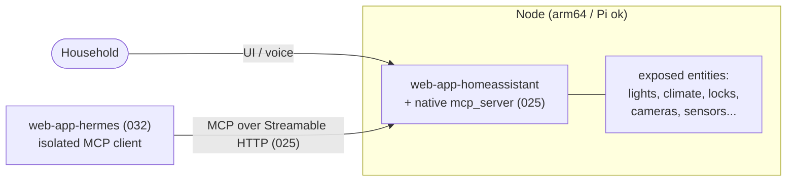

# 033 - Home Assistant Role with MCP Server Surface

## User Story

As a platform administrator of Infinito.Nexus, I want a `web-app-homeassistant` role that deploys [Home Assistant](https://www.home-assistant.io/) and exposes its native MCP server, so that agent employees (Hermes on a Pi, [032](032-agent-employees-firecracker.md)) and other MCP clients can control home devices as scoped MCP tools without any host access, making the "isolated home assistant" scenario concrete.

## Background

Home Assistant is the open-source home-automation platform. It ships a **native Model Context Protocol Server integration** ([`mcp_server`](https://www.home-assistant.io/integrations/mcp_server/)) that implements Streamable HTTP and exposes Home Assistant's Assist API to MCP clients, with per-entity access control (only explicitly exposed entities are reachable). It can control lights, climate, covers, switches, sensors, media players, fans, locks, vacuums, and cameras.

This makes Home Assistant a natural [025](025-mcp-role-integration.md) **MCP server role** and the concrete backend for the isolated-home-assistant scenario in [032](032-agent-employees-firecracker.md): the agent stays kernel-isolated and reaches the home only through this MCP surface, never through host access. Home Assistant runs natively on `arm64`/Raspberry Pi, so it co-locates with the Pi agent story.

## Confirmed Decisions

These choices are settled at requirement creation time and bound the implementation. Re-opening any of them MUST be recorded in the implementing PR.

1. **`web-app-homeassistant` deploys Home Assistant in Container mode.** The role uses the official `home-assistant/home-assistant` container (no Supervisor, no add-on store, not privileged), following the standard `web-app-*` contract (`meta/*`). Add-on management is out of scope; the `mcp_server` core integration does not need the Supervisor.
2. **MCP surface is the native `mcp_server` integration under the [025](025-mcp-role-integration.md) contract.** The role's `meta/services.yml` declares `mcp` with `direction: server`, `implementation: native`, `transport: streamable_http`, served under the role's canonical origin per 025. No third-party MCP add-on is used when the native integration covers the need.
3. **Access is entity-scoped and read-mostly by default.** Only entities explicitly exposed to the Assist API are reachable via MCP. Mutating/actuating tools (locks, covers, switches) are off by default and require operator opt-in, per 025's mutating-tools rule.
4. **Consumers discover it via 025.** Agent clients ([032](032-agent-employees-firecracker.md)) and other 025 client roles reach it through the `roles_with_service` lookup; the endpoint is not hard-coded in any consumer.
5. **Auth caveat is documented.** Home Assistant uses its own auth (users + long-lived tokens + `trusted_proxies`), not full OIDC. The MCP endpoint is authenticated with a Home Assistant credential stored in `meta/schema.yml` `credentials:`; if platform SSO in front of the HA UI is wanted, the trusted-proxy header approach and its limits MUST be documented in the role README.
6. **arm64/Raspberry Pi is supported.** The role runs on `arm64` so it can sit next to the Pi agent from [032](032-agent-employees-firecracker.md).
7. **Exposure is internal-only.** Home Assistant is reachable on the internal/home (or VPN) network only; it is NOT published to a public domain. The agent reaches it in-cluster via MCP. This keeps the attack surface small and matches the typical home-appliance deployment. If a home user later wants remote access, that is a documented follow-up, not the default.

## Architecture

## Acceptance Criteria

- [ ] A `web-app-homeassistant` role deploys Home Assistant in Container mode (no Supervisor/add-ons, not privileged) and it comes up healthy on the internal network; it is not published to a public domain.
- [x] The native `mcp_server` integration is enabled and declared in `meta/services.yml` as `direction: server`, `implementation: native`, `transport: streamable_http`, conforming to the [025](025-mcp-role-integration.md) schema and lint.
- [ ] The MCP endpoint is authenticated; an unauthenticated probe is rejected, and the credential lives in `meta/schema.yml` `credentials:` (never in README/env/traces).
- [ ] Only entities explicitly exposed to Assist are reachable via MCP; mutating tools are off unless the operator opts in.
- [ ] An MCP client (e.g. `web-app-hermes` from [032](032-agent-employees-firecracker.md)) discovers the role via `roles_with_service` and reads an exposed entity's state through MCP.
- [x] The role is added to 025's MCP audit as a `server` role.
- [ ] The role runs on `arm64`.
- [ ] The role comes up green in both compose and swarm modes.
- [x] A Playwright spec exercises the Home Assistant surface and is green.

## Cross-linking

- Implementing PR: _to be linked_.

## See Also

- MCP contract: [025-mcp-role-integration.md](025-mcp-role-integration.md)
- Agent that consumes it (isolated home-assistant scenario): [032-agent-employees-firecracker.md](032-agent-employees-firecracker.md)
- Home Assistant MCP Server: [home-assistant.io/integrations/mcp_server](https://www.home-assistant.io/integrations/mcp_server/)
