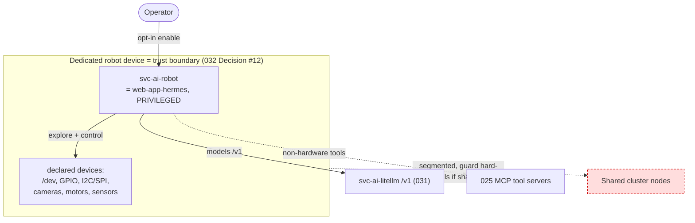

# 034 - Embodied Robot Platform for Hermes (svc-ai-robot)

## User Story

As a platform administrator of Infinito.Nexus, I want a `svc-ai-robot` role that turns one dedicated machine into an embodied platform for Hermes, giving the agent scoped-to-full host access so it can explore its own hardware and act in the physical world, so that Hermes can "come to life" on a robot while this power stays confined to a dedicated, segmented device and never leaks onto shared infrastructure.

## Background

Every other agent deployment in [032](032-agent-employees-firecracker.md) keeps the agent kernel-isolated. This role is the deliberate inverse defined by [032](032-agent-employees-firecracker.md) Decision #12 (embodied / dedicated-device mode): for a robot, the useful trust boundary is the **whole device**, because the agent's job is to drive that device's hardware (GPIO, I2C/SPI sensors, cameras, actuators, motors). A microVM around the agent would only get in the way of the very hardware it is meant to control.

The safety of this design comes entirely from **confinement of the device**, not from confinement of the agent: the machine is dedicated to Hermes, single-tenant, network-segmented, and physically separate from shared infrastructure. `svc-ai-robot` is the role that provisions that device and deploys Hermes on it in privileged mode. It builds on the [`web-app-hermes`](032-agent-employees-firecracker.md) role rather than reimplementing the agent.

## Confirmed Decisions

These choices are settled at requirement creation time and bound the implementation. Re-opening any of them MUST be recorded in the implementing PR.

1. **`svc-ai-robot` deploys Hermes in embodied mode on a dedicated device.** It reuses the `web-app-hermes` agent from [032](032-agent-employees-firecracker.md) and configures it for privileged hardware access. The trust boundary is the device ([032](032-agent-employees-firecracker.md) Decision #12), so no microVM wraps the agent here.
2. **Dedicated, single-tenant, segmented node only.** The role MUST refuse to deploy on a node that carries any shared-workload label or hosts other tenants, and the node MUST be network-segmented from shared infrastructure. This is enforced, not just documented: a placement/preflight guard hard-fails on a shared node.
3. **Hardware access is declared, not blanket-by-accident.** The role exposes a device allowlist (`/dev/*`, GPIO, I2C/SPI, video/camera, serial) that the operator sets; "full access" is an explicit, documented opt-in, not the silent default. The README documents the blast radius: the agent can do anything the granted devices allow.
4. **Control is raw device access plus agent code execution; no robotics middleware is mandated.** Hermes drives the hardware by executing code directly against the granted devices (GPIO/I2C/SPI/serial/video libraries), consistent with its self-exploration. This is the deliberate choice over a ROS2/middleware abstraction: the embodied device is already the trust boundary (there is no microVM here), so the agent runs code on the device itself. A middleware layer MAY be added later per robot but is not required by this role.
5. **Self-exploration is a first-class capability.** Hermes enumerates and probes the granted hardware to build a capability map (which sensors/actuators exist, what they report/do) before or during control, and that map is retrievable.
6. **Models via the [031](031-llm-gateway-model-backends.md) gateway; higher-level tools via [025](025-mcp-role-integration.md) MCP.** Embodiment changes the host boundary, not the model or tool planes: inference still goes through the gateway, and non-hardware tools still come via MCP.
7. **`arm64` robot SBCs are a target.** The role runs on `arm64` single-board computers typical of robotics, not only x86.
8. **Opt-in and off by default.** Privileged embodied mode is never a default; enabling it is an explicit operator action with the guardrails above in force.
9. **Physical safety is the operator's responsibility, and the role MUST say so.** This role does NOT mandate an emergency-stop or motion rate-limits as a platform acceptance criterion. Because an agent driving motors/actuators can cause physical harm, the README MUST prominently warn that hardware safety (e-stop, current/motion limits, fail-safe wiring) is the operator's responsibility and is out of the platform's scope. The role MUST NOT claim any safety guarantee it does not enforce.

## Architecture

## Acceptance Criteria

- [ ] A `svc-ai-robot` role deploys `web-app-hermes` in privileged embodied mode on a dedicated device and it comes up healthy.
- [ ] The role hard-fails (placement/preflight guard) when targeted at a node carrying a shared-workload label or hosting other tenants.
- [x] Hardware access is limited to an operator-set device allowlist; no device outside the allowlist is exposed to the agent.
- [ ] Hermes produces a retrievable capability map of the granted hardware (self-exploration).
- [ ] The agent can read a granted sensor and actuate a granted output through its embodied access.
- [ ] Inference still routes through the [031](031-llm-gateway-model-backends.md) gateway; non-hardware tools still come via [025](025-mcp-role-integration.md) MCP.
- [ ] The role runs on `arm64`.
- [x] Privileged mode is off by default; enabling it is an explicit, documented operator opt-in, and the README states the blast radius.
- [x] The README prominently warns that physical hardware safety (e-stop, motion/current limits, fail-safe wiring) is the operator's responsibility and out of platform scope; the role claims no safety guarantee it does not enforce.

## Cross-linking

- Implementing PR: _to be linked_.

## See Also

- Embodied-mode decision and scenario: [032-agent-employees-firecracker.md](032-agent-employees-firecracker.md)
- LLM gateway: [031-llm-gateway-model-backends.md](031-llm-gateway-model-backends.md)
- MCP tool plane: [025-mcp-role-integration.md](025-mcp-role-integration.md)
