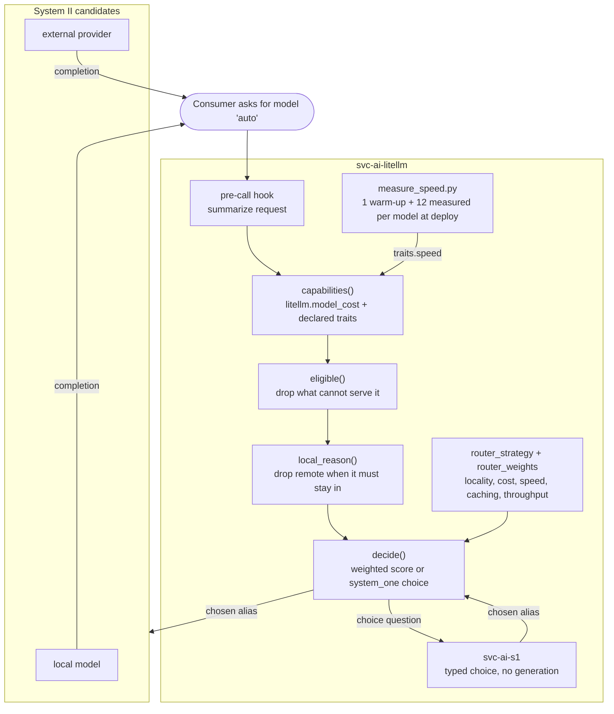

# 038 - System One Model Router

## User Story

As a consumer of the Infinito.Nexus LLM gateway, I want to send a prompt to one alias and have a fast typed decision pick the model that can actually serve it, so that I neither hard-code a model per call site nor pay a large model to answer a question a small one handles.

## Background

[031](031-llm-gateway-model-backends.md) made [`svc-ai-litellm`](../../roles/svc-ai-litellm/) the single place model backends are wired, and consumers now carry a gateway URL plus a model alias. That moved the wiring, not the choice: every consumer still names one alias, and `LITELLM_CHAT_MODEL` in [16_ai.yml](../../group_vars/all/16_ai.yml) resolves it once per deploy for everyone.

That choice is wrong in two directions at once. A prompt that needs a large context window reaches a model that cannot hold it, which is how [`web-app-hermes`](../../roles/web-app-hermes/) answers HTTP 500 when the agent model declares fewer than 64000 tokens. And a one-line factual question reaches whatever the deploy happened to pick, which is usually the largest model available.

Daniel Kahneman's split names the shape. The models behind the gateway are System II: slow, general, token-generating. What is missing is System I: fast, typed, no generation, deciding which System II model answers. TypeSafe released [Jev](https://en.wikipedia.org/wiki/Jev_(AI_model)) on 2026-09-15 as a model of exactly that kind, and [jev-router](https://github.com/prismhq/jev-router) wires one into LiteLLM as a pre-call hook. This requirement takes that shape and keeps the decision deterministic; decision 8 records why.

This is the **routing plane**. The model plane is [031](031-llm-gateway-model-backends.md), the tool plane is [025](025-mcp-role-integration.md), and the agent fleet that benefits most is [032](032-agent-employees-firecracker.md).

## Confirmed Decisions

These choices are settled at requirement creation time and bound the implementation. Re-opening any of them MUST be recorded in the implementing PR.

1. **The router is a LiteLLM pre-call hook, not a semantic router.** The hook summarizes the request, filters the gateway's own model list down to the routes that can serve it, and picks one. LiteLLM's built-in `auto_router` is explicitly rejected: it routes by embedding similarity to example utterances, which answers "what is this about" rather than "which model can serve this", and it pulls in the `semantic-router` extra plus an embedding backend the gateway does not otherwise need.

2. **The hook ships as a mounted Python file, not a derived image.** LiteLLM's `proxy_server.py` resolves a custom handler through `get_instance_fn(value, config_file_path)`, which loads `module.instance` out of the directory holding `config.yaml`. A `.py` file rendered next to it is therefore imported at proxy start with no image change, and `services.litellm.image` stays on its pin. [`probe_auth.py`](../../roles/svc-ai-litellm/files/python/probe_auth.py) is the precedent for a Python file the role ships and the container runs.

3. **The router is an alias beside the default, and it fails loud.** The gateway publishes one additional `model_name` (`auto`). `LITELLM_CHAT_MODEL` and every existing alias keep resolving exactly as they do today, and a consumer opts in by naming `auto`.

   Every path that cannot route rejects the request with its reason instead of answering. The hook returns a string when the proxy has no router or when no served model can take the request, and the proxy turns that into a `RejectedRequestError` carrying the text. The alias's own `model_list` entry exists only so the name is listable and carries `mock_response: litellm.InternalServerError`, so reaching it at all raises. Both halves matter, because a router that silently served whatever was first would hide its own failure behind a plausible reply, and the alias exists precisely so callers do not have to know which model answered.

4. **The alias is the switch.** `services.litellm.router_alias` defaults to `auto`; setting it empty publishes no route and renders no `callbacks` entry, so the hook is not even a condition of starting the proxy. One knob, because a separate enable flag would let `services.yml` read as on while the router is off.

5. **Eligibility is read from LiteLLM's own catalog; a declaration is the override.** The image ships `model_prices_and_context_window_backup.json`, 1595 models deep, carrying `max_input_tokens`, `supports_vision`, `supports_function_calling` and `input_cost_per_token`. The hook reads a route's capabilities from `litellm.model_cost`, keyed on the route's own `litellm_params.model` and then on that name without its first segment, because `ollama/llama3` is filed prefixed while `openai/gpt-4o-mini` is filed as `gpt-4o-mini`. It never probes a backend at request time.

   A model entry MAY still carry a `traits` mapping (`vision`, `tools`, `max_output`, `cost`), and it wins over the catalog. That is for what the catalog does not know: `openrouter/auto`, the mock, and a local tag such as `ollama/qwen2.5:0.5b` that is absent although its family is present. `context` keeps its existing home on the entry, feeds `AI_MODEL_CONTEXTS` and `num_ctx`, and outranks the catalogued window.

   Declaring what the catalog already states is forbidden, because it duplicates a fact this project does not own and rots silently in the dangerous direction: a stale `supports_vision` keeps a model eligible for requests it can no longer serve. Cost is not declared either. Whether a route is free follows from what it is: a route with an `api_base` or a `mock_response` is served by this deployment and costs nothing, and a keyed route the catalog does not price sorts behind every route it does.

   A capability neither catalogued nor declared counts as absent, and a limit neither catalogued nor declared is not enforced.

   The hook reads every catalogued field a request can act on, not a chosen few: the context window and output cap, `supports_vision`, `supports_function_calling`, `supports_tool_choice`, `supports_parallel_function_calling`, `supports_response_schema`, `supports_pdf_input`, `supports_audio_input`, `max_images_per_prompt`, `supports_system_messages`, `mode`, `deprecation_date`, both per-token prices, `supports_prompt_caching` and `tpm`.

   Two polarities govern them, and mixing them up routes silently wrong. A capability the request **demands** must be proven, because such a flag is catalogued wherever it exists: an absent `supports_vision` means no vision, and the route is dropped only when the request carries an image. A **disqualifier** acts on explicit evidence only, because silence is the norm for it: 256 of 1595 entries carry `supports_system_messages` at all and a local tag is catalogued not at all, so reading silence as denial would drop nearly every route. A model is therefore excluded only when the catalog states a non-chat `mode`, denies system messages outright, or gives a `deprecation_date` already past.

   Three of those are live rather than theoretical. 314 of the 1595 entries are not chat models, so without the `mode` filter an embedding model in the `model_list` is a valid candidate that fails at the backend. 53 of the 54 dated entries are already past their deprecation date. And the catalog ships a `sample_spec` documentation stub whose `mode` and `deprecation_date` are prose, so only an ISO date counts and anything else reads as undated.

6. **Variant 1 of `svc-ai-ollama` serves three models with different windows.** A router is only observable when the routes differ in something the request can demand. Variant 1 therefore preloads `qwen2.5:0.5b`, `smollm2:135m` and `llama3.2:1b` with declared windows of 4096, 16384 and 65536. A declared window below what the tag supports is deliberate: it bounds the KV cache, and it is the number the filter reads.

   The CLI probe sizes its prompt off the smallest declared window, so the model holding that window is the one the request must exclude, and the model that answers instead is what shows the filter ran. `smollm2:135m` is deliberately not the smallest: `8dbdd31b22` measured it running to `n_gen=22011` with context shifts at `n_left=4091`, and a route's `max_tokens` is a default a consumer can override rather than a cap, so it is kept away from the window at which it was seen to run away.

   Variant 0 preloads nothing and the gateway serves its mock, so none of this costs anything in the rounds that are not about serving.

7. **A request stays inside the deployment while a local model can serve it.** A prompt can carry a credential, so locality is its own rank above price rather than a consequence of local models happening to be free. `services.litellm.router_remote_fallback` defaults to `false`: while any local route is deployed, a request no local model can take is refused with its reason instead of reaching a third party, and the refusal names the switch that would allow it. With no local route deployed the rule does not apply, because there would be nothing to hold the request on.

   A structured secret in the prompt forces the same restriction even when the switch is on. Only unambiguous shapes count (PEM headers, `sk-`, `ghp_`, `github_pat_`, `AKIA`, `xox[bapsr]-`, `AIza`); a pattern like `password=` would match prose and teach callers to click past the refusal. This is a second lock and not the guarantee, because any such pattern has false negatives. The guarantee is that this restriction is a filter applied before any ranking: a restricted request has no remote candidate left to rank, whatever weight locality carries in decision 9.

8. **The decision is deterministic, and a learned decision model is out of scope.** Among the routes that survive the filter, each is scored on the factors of decision 9 and the highest scorer wins, with the alias breaking a tie. The same request therefore returns the same model twice. No inference runs, nothing is downloaded, and the CI rows mean the same thing as production.

   **This decision was reversed.** A System One *model* was weighed and rejected here on the ground that the filter in decision 5 already leaves one to three candidates, so a model choosing between two that can both answer buys accuracy nobody can measure while adding a container, a checkpoint and a second thing that can be down when the gateway starts. The operator reversed it: [`svc-ai-s1`](../../roles/svc-ai-s1/) now serves that decision under decision 11's `system_one` strategy.

   What the rejection got right still holds and is now a cost rather than an argument. jeff ships no container image, so the role builds one from a pinned commit. It answers over a 575M GLiFormer encoder, so it carries a checkpoint. And the `auto` alias now depends on a service that can be unavailable, which is why an unreachable decider rejects loudly instead of falling back.

   What the rejection got wrong was the reach of its last point. A learned decider does make a CI row speak less directly for production, but only for the rounds that deploy it; the `weighted` strategy still decides every round that does not, and it remains reproducible.

   The remaining reproductions of Jev, [open-alternative-jev](https://github.com/ikermoel/open-alternative-jev) on any open-weights model and OpenJev on DiffusionGemma 26B-A4B, are not used.

9. **How much each factor counts is a number in `services.yml`, between 0 and 1.** `services.litellm.router_weights` carries one weight per factor: `locality`, `cost` and `speed`. Each factor is scaled to 0..1 *inside the candidate set* before its weight applies, because the raw units do not compare - a per-token price is a millionth of a cent and a rate is tens of tokens per second. A factor whose value is identical across the set scores every route 1 and therefore decides nothing, rather than ranking on a rounding artefact.

   The factors are `locality`, `cost`, `speed`, `caching` and `throughput`. `cost` is the expected bill for this request, input price times estimated input tokens plus output price times requested output, because ranking on the input price alone reads the cheaper half: an output token commonly costs several times an input one, and a short prompt with a long answer inverts the order the input price suggests. `caching` prefers a route that can reuse a cached prefix, which is the largest real saving for an agent with a stable system prompt. `throughput` reads the catalogued `tpm`, the only quota the catalog carries.

   The shipped weights are `locality: 1.0`, `cost: 0.4`, `speed: 0.25`, `caching: 0.15`, `throughput: 0.1`, and the constraint behind them is that locality **exceeds** the sum of the others, so no combination of the rest outscores staying in the cluster. That is a preference, not the protection: decision 7's restriction removes remote candidates before this runs, which is why a weighting that sends everything to the cheapest provider still cannot send a credential there.

   Weights are a preference because the operator is the only one who knows what this deployment is for. A cluster whose local models are toys wants `speed` high; a cluster billing a provider per token wants `cost` high; a cluster handling client data leaves `locality` where it is. Encoding one of those as the rule would be this project guessing.

10. **Speed is measured at deploy time, not declared, and only for a model that has no rate yet.** A rate is a property of this machine under this load, not of the model, so no catalogue carries one and a hand-written number in `services.yml` would be a guess that rots. After the gateway is warm, [measure_speed.py](../../roles/svc-ai-litellm/files/python/measure_speed.py) asks it which models it serves and sends one warm-up request plus `services.litellm.router_speed_samples` (12) measured requests to each unranked one, taking their median as output tokens per second. The warm-up is discarded at every setting, including a one-sample run: a rate that still carries the model load time ranks a small model below a larger one, and the router then routes on that inversion.

    A model that already carries a rate is not measured at all. Re-measuring everything on every deploy would send traffic whose result the tolerance below discards anyway, and that traffic is the entire live surface of this step: it is what can hang, what can fail the deploy, and what the deploy waits for. `services.litellm.router_speed_remeasure` discards the stored numbers once, for the case where the hardware under them changed.

    The result is stored on the stack host and rendered back into `model_info.traits.speed` on the same deploy, so the gateway restarts once with the numbers it just produced. A re-measured rate that moved less than 10% keeps its stored value, because no two runs measure the same machine and an unclamped result would restart the gateway for nothing. A model the measurement could not reach keeps its stored rate rather than losing it, so one bad minute does not unrank a model against its peers.

    Two budgets bound the step. A measured request may take `services.litellm.router_speed_timeout` (60s); the discarded first request gets `services.litellm.upstream_timeout` instead, because it pays the model load and holding it to the sample budget would time out exactly the models worth measuring. A request that exceeds its budget raises, which abandons that model rather than the deploy.

    Every matrix variant overrides the sample count to 1. At that setting the single sample is kept rather than discarded as cold, because what a CI round proves is that the measurement, the store and the re-render ran, not what the rate was on a shared runner.

    A declared `traits.speed` still wins, because a declaration is the operator overriding the measurement and the next deploy must not overwrite it back.

11. **Two strategies decide among the survivors, and `services.litellm.router_strategy` picks one.** Both run behind the same filter and behind decision 7's locality restriction; they differ only in what ranks the routes that are left.

    `weighted` is decision 9's score. It ranks on standing preferences and, once the filter has run, ignores the prompt entirely: the same candidate set returns the same winner whatever was asked. The name is the mechanism, and it names its own configuration: `router_strategy: weighted` is the strategy that reads `router_weights`, which `system_one` ignores.

    `system_one` puts the choice to [`svc-ai-s1`](../../roles/svc-ai-s1/). The surviving candidates become the options of a single `choice` question and the prompt becomes the state it classifies, so the decision reads what the request is about rather than only how large it is. An option the router did not offer is refused rather than routed to, because the filter excluded the others for a reason.

    Neither strategy is chosen by hand. `services.litellm.router_strategy` derives from `services.jeff.enabled`: with the System One service deployed the gateway asks it, and without it there is nothing to ask, so the gateway falls to the strategy it can compute itself. Reading the service flag rather than `group_names` keeps one path from the deployment to the behaviour.

    A jeff that cannot be reached rejects the request. It is not routed around, because the caller named an alias precisely so it would not have to know which model answered, and substituting a different decider would make that answer mean something else.

12. **Variant 2 of `svc-ai-litellm` carries `system_one` on three mocks, and no fourth variant is added.** The strategy is only observable when the routes differ in the one thing it ranks on, so that variant publishes mocks with windows of 4096, 16384 and 131072. Mocks pull no model and cost no wall clock, and they carry no measured rate, so nothing but the window separates them and the round tests exactly the axis the strategy adds. `mock/deterministic` keeps its name and its 131072 window, because the agent broker runs its agents on it in every round.

    The order of those mocks is load-bearing and the router is not what reads it. `AI_AGENT_MODEL` takes `AI_MOCK_ALIASES | first`, so the mock declared first becomes the agent broker's model and its window becomes the context the broker gates platforms on. Declaring the 4096 mock first withheld `hermes`, whose `min_context` is 64000, and the broker's CLI test failed with the reason spelled out. The widest mock therefore leads. A sharper fix would be to have `AI_AGENT_MODEL` pick the mock with the largest declared context instead of the first one, which would make the order irrelevant.

    Variant 2 also pins `services.jeff.enabled` true, which is what selects the strategy and what `test_bond_baseline` requires of a loose-bond partner: a service nothing ever enables is a service nothing ever tests. Variant 1 keeps `weighted` with three real models, so each strategy owns one observable round.

    A fourth variant was built first and then withdrawn: `tests/integration/roles/meta/variants/test_limit.py` caps a role at three, on the stated ground that variants exercise dynamic-flag polarities rather than enumerate features, and the `# nocheck: variant-limit` escape would have been a suppression bought to keep a design that fits in three anyway.

13. **A declared window is an upper bound the backend honours, and the token demand is a floor.** Two numbers guard the same decision from opposite sides, and each was wrong in the direction that hid the other. `smollm2:135m` was declared at 16384 against a trained `max_position_embeddings` of 8192 with no rope scaling, so Ollama clamped `num_ctx` and then truncated the prompt to half the window, which is the `n_left=4091` recorded in `8dbdd31b22`. Meanwhile `CHARS_PER_TOKEN = 3` was justified as erring high, but the router's own probe builds its oversized prompt from `"x "`, which tokenizes at two characters per token: 16384 characters are 8193 real tokens on all three served tokenizers against an estimate of 5461.

    Neither correction works alone, which is why both ship. Declaring 8192 while still estimating 5461 leaves the model eligible; estimating 8192 while still declaring 16384 does the same. Together the demand becomes 8192 plus the 16 output tokens, which exceeds the honest window and excludes the route. The constant is therefore `services.litellm.router_min_chars_per_token`, named as a floor rather than an average, and it is rendered into both the hook and the probe so the two cannot drift.

    The probe's own check was vacuous beside this: it compared a declared window against an estimated demand, both produced by this deployment, so it structurally could not observe a declaration the backend does not honour. It now also reads `usage.prompt_tokens` from the answer, the one number in the exchange that the backend produced.

## Component Roles

The router sits inside the gateway. No consumer learns a second endpoint.

| Component | Role | Interactive? |
|---|---|---|
| [`web-app-openwebui`](../../roles/web-app-openwebui/) | Human chat UI, may select `auto` like any other model | Human, on demand |
| `web-app-hermes`, `web-app-openclaw` ([032](032-agent-employees-firecracker.md)) | Autonomous agents, benefit most from capability filtering | Autonomous |
| [`svc-ai-litellm`](../../roles/svc-ai-litellm/) | Hosts the pre-call hook; publishes the `auto` alias | - |
| [`svc-ai-ollama`](../../roles/svc-ai-ollama/), [`svc-ai-lmstudio`](../../roles/svc-ai-lmstudio/), OpenRouter | System II candidates, unchanged by this requirement | - |

## Where each guarantee is enforced

| Guarantee | Enforced by |
| --- | --- |
| The `auto` alias exists and every other alias still resolves | [test_config_model_list.py](../../tests/unit/python/roles/svc-ai-litellm/templates/test_config_model_list.py), and the role's own routing probe on every deploy |
| The callback names the file the role mounts | the same test, reading the target out of [meta/volumes.yml](../../roles/svc-ai-litellm/meta/volumes.yml) rather than repeating it |
| A gateway with no router alias loads no hook | the same test |
| The alias raises rather than serving a default | the same test |
| A request whose demands exceed a model's capabilities never reaches it | [test_router_hook.py](../../tests/unit/python/roles/svc-ai-litellm/templates/test_router_hook.py), against an injected catalog |
| A declaration wins over the catalog, and an uncatalogued route claims nothing | the same test |
| The decision repeats for the same request | the same test |
| A request stays local while a local model can serve it, switch or not | the same test, over the switch and over a prompt carrying a secret |
| Speed decides among equal-cost routes, and unknown does not count as fast | the same test |
| Each factor carries the weight `services.yml` gives it, and a zero weight removes it | the same test, rendering the hook with the shipped weights and with a single-factor one |
| No weighting sends a restricted request out of the cluster | the same test, weighting speed alone with the fallback switch on |
| The shipped weights keep locality worth at least the other factors combined | the same test, reading them out of [meta/services.yml](../../roles/svc-ai-litellm/meta/services.yml) rather than repeating them |
| A measured rate reaches `traits.speed`, and a declared one outranks it | [test_config_model_list.py](../../tests/unit/python/roles/svc-ai-litellm/templates/test_config_model_list.py) |
| The cold first sample is discarded, one slow sample does not move the median, and an unreachable model keeps its rate | [test_measure_speed.py](../../tests/unit/python/roles/svc-ai-litellm/files/test_measure_speed.py) |
| A model that already carries a rate sends no request, and the remeasure switch sends them again | the same test |
| An embedding model, a deprecated model and a model that denies system messages are never routed to | [test_router_hook.py](../../tests/unit/python/roles/svc-ai-litellm/templates/test_router_hook.py), against an injected catalog |
| A demanded capability must be proven, while a disqualifier needs explicit evidence | the same test, over an uncatalogued local route and a catalogued embedding one |
| A prose deprecation value is not read as a date | the same test, modelling the catalog's `sample_spec` stub |
| The expected bill counts the output price, and a long answer can invert the input-price order | the same test |
| `system_one` routes to the alias jeff chose, and `weighted` does not read the prompt at all | the same test, over one route set and both strategies, with jeff stubbed |
| The candidates become the choice options and the prompt becomes the state | the same test |
| A prompt above the server's state limit is truncated rather than rejected as a routing failure | the same test |
| An option the router never offered is refused | the same test |
| An unreachable decider rejects rather than falling back to another one | the same test |
| The cold first request gets the longer budget, and a single-sample run keeps its one measurement | the same test |
| The alias is served and is not read as a route without a backend | [probe.py](../../roles/svc-ai-litellm/files/test/probe.py), run on every gateway deploy |
| The alias routes rather than falling back, proven by the model that answers | [probe.py](../../roles/svc-ai-litellm/files/test/probe.py), on every gateway deploy that serves more than one declared window |
| A consumer selecting `auto` receives a completion | [test-system-one-router.js](../../roles/web-app-openwebui/files/playwright/test-system-one-router.js) |

## Acceptance Criteria

- [x] `svc-ai-litellm` publishes an additional `auto` alias, and every alias that resolved before this change still resolves after it.
- [x] The pre-call hook is a Python file the role renders next to `config.yaml` and LiteLLM imports by `module.instance`; `services.litellm.image` and its pinned version are unchanged.
- [x] A gateway that publishes no router alias renders no `callbacks` entry and does not load the hook, and `services.litellm.router_alias` is the only switch.
- [x] A request the router cannot serve is rejected with the reason, and the alias's own route raises rather than answering from a default.
- [x] The hook excludes a candidate whose capabilities cannot serve the request (context window, vision, tools, output length), reading them from LiteLLM's catalog and letting a declared `traits` mapping override it.
- [x] A model entry declares none of what the catalog already states, and a route's price follows from whether it is local, mocked or keyed.
- [x] The same request picks the same model twice, with no inference and no download on any path.
- [x] Every routing factor carries a 0..1 weight in `services.litellm.router_weights`, a zero weight removes the factor, and no weighting lets a restricted request reach a remote model.
- [x] The hook reads every catalogued field a request can act on, a demanded capability is proven before use, and a disqualifier fires only on explicit evidence.
- [x] `services.litellm.router_strategy` derives from `services.jeff.enabled` and selects `weighted` or `system_one`, and the two return different models for the same candidate set.
- [ ] `svc-ai-s1` builds, serves `/healthz`, and answers the gateway's choice question with an alias the router offered.
- [ ] Variant 2 deploys with three mocks of distinct windows and `system_one`, and the routing probe shows the choice following the prompt.
- [ ] The deploy sends `services.litellm.router_speed_samples` requests to each served model, and the measured rates reach `model_info.traits.speed` in the rendered config on the same deploy.
- [x] The routing probe treats the alias as served rather than as a route without a backend, and fails when the gateway withholds it.
- [ ] A request naming `auto` returns a completion whose served model is one of the eligible candidates, verified through the gateway with a consumer virtual key. The CLI probe sends a prompt the smallest declared window cannot hold and fails when the answer names the alias itself or a model whose window is too small.
- [ ] A Playwright spec verifies that selecting `auto` in Open WebUI returns an answer.
- [ ] The routing path comes up green in both compose and swarm modes.

## Cross-linking

- Implementing PR: *to be linked*.

## See Also

- Model plane this builds on: [031-llm-gateway-model-backends.md](031-llm-gateway-model-backends.md)
- Agent fleet that consumes the gateway: [032-agent-employees-firecracker.md](032-agent-employees-firecracker.md)
- MCP tool plane: [025-mcp-role-integration.md](025-mcp-role-integration.md)
- Upstream shape this follows: [jev-router](https://github.com/prismhq/jev-router)
