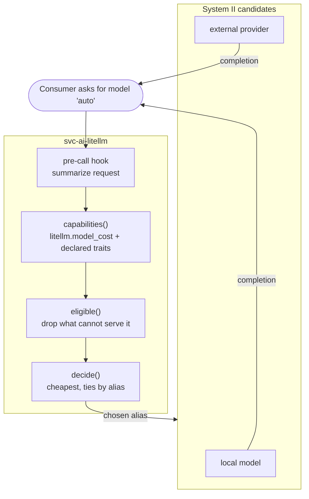

# 038 - System One Model Router

## User Story

As a consumer of the Infinito.Nexus LLM gateway, I want to send a prompt to one alias and have a fast typed decision pick the model that can actually serve it, so that I neither hard-code a model per call site nor pay a large model to answer a question a small one handles.

## Background

[031](031-llm-gateway-model-backends.md) made [`svc-ai-litellm`](../../roles/svc-ai-litellm/) the single place model backends are wired, and consumers now carry a gateway URL plus a model alias. That moved the wiring, not the choice: every consumer still names one alias, and `LITELLM_CHAT_MODEL` in [16_ai.yml](../../group_vars/all/16_ai.yml) resolves it once per deploy for everyone.

That choice is wrong in two directions at once. A prompt that needs a large context window reaches a model that cannot hold it, which is how [`web-app-hermes`](../../roles/web-app-hermes/) answers HTTP 500 when the agent model declares fewer than 64000 tokens. And a one-line factual question reaches whatever the deploy happened to pick, which is usually the largest model available.

Daniel Kahneman's split names the shape. The models behind the gateway are System II: slow, general, token-generating. What is missing is System I: fast, typed, no generation, deciding which System II model answers. TypeSafe released [Jev](https://en.wikipedia.org/wiki/Jev_(AI_model)) on 2026-09-15 as a model of exactly that kind, and [jev-router](https://github.com/prismhq/jev-router) wires one into LiteLLM as a pre-call hook. This requirement takes that shape and keeps the decision deterministic; decision 7 records why.

This is the **routing plane**. The model plane is [031](031-llm-gateway-model-backends.md), the tool plane is [025](025-mcp-role-integration.md), and the agent fleet that benefits most is [032](032-agent-employees-firecracker.md).

## Confirmed Decisions

These choices are settled at requirement creation time and bound the implementation. Re-opening any of them MUST be recorded in the implementing PR.

1. **The router is a LiteLLM pre-call hook, not a semantic router.** The hook summarizes the request, filters the gateway's own model list down to the routes that can serve it, and picks one. LiteLLM's built-in `auto_router` is explicitly rejected: it routes by embedding similarity to example utterances, which answers "what is this about" rather than "which model can serve this", and it pulls in the `semantic-router` extra plus an embedding backend the gateway does not otherwise need.

2. **The hook ships as a mounted Python file, not a derived image.** LiteLLM's `proxy_server.py` resolves a custom handler through `get_instance_fn(value, config_file_path)`, which loads `module.instance` out of the directory holding `config.yaml`. A `.py` file rendered next to it is therefore imported at proxy start with no image change, and `services.litellm.image` stays on its pin. [`probe_auth.py`](../../roles/svc-ai-litellm/files/python/probe_auth.py) is the precedent for a Python file the role ships and the container runs.

3. **The router is an alias beside the default, and it fails loud.** The gateway publishes one additional `model_name` (`auto`). `LITELLM_CHAT_MODEL` and every existing alias keep resolving exactly as they do today, and a consumer opts in by naming `auto`.

   Every path that cannot route rejects the request with its reason instead of answering. The hook returns a string when the proxy has no router or when no served model can take the request, and the proxy turns that into a `RejectedRequestError` carrying the text. The alias's own `model_list` entry exists only so the name is listable and carries `mock_response: litellm.InternalServerError`, so reaching it at all raises. Both halves matter, because a router that silently served whatever was first would hide its own failure behind a plausible reply, and the alias exists precisely so callers do not have to know which model answered.

4. **The alias is the switch.** `services.litellm.router_alias` defaults to `auto`; setting it empty publishes no route and renders no `callbacks` entry, so the hook is not even a condition of starting the proxy. One knob, because a separate enable flag would let `services.yml` read as on while the router is off.

5. **Eligibility is read from LiteLLM's own catalog; a declaration is the override.** The image ships `model_prices_and_context_window_backup.json`, 1595 models deep, carrying `max_input_tokens`, `supports_vision`, `supports_function_calling` and `input_cost_per_token`. The hook reads a route's capabilities from `litellm.model_cost`, keyed on the route's own `litellm_params.model` and then on that name without its first segment, because `ollama/llama3` is filed prefixed while `openai/gpt-4o-mini` is filed as `gpt-4o-mini`. It never probes a backend at request time.

   A model entry MAY still carry a `traits` mapping (`vision`, `tools`, `max_output`, `cost`), and it wins over the catalog. That is for what the catalog does not know: `openrouter/auto`, the mock, and a local tag such as `ollama/qwen2.5:0.5b` that is absent although its family is present. `context` keeps its existing home on the entry, feeds `AI_MODEL_CONTEXTS` and `num_ctx`, and outranks the catalogued window.

   Declaring what the catalog already states is forbidden, because it duplicates a fact this project does not own and rots silently in the dangerous direction: a stale `supports_vision` keeps a model eligible for requests it can no longer serve. Cost is not declared either. Whether a route is free follows from what it is: a route with an `api_base` or a `mock_response` is served by this deployment and costs nothing, and a keyed route the catalog does not price sorts behind every route it does.

   A capability neither catalogued nor declared counts as absent, and a limit neither catalogued nor declared is not enforced.

6. **Variant 1 of `svc-ai-ollama` serves three models with different windows.** A router is only observable when the routes differ in something the request can demand. Variant 1 therefore preloads `qwen2.5:0.5b`, `smollm2:135m` and `llama3.2:1b` with declared windows of 4096, 16384 and 65536. A declared window below what the tag supports is deliberate: it bounds the KV cache, and it is the number the filter reads.

   The CLI probe sizes its prompt off the smallest declared window, so the model holding that window is the one the request must exclude, and the model that answers instead is what shows the filter ran. `smollm2:135m` is deliberately not the smallest: `8dbdd31b22` measured it running to `n_gen=22011` with context shifts at `n_left=4091`, and a route's `max_tokens` is a default a consumer can override rather than a cap, so it is kept away from the window at which it was seen to run away.

   Variant 0 preloads nothing and the gateway serves its mock, so none of this costs anything in the rounds that are not about serving.

7. **The decision is deterministic, and a learned decision model is out of scope.** Among the routes that survive the filter, the cheapest per-token price wins and a tie is broken by alias, so the same request returns the same model twice. No inference runs, nothing is downloaded, and the CI rows mean the same thing as production.

   A System One *model* in place of that rule was weighed and rejected. The open reproductions of Jev, [jeff](https://github.com/logan-markewich/jeff) on a 400M GLiFormer, [open-alternative-jev](https://github.com/ikermoel/open-alternative-jev) on any open-weights model, and OpenJev on DiffusionGemma 26B-A4B, were all published in the week after 2026-09-15, none ships a container image, and none has been observed answering. Against that cost stands a thin benefit: the filter in decision 5 is what removes the models that cannot serve the request, and what it leaves in this deployment is one to three candidates. A model that chooses between two models both able to answer buys accuracy nobody can measure, while adding a container, a checkpoint, an unverified wire format and a second thing that can be down when the gateway starts. It also breaks the property that makes a green CI row speak for production, because a different decider on different hardware picks a different System II model.

   The point to revisit this is when the candidate set is routinely large, which means many keyed providers or many local models, not when a second implementation appears.

## Component Roles

The router sits inside the gateway. No consumer learns a second endpoint.

| Component | Role | Interactive? |
|---|---|---|
| [`web-app-openwebui`](../../roles/web-app-openwebui/) | Human chat UI, may select `auto` like any other model | Human, on demand |
| `web-app-hermes`, `web-app-openclaw` ([032](032-agent-employees-firecracker.md)) | Autonomous agents, benefit most from capability filtering | Autonomous |
| [`svc-ai-litellm`](../../roles/svc-ai-litellm/) | Hosts the pre-call hook; publishes the `auto` alias | - |
| [`svc-ai-ollama`](../../roles/svc-ai-ollama/), [`svc-ai-lmstudio`](../../roles/svc-ai-lmstudio/), OpenRouter | System II candidates, unchanged by this requirement | - |

## Where each guarantee is enforced

| Guarantee | Enforced by |
| --- | --- |
| The `auto` alias exists and every other alias still resolves | [test_config_model_list.py](../../tests/unit/python/roles/svc-ai-litellm/templates/test_config_model_list.py), and the role's own routing probe on every deploy |
| The callback names the file the role mounts | the same test, reading the target out of [meta/volumes.yml](../../roles/svc-ai-litellm/meta/volumes.yml) rather than repeating it |
| A gateway with no router alias loads no hook | the same test |
| The alias raises rather than serving a default | the same test |
| A request whose demands exceed a model's capabilities never reaches it | [test_router_hook.py](../../tests/unit/python/roles/svc-ai-litellm/templates/test_router_hook.py), against an injected catalog |
| A declaration wins over the catalog, and an uncatalogued route claims nothing | the same test |
| The decision repeats for the same request | the same test |
| The alias is served and is not read as a route without a backend | [probe.py](../../roles/svc-ai-litellm/files/test/probe.py), run on every gateway deploy |
| The alias routes rather than falling back, proven by the model that answers | [probe.py](../../roles/svc-ai-litellm/files/test/probe.py), on every gateway deploy that serves more than one declared window |
| A consumer selecting `auto` receives a completion | [test-system-one-router.js](../../roles/web-app-openwebui/files/playwright/test-system-one-router.js) |

## Acceptance Criteria

- [x] `svc-ai-litellm` publishes an additional `auto` alias, and every alias that resolved before this change still resolves after it.
- [x] The pre-call hook is a Python file the role renders next to `config.yaml` and LiteLLM imports by `module.instance`; `services.litellm.image` and its pinned version are unchanged.
- [x] A gateway that publishes no router alias renders no `callbacks` entry and does not load the hook, and `services.litellm.router_alias` is the only switch.
- [x] A request the router cannot serve is rejected with the reason, and the alias's own route raises rather than answering from a default.
- [x] The hook excludes a candidate whose capabilities cannot serve the request (context window, vision, tools, output length), reading them from LiteLLM's catalog and letting a declared `traits` mapping override it.
- [x] A model entry declares none of what the catalog already states, and a route's price follows from whether it is local, mocked or keyed.
- [x] The same request picks the same model twice, with no inference and no download on any path.
- [x] The routing probe treats the alias as served rather than as a route without a backend, and fails when the gateway withholds it.
- [ ] A request naming `auto` returns a completion whose served model is one of the eligible candidates, verified through the gateway with a consumer virtual key. The CLI probe sends a prompt the smallest declared window cannot hold and fails when the answer names the alias itself or a model whose window is too small.
- [ ] A Playwright spec verifies that selecting `auto` in Open WebUI returns an answer.
- [ ] The routing path comes up green in both compose and swarm modes.

## Cross-linking

- Implementing PR: *to be linked*.

## See Also

- Model plane this builds on: [031-llm-gateway-model-backends.md](031-llm-gateway-model-backends.md)
- Agent fleet that consumes the gateway: [032-agent-employees-firecracker.md](032-agent-employees-firecracker.md)
- MCP tool plane: [025-mcp-role-integration.md](025-mcp-role-integration.md)
- Upstream shape this follows: [jev-router](https://github.com/prismhq/jev-router)
