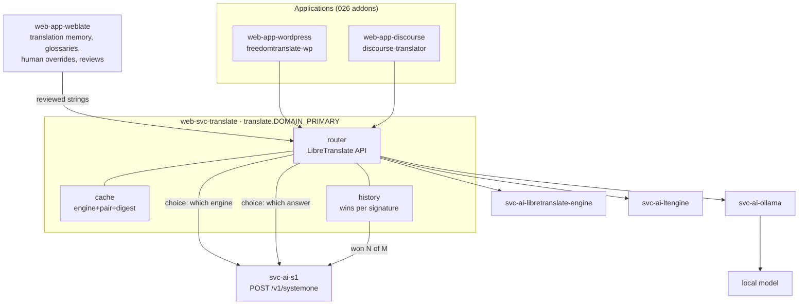

# 040 - Translation Gateway

## User Story

As an operator of an Infinito.Nexus deployment, I want one translation endpoint that chooses the best engine itself, remembers which engine won earlier comparisons, and lets a human override any string, so that every application translates content through a single configured URL and the quality improves without me tuning each application separately.

## Background

The runtime half of translation is unbuilt, but most of its parts are already in the repository.

Present today:

- [`svc-ai-libretranslate-engine`](../../roles/svc-ai-libretranslate-engine/) runs LibreTranslate as an engine without a browser surface, and [`web-svc-libretranslate`](../../roles/web-svc-libretranslate/) publishes it at `libre.translate.{{ DOMAIN_PRIMARY }}` behind SSO.
- [`svc-ai-ollama`](../../roles/svc-ai-ollama/) serves local models.
- [`svc-ai-s1`](../../roles/svc-ai-s1/) answers typed questions on `POST /v1/systemone`, and [`web-svc-s1`](../../roles/web-svc-s1/) publishes that contract.
- [`svc-ai-litellm`](../../roles/svc-ai-litellm/) already implements, for model routing, every mechanism this requirement needs for engine routing: `Sampler` ([router_hook.py.j2:405](../../roles/svc-ai-litellm/templates/router_hook.py.j2#L405)) decides when to explore, `History` ([:441](../../roles/svc-ai-litellm/templates/router_hook.py.j2#L441)) keeps one row per offered route per decision in the proxy's own database, `wins()` returns `{alias: (won, seen)}`, `record_of()` ([:496](../../roles/svc-ai-litellm/templates/router_hook.py.j2#L496)) turns that into a clause inside the criteria line, `judge_answers()` ([:610](../../roles/svc-ai-litellm/templates/router_hook.py.j2#L610)) puts the replies themselves to the decider while hiding which route produced them, and `_compare()` ([:783](../../roles/svc-ai-litellm/templates/router_hook.py.j2#L783)) runs the fan-out in a `serve` or a `shadow` mode.

Absent today:

- No role fronts several translation engines; `libretranslate` is the only translation service key any consumer declares, and only [`web-app-mediawiki`](../../roles/web-app-mediawiki/) declares it.
- No LTEngine role.
- No Weblate role, so the deployment has no translation memory, no glossary and no place for a reviewed human override.

## Scope

In scope: a gateway role, an LTEngine backend, a Weblate role, the engine decision and its learning log, the cache, and the per-application consumer integration.

Out of scope, and deliberately left alone:

- [037 - Gettext Catalogs LibreTranslate](037-gettext-catalogs-libretranslate.md) translates this project's own `.po` catalogs at build time by calling the engine directly from `make i18n-translate`. That path works and keeps calling the engine directly. A build-time catalog run is one batch of known strings against one engine, with no request to cache and no caller to serve; routing it through the gateway would add a hop and a database to a path that needs neither.
- [039 - Core i18n Consumers](039-core-i18n-consumers.md) wires this project's own surfaces onto those catalogs. 040 translates the content users put into the applications, at request time. The boundary is build time versus request time, and it is stated in both directions so that neither requirement is used to fix a defect belonging to the other.

## Findings That Constrain the Design

- The decision mechanism is not new work. Lifting it means extracting it, not copying it: a second copy of `History` and `judge_answers` is a second thing to fix when the contract moves. The house precedent for a cross-role Python artefact is the MCP adapter, whose build context is owned by one role and staged per instance so every consumer shares one audited copy (the `libretranslatemcp` entry in [web-svc-libretranslate/meta/services.yml](../../roles/web-svc-libretranslate/meta/services.yml)).
- Consumer wiring is also not new work. [026 - Unified Addon Syntax](026-unified-addon-syntax.md) already defines how one role bridges a service another role provides: `roles/<role>/meta/addons/<id>.yml` with a `bridges:` key that MUST resolve to a service in the same role's `meta/services.yml`, and an `enabled` derived from that service flag rather than from `group_names`. Every application-side integration in this requirement is an addon under that contract.
- The `translate.{{ DOMAIN_PRIMARY }}` label is unclaimed; the only translation domain in the repository is the engine frontend's.
- Ollama and LTEngine both pull models and reserve memory. The variant resource budget caps the deduplicated reservations of one variant, so the heavy backends cannot share a variant with each other.

## Confirmed Decisions

Re-opening any of these MUST be recorded in the implementing PR.

1. **The gateway is a new role, `web-svc-translate`, published at `api.translate.{{ DOMAIN_PRIMARY }}`.** It is not an extension of `web-svc-libretranslate`, because that role publishes one engine's own API and SSO-protected frontend, and a router in front of several engines is a different responsibility with its own database and its own failure modes.

2. **The gateway speaks the LibreTranslate API.** `POST /translate`, `POST /detect` and `GET /languages` keep their published request and response shapes. A consumer therefore points at the gateway by changing one URL, and anything that already speaks to LibreTranslate works unchanged. The gateway is a router, not a new dialect.

3. **Backends are declared, never hardcoded.** Each backend is a consumer declaration in the gateway's own `meta/services.yml`, gated on whether the providing role is deployed, and every reader of that backend inside the role goes through `lookup('config', application_id, 'services.<backend>.enabled')` rather than testing the deployment again. Adding a backend is a declaration plus a template entry, not a code change. See [Re-opened Decisions](#re-opened-decisions).

4. **Three backends ship: LibreTranslate, LTEngine, and Ollama.** LibreTranslate is the default and the only one enabled without further deployment. LTEngine arrives as a new `svc-ai-ltengine` role. Ollama reuses `svc-ai-ollama` and reaches a local model.

5. **Which engine answers is a System One decision, taken exactly as the model router takes it.** The surviving candidate engines become the options of a single `choice` question, the request becomes the state, and each option's criteria line states only measured or catalogued facts about that engine: whether it runs in this cluster, which language pairs it serves, its measured latency where one exists, and how it fared in earlier comparisons. A `choice` naming an engine the gateway did not offer is refused rather than routed to.

6. **The strategy derives from the deployment, not from a hand-set value.** `services.translate.router.strategy` follows `services.s1.enabled`: with the decider deployed the gateway asks it, and without it the gateway falls to a `preference` strategy it can compute itself from a declared engine order. One path leads from the deployment to the behaviour.

7. **The learning log is a `History`-shaped table in the gateway's own database**, one row per offered engine per decision, each row marking whether that engine won. The signature groups comparable requests: source language, target language, and a coarse content class derived from the payload's length and whether it carries markup. `wins(signature)` returns `{engine: (won, seen)}` and feeds decision 5's criteria line, so the next decision reads what earlier ones concluded. A log that cannot be read MUST degrade to deciding without it and MUST NOT fail the request.

8. **What "best" means is judged on the answers, blind to their source.** While sampling, the gateway asks several engines the same request and puts the returned translations to the decider as the options of one typed `choice`, labelled `option-0`, `option-1`, … so the verdict rests on what came back rather than on which engine promised what. The winner is the row marked won.

9. **Sampling is the exception, answering is the rule.** The gateway fans out only when the sampler is due, and once a signature has accumulated a clear leader over a configured number of comparisons it routes straight to that engine without asking the decider at all. That is what makes the log pay for itself. A configured re-sample rate keeps a signature from freezing on a verdict the engines have since outgrown.

10. **A reviewed human translation outranks every engine.** The gateway consults Weblate's translation memory first; a string with a reviewed translation is returned verbatim, no engine is called, and machine output MUST NOT overwrite it. This is the only hard precedence rule in the gateway.

11. **Weblate ships as `web-app-weblate`** with translation memory, glossaries, and a review workflow, reachable by its own UI and by the gateway over Weblate's HTTP API with a token from the credential store. Glossary terms are passed to engines that accept them, and an answer that mangles a protected term is rejected rather than cached.

12. **The cache is one store, and it is the database the gateway already needs.** A translation is cached on the tuple of engine, source language, target language and the digest of the source text. No second cache technology is introduced for it; a Redis consumer declaration stays off unless a measurement shows the database cache is the bottleneck.

13. **No backend reachable means a loud failure.** The gateway answers an error, never the untranslated source text dressed as a translation. An engine that errors repeatedly drops out of the candidate set, and its failures are counted separately from lost comparisons, because failing is not the same as answering worse.

14. **The shared mechanism is extracted, not duplicated.** `Sampler`, `History`, `record_of`, `judge_answers` and `decide` move into one Python package owned by `svc-ai-s1`, which owns the decider contract, and staged into both `svc-ai-litellm` and `web-svc-translate` the way the MCP adapter's build context is staged per instance. The model router's behaviour MUST not change: its existing tests are the regression net for the extraction.

15. **Every application-side integration is a 026 addon.** A consuming role declares a `translate` consumer entry gated on the gateway's service flag and an addon that bridges it. The applications in scope are the ones the architecture names: WordPress, Moodle, Discourse, OpenProject, Nextcloud and Matrix; which of them have an upstream consumer of this API is settled under [Re-opened Decisions](#re-opened-decisions).

16. **The heavy backends live in separate variants.** LTEngine and Ollama are not enabled in the same variant, and the variant set is measured with `cli/meta/roles/applications/ressources` against the budget before the matrix runs.

## Re-opened Decisions

**Decision 3, the backend gate.** As first written it demanded `lookup('config', '<providing role>', …)` and forbade `group_names`. That gate cannot work: `lookup('config', …)` resolves through `get_merged_applications` ([plugins/lookup/config.py:45](../../plugins/lookup/config.py#L45)), which merges every role in the repository rather than the ones this deploy carries, so `services.ltengine.enabled` reads `true` whether or not LTEngine is deployed and every backend would always be offered. The play-scoped set lives behind a separate lookup ([plugins/lookup/applications_current_play.py:69](../../plugins/lookup/applications_current_play.py#L69)), and the applications cache keys its renders on `group_names` ([utils/cache/base.py:108](../../utils/cache/base.py#L108)) rather than on the whole inventory, so a deployment-wide presence test inside `meta/services.yml` would be cached across inventories that differ.

The gate is therefore the house idiom every other consumer declaration uses, `'<providing role>' in group_names`, and the part of the decision that carries the design survives unchanged: no code inside the gateway tests a deployment, every reader asks its own `services.<backend>.enabled`, and adding a backend stays a declaration.

**Decision 15, the six consumers.** The decision names WordPress, Moodle, Discourse, OpenProject, Nextcloud and Matrix. An upstream survey of all six found a consumer of a self-hosted LibreTranslate endpoint in two of them:

| App | Upstream path | Verdict |
| --- | --- | --- |
| WordPress | [`freedomtranslate-wp`](https://wordpress.org/plugins/freedomtranslate-wp/) reads `freedomtranslate_service=libretranslate` and `freedomtranslate_api_url` | wired |
| Discourse | [`discourse-translator`](https://github.com/discourse/discourse-translator) carries a LibreTranslate provider whose `translator_libretranslate_endpoint` the gateway answers for `/translate`, `/detect` and `/languages` | wired |
| Nextcloud | the only LibreTranslate app, [`integration_libretranslate`](https://apps.nextcloud.com/apps/integration_libretranslate), declares `>=26,<29`, and this deployment runs Nextcloud 34; its own translation providers take bundled models or an OpenAI-compatible endpoint, which `svc-ai-litellm` already serves | open |
| Moodle | the translation plugins take Google (`filter_translations`, `filter_fulltranslate`) or an OpenAI-compatible endpoint (`filter_autotranslate`); none speaks the LibreTranslate API | open |
| Matrix | [`maubot/translate`](https://github.com/maubot/translate) implements Google Translate, with DeepL planned; no LibreTranslate provider | open |
| OpenProject | ships no machine-translation extension at all; its localisation is static catalogues | open |

The two wired pairs ship as 026 addons. The four open ones stay open rather than being faked: wiring them would mean either writing the app plugin in this repository or giving the gateway a second dialect, and decision 2 pins it to the LibreTranslate API. An OpenAI-compatible route on the gateway would reach Nextcloud and Moodle in one move and is the obvious follow-up, recorded here rather than implemented.

## Architecture

## Component Roles

| Role | Responsibility | State |
| --- | --- | --- |
| `web-svc-translate` | The gateway: LibreTranslate-compatible API, router, cache, learning log | new |
| `svc-ai-ltengine` | LTEngine backend | new |
| `web-app-weblate` | Translation memory, glossaries, human overrides, reviews | new |
| `svc-ai-libretranslate-engine` | Default backend | exists, gains a gateway consumer declaration |
| `svc-ai-ollama` | Local-model backend | exists, gains a gateway consumer declaration |
| `svc-ai-s1` | Answers both typed choices; owns the extracted decision package | exists, gains the shared package |
| `svc-ai-litellm` | Keeps routing models, now on the extracted package | exists, refactored without behaviour change |

## Where each guarantee is enforced

| Guarantee | Proven by |
| --- | --- |
| The gateway answers the LibreTranslate API shapes | a Playwright spec translating a known string through `api.translate.<domain>` |
| A reviewed Weblate string wins over every engine | a spec seeding a reviewed override and asserting the engine is never called |
| The decision reads earlier outcomes | a unit test over `wins()` output reaching the criteria line |
| The verdict is blind to the engine | a unit test asserting no engine name appears in the judge's options |
| A saturated signature skips the decider | a unit test over the sampler and the saturation rule |
| An unreadable log does not fail a request | a unit test with the store raising |
| No backend reachable fails loudly | a unit test asserting an error, not a passthrough |
| Extraction changed no model-router behaviour | the existing `svc-ai-litellm` router tests, unchanged |
| Each consumer integration is a valid addon | the 026 addon lints, including the bridge and Playwright-spec checks |
| The variant set fits the budget | `tests/integration/roles/meta/variants/test_resource_budget.py` |

## Acceptance Criteria

### Gateway

- [ ] A `web-svc-translate` role exists and is published at `api.translate.{{ DOMAIN_PRIMARY }}`.
- [ ] `POST /translate`, `POST /detect` and `GET /languages` answer in the LibreTranslate request and response shapes.
- [ ] The gateway's backends are consumer declarations in its own `meta/services.yml`, and every reader inside the role resolves a backend through `lookup('config', application_id, 'services.<backend>.enabled')`.
- [ ] `services.translate.router.strategy` derives from `services.s1.enabled` and resolves to `system_one` with the decider deployed and to `preference` without it.
- [ ] With no backend reachable the gateway answers an error and never returns the untranslated source as a translation.
- [ ] An engine that errors repeatedly leaves the candidate set, and its failure count is stored separately from its lost comparisons.

### Backends

- [ ] An `svc-ai-ltengine` role serves translations and is reachable by the gateway.
- [ ] `svc-ai-libretranslate-engine` is the default backend and the only one enabled without a further deployment.
- [ ] `svc-ai-ollama` serves as a backend through a local model.
- [ ] LTEngine and Ollama are never enabled in the same variant, and `cli/meta/roles/applications/ressources` reports every variant inside the budget.

### Decision and learning

- [ ] The gateway asks the decider one `choice` question whose options are the candidate engines and whose criteria lines state only measured or catalogued facts.
- [ ] A `choice` naming an engine the gateway did not offer is refused and no request is routed to it.
- [ ] One row per offered engine per decision is stored, marking which engine won, keyed on a signature of source language, target language and content class.
- [ ] Earlier outcomes reach the next decision as a clause in the criteria line.
- [ ] While sampling, several engines answer the same request and the decider chooses between the returned translations, labelled so that no engine name is visible to it.
- [ ] A signature with a clear leader over the configured number of comparisons routes directly to that engine without a decider call, and the configured re-sample rate still re-opens it.
- [ ] A log that cannot be read is logged and the decision proceeds without it; no request fails because of it.

### Weblate

- [ ] A `web-app-weblate` role exists with translation memory, glossaries and a review workflow.
- [ ] The gateway returns a reviewed Weblate translation verbatim without calling any engine.
- [ ] Machine output never overwrites a reviewed translation.
- [ ] Glossary terms are passed to engines that accept them, and an answer that mangles a protected term is rejected and not cached.

### Cache

- [ ] A translation is cached on engine, source language, target language and the digest of the source text, in the gateway's own database.
- [ ] A repeated identical request is answered from the cache without reaching an engine.

### Shared mechanism

- [ ] `Sampler`, `History`, `record_of`, `judge_answers` and `decide` live in one package owned by `svc-ai-s1` and are staged into both `svc-ai-litellm` and `web-svc-translate`.
- [ ] No second copy of that mechanism remains in the repository.
- [ ] The existing `svc-ai-litellm` router tests pass unchanged after the extraction.

### Consumers

- [ ] WordPress and Discourse each declare a `translate` consumer entry and an addon under [026](026-unified-addon-syntax.md) that bridges it; Nextcloud, Moodle, Matrix and OpenProject stay open for the reason stated under [Re-opened Decisions](#re-opened-decisions).
- [ ] Every one of those addons passes the 026 addon lints, including the bridge resolution and the per-addon Playwright spec check.

### Tests and documentation

- [ ] A Playwright spec translates a known string through `api.translate.<domain>` and asserts the response.
- [ ] A Playwright spec asserts a reviewed Weblate override wins over the engine.
- [ ] Unit tests cover the saturation rule, the unreadable log, the blind verdict and the loud failure.
- [ ] Each new role carries a `README.md` describing what it does and how it is wired.
- [ ] This requirement's boundary against [037](037-gettext-catalogs-libretranslate.md) and [039](039-core-i18n-consumers.md) is stated in the gateway's README.

## Cross-linking

- Implementing PR: _to be linked_

## See Also

- [026 - Unified Addon Syntax](026-unified-addon-syntax.md)
- [037 - Gettext Catalogs LibreTranslate](037-gettext-catalogs-libretranslate.md)
- [038 - System One Model Router](038-system-one-model-router.md)
- [039 - Core i18n Consumers](039-core-i18n-consumers.md)
