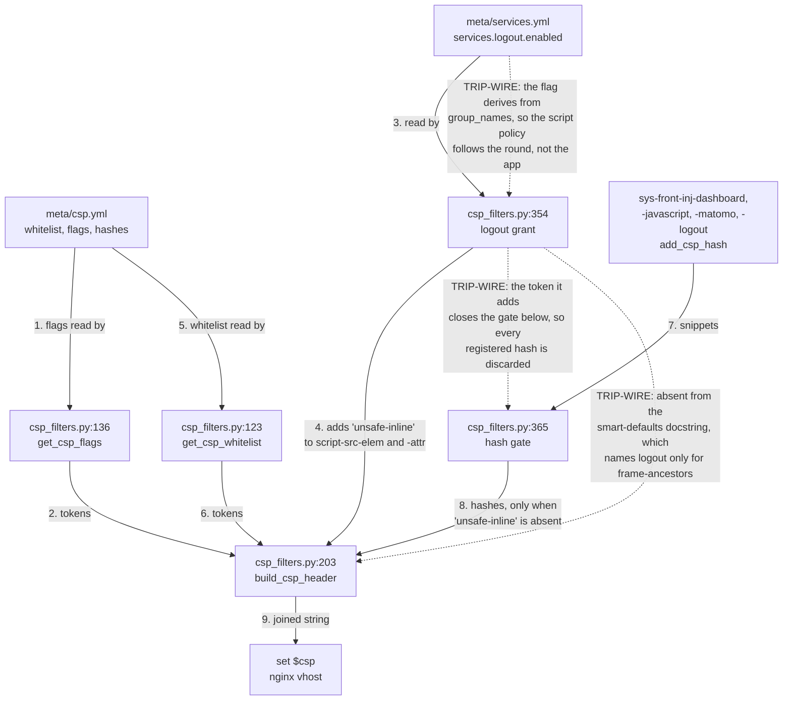

# Custom Filter Plugins for Infinito.Nexus

This directory contains custom **Ansible filter plugins** used within the Infinito.Nexus project.

## When to Use a Filter Plugin

- **Transform values:** Use filters to transform, extract, reformat, or compute values from existing variables or facts.
- **Inline data manipulation:** Filters are designed for inline use in Jinja2 expressions (in templates, tasks, vars, etc.).
- **No external lookups:** Filters only operate on data you explicitly pass to them and cannot access external files, the Ansible inventory, or runtime context.

### Examples

```jinja2
{{ role_name | get_entity_name }}
{{ my_list | unique }}
{{ user_email | regex_replace('^(.+)@.*$', '\\1') }}
````

## When *not* to Use a Filter Plugin

- If you need to **load data from an external source** (e.g., file, environment, API), use a lookup plugin instead.
- If your logic requires **access to inventory, facts, or host-level information** that is not passed as a parameter.

## Schema 🗺️

How `csp_filters.py` assembles one application's Content-Security-Policy. Scope is the header build, not the other filters in this directory.



Styles carry `'unsafe-inline'` by default; scripts do not. The logout grant is the only path that puts it into a script directive.

## Further Reading

- [Ansible Filter Plugins Documentation](https://docs.ansible.com/ansible/latest/plugins/filter.html)
- [Developing Ansible Filter Plugins](https://docs.ansible.com/ansible/latest/dev_guide/developing_plugins.html#developing-filter-plugins)
