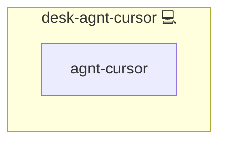

# Cursor

## Description

[Cursor](https://cursor.com/) is an AI-first code editor. This role installs it on a workstation.

## Overview

Cursor's CLI cannot be pointed at a custom OpenAI-compatible endpoint: it exchanges the key for Cursor session tokens and talks its own protocol afterwards. The editor does carry an "Override OpenAI Base URL" field, but it lives in Cursor's own state database rather than in a file this role could render.

The role therefore installs the editor and leaves the endpoint override to the operator. Nothing here pretends to configure a gateway that the product does not accept from a file.

## Cosmos

The diagram places Cursor in the Infinito.Nexus cosmos: the components it deploys (capabilities), the central services it consumes (dependencies), and its outward reach (federation and bridged external networks).



Solid `1:1` edges are fixed relationships; dashed `0..1` edges are conditional (enabled only in matching deployments); red `0..0` edges are turned off in this role. Node markers show the role's deploy modes (💻 host, 🐳 compose, 🐝 swarm); ❌ marks a service that is explicitly turned off, and ⚙️ an Ansible role dependency declared in `meta/main.yml`.

## Features

- **Installed, not faked:** the editor is provisioned; the endpoint override stays a documented operator step.
- **Arch today:** the vendor ships neither a Debian nor an RPM repository, so only the Arch build is wired up.

## Quick Setup

### Development

Clone, set up the workstation, and deploy Cursor onto the local stack:

```bash
git clone https://github.com/infinito-nexus/core.git
cd core
make onboard
make compose-deploy mode=reinstall apps=desk-agnt-cursor full_cycle=false
```

### Production

Install Cursor directly onto the target machine: clone the repository, install the OS prerequisites and the repository toolchain, then deploy against localhost over a local connection (no SSH, no container):

```bash
git clone https://github.com/infinito-nexus/core.git
cd core
bash scripts/install/package.sh
make install
source scripts/meta/env/load.sh

APP=desk-agnt-cursor
DOMAIN=<your-domain>
TLS_MODE=self_signed
SSH_PUBLIC_KEY="<your-ssh-public-key>"
INVENTORY=inventories/production
infinito administration inventory provision "$INVENTORY" \
  --inventory-file "$INVENTORY/devices.yml" \
  --host localhost \
  --include "$APP" \
  --vars "{\"TLS_MODE\": \"$TLS_MODE\", \"DOMAIN_PRIMARY\": \"$DOMAIN\", \"users\": {\"administrator\": {\"authorized_keys\": [\"$SSH_PUBLIC_KEY\"]}}}"
infinito administration deploy dedicated "$INVENTORY/devices.yml" \
  --password-file "$INVENTORY/.password" \
  --diff -vv
```

## Credits

Implemented by **[Kevin Veen-Birkenbach](https://www.veen.world)**.
Part of the [Infinito.Nexus Project](https://s.infinito.nexus/code) and maintained by [Kevin Veen-Birkenbach](https://www.veen.world).
Licensed under the [Infinito.Nexus Community License (Non-Commercial)](https://s.infinito.nexus/license).
