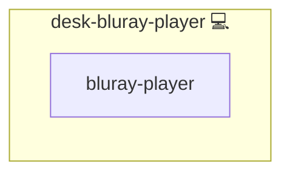

# Blue-ray Disc

## Description

This Ansible role installs and configures all the software required for Blu-ray playback on Arch Linux–based systems. It ensures that VLC and the necessary libraries for Blu-ray disc decryption and playback (`libaacs`, `libbluray`) are present, and provides hooks for optional AUR packages.

## Overview

- Uses the `community.general.pacman` module to install:
  - `vlc` (media player with Blu-ray support)  
  - `libaacs` (AACS decryption library)  
  - `libbluray` (Blu-ray playback support library)  
- Contains commented-out tasks for optional AUR packages (`aacskeys`, `libbdplus`) you can enable as needed.
- Designed for idempotent execution on Arch Linux and derivatives.

## Cosmos

The diagram places Blue-ray Disc in the Infinito.Nexus cosmos: the components it deploys (capabilities), the central services it consumes (dependencies), and its outward reach (federation and bridged external networks).



Solid `1:1` edges are fixed relationships; dashed `0..1` edges are conditional (enabled only in matching deployments). Node markers show the role's deploy modes (💻 host, 🐳 compose, 🐝 swarm); ❌ marks a service that is explicitly turned off.

## Features

- **VLC Installation**  
  Installs `vlc` for general media and Blu-ray playback.

- **AACS & BD+ Support**  
  Installs `libaacs` and `libbluray` to handle Blu-ray disc encryption and playback.

- **Optional AUR Packages**  
  Drop-in tasks for `aacskeys` and `libbdplus` via AUR (commented out by default).

- **Idempotent Role**  
  Safe to run multiple times without unintended side effects.

- **Arch Linux–Optimized**  
  Leverages Pacman for fast and reliable package management.

## Quick Setup

### Development

Clone, set up the workstation, and deploy Blue-ray Disc onto the local stack:

```bash
git clone https://github.com/infinito-nexus/core.git
cd core
make onboard
make compose-deploy mode=reinstall apps=desk-bluray-player full_cycle=false
```

### Production

Run the published image to provision the inventory and deploy Blue-ray Disc to a managed server (the mounted volume persists the inventory between the two runs):

```bash
docker run --rm -it \
  -v "$PWD/inventories:/etc/infinito.nexus/inventories" \
  ghcr.io/infinito-nexus/core/debian \
  infinito administration inventory provision /etc/infinito.nexus/inventories/prod \
  --inventory-file /etc/infinito.nexus/inventories/prod/devices.yml \
  --host <your-server> \
  --vars-file inventories/<env>/default.yml \
  --include 'desk-bluray-player'

docker run --rm -it \
  -v "$PWD/inventories:/etc/infinito.nexus/inventories" \
  ghcr.io/infinito-nexus/core/debian \
  infinito administration deploy dedicated /etc/infinito.nexus/inventories/prod/devices.yml \
  --password-file /etc/infinito.nexus/inventories/prod/.password \
  --id desk-bluray-player \
  --diff \
  -vv
```

## Further Resources

- [Arch Linux Wiki: Blu-ray Playback](https://wiki.archlinux.org/title/Blu-ray#Using_aacskeys)  
- [Play Blu-ray with VLC Guide](https://videobyte.de/play-blu-ray-with-vlc)  
- [FV Online DB – Blu-ray Tools](http://fvonline-db.bplaced.net/)  

## Credits

Implemented by **[Kevin Veen-Birkenbach](https://www.veen.world)**.
Part of the [Infinito.Nexus Project](https://s.infinito.nexus/code) and maintained by [Kevin Veen-Birkenbach](https://www.veen.world).
Licensed under the [Infinito.Nexus Community License (Non-Commercial)](https://s.infinito.nexus/license).
