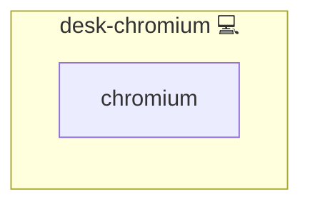

# Chromium

## Description

This Ansible role installs and configures the Chromium browser along with essential security and productivity extensions. It ensures that Chromium is installed and properly set up with forced installation of uBlock Origin and the KeePassXC browser extension via Enterprise Policies, providing a secure and streamlined browsing experience.

## Overview

Designed for various Linux distributions, this role manages the installation of the Chromium browser using the system’s package manager. It configures Chromium's managed policies to automatically deploy key browser extensions, ensuring that users always have a secure and consistent environment. This role integrates seamlessly with other system management roles for a holistic deployment.

## Cosmos

The diagram places Chromium in the Infinito.Nexus cosmos: the components it deploys (capabilities), the central services it consumes (dependencies), and its outward reach (federation and bridged external networks).



Solid `1:1` edges are fixed relationships; dashed `0..1` edges are conditional (enabled only in matching deployments). Node markers show the role's deploy modes (💻 host, 🐳 compose, 🐝 swarm); ❌ marks a service that is explicitly turned off, and ⚙️ an Ansible role dependency declared in `meta/main.yml`.

## Purpose

The purpose of this role is to automate the provisioning of a secure Chromium environment in a consistent and maintainable way. It reduces manual configuration steps and guarantees that critical browser extensions are enforced, making it ideal for both production and personal deployments.

## Features

- **Installs Chromium Browser:** Automatically installs the appropriate Chromium package based on the target system.
- **Installs KeePassXC:** Ensures KeePassXC is installed for secure password management.
- **Enforces Browser Extensions:** Configures Chromium Enterprise Policies to force-install uBlock Origin and the KeePassXC browser extension.
- **Cross-Platform Support:** Handles package variations for multiple Linux distributions.
- **Seamless Integration:** Provides a stable and secure browsing setup as part of broader system automation workflows.

## Quick Setup

### Development

Clone, set up the workstation, and deploy Chromium onto the local stack:

```bash
git clone https://github.com/infinito-nexus/core.git
cd core
make onboard
make compose-deploy mode=reinstall apps=desk-chromium full_cycle=false
```

### Production

Install Chromium directly onto the target machine — clone the repository, install the OS prerequisites and the repository toolchain, then deploy against localhost over a local connection (no SSH, no container):

```bash
git clone https://github.com/infinito-nexus/core.git
cd core
bash scripts/install/package.sh
make install
source scripts/meta/env/load.sh

APP=desk-chromium
TLS_MODE=self_signed
SSH_PUBLIC_KEY="<your-ssh-public-key>"
INVENTORY=inventories/production
infinito administration inventory provision "$INVENTORY" \
  --inventory-file "$INVENTORY/devices.yml" \
  --host localhost \
  --include "$APP" \
  --vars "{\"TLS_MODE\": \"$TLS_MODE\", \"users\": {\"administrator\": {\"authorized_keys\": [\"$SSH_PUBLIC_KEY\"]}}}"
infinito administration deploy dedicated "$INVENTORY/devices.yml" \
  --password-file "$INVENTORY/.password" \
  --diff -vv
```

## Addons

This role force-installs the following Chromium browser extensions via managed Enterprise Policies. They are declared in [meta/addons/](meta/addons/) and rendered into the CRX install list.

| Addon | Mechanism | Default state | Bridges |
|---|---|---|---|
| ublock-origin | extension | enabled (required) | none |
| keepassxc-browser | extension | enabled (required) | none |
| privacy-badger | extension | enabled (required) | none |

Playwright exemption: these are desktop browser extensions with no in-app web surface to drive, so no Playwright spec is required (requirement 026, Decision 11).

## Credits

Implemented by **[Kevin Veen-Birkenbach](https://www.veen.world)**.
Part of the [Infinito.Nexus Project](https://s.infinito.nexus/code) and maintained by [Kevin Veen-Birkenbach](https://www.veen.world).
Licensed under the [Infinito.Nexus Community License (Non-Commercial)](https://s.infinito.nexus/license).
