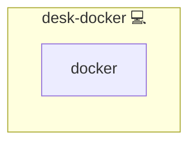

# Workstation Docker

## Description

Installs Docker and Docker Compose, and adds a user to the Docker group for non-root usage on development machines.

## Overview

This playbook, `desk-docker`, is part of a larger collection housed within the `infinito` repository. It is specifically tailored for setting up Docker and Docker Compose on personal computers (PCs) used for development purposes. The primary goal is to facilitate a development environment on individual workstations rather than configuring servers for hosting or distributing Docker images.

## Cosmos

The diagram places Workstation Docker in the Infinito.Nexus cosmos: the components it deploys (capabilities), the central services it consumes (dependencies), and its outward reach (federation and bridged external networks).



Solid `1:1` edges are fixed relationships; dashed `0..1` edges are conditional (enabled only in matching deployments). Node markers show the role's deploy modes (💻 host, 🐳 compose, 🐝 swarm); ❌ marks a service that is explicitly turned off, and ⚙️ an Ansible role dependency declared in `meta/main.yml`.

## Features

The `main.yml` file in the `desk-docker` role consists of two primary tasks:

1. **Install Docker**: This task uses the `community.general.pacman` module to install `docker` and `docker-compose` on the system. It ensures that these packages are present on the PC.

2. **User Group Configuration**: This task adds a specified user (denoted as `{{users.client.username}}`) to the Docker user group. This is crucial for allowing the specified user to interact with Docker without needing superuser permissions.

## Quick Setup

### Development

Clone, set up the workstation, and deploy Workstation Docker onto the local stack:

```bash
git clone https://github.com/infinito-nexus/core.git
cd core
make onboard
make compose-deploy mode=reinstall apps=desk-docker full_cycle=false
```

### Production

Install Workstation Docker directly onto the target machine — clone the repository, install the OS prerequisites and the repository toolchain, then deploy against localhost over a local connection (no SSH, no container):

```bash
git clone https://github.com/infinito-nexus/core.git
cd core
bash scripts/install/package.sh
make install
source scripts/meta/env/load.sh

APP=desk-docker
TLS_MODE=self_signed
SSH_PUBLIC_KEY="<your-ssh-public-key>"
INVENTORY=inventories/production
infinito administration inventory provision "$INVENTORY" \
  --inventory-file "$INVENTORY/devices.yml" \
  --host localhost \
  --include "$APP" \
  --vars "{\"TLS_MODE\": \"$TLS_MODE\", \"users\": {\"administrator\": {\"authorized_keys\": [\"$SSH_PUBLIC_KEY\"]}}}"
infinito administration deploy dedicated "$INVENTORY/devices.yml" \
  --password-file "$INVENTORY/.password" \
  --diff -vv
```

## Use Case

The playbook is designed for developers who require Docker in their local development environments. It simplifies the process of Docker installation and configuration, making it straightforward for developers to start containerizing their applications without the complexities often encountered in a server or production environment.

## Prerequisites

- Ansible: Ensure that Ansible is installed on your system to run this playbook.
- Arch Linux-based System: This playbook uses the `pacman` package manager, indicating it's designed for Arch Linux-based systems.

## Running the Playbook

To run this playbook:

1. Clone the `infinito` repository.
2. Navigate to the `roles/desk-docker` directory.
3. Run the playbook using the appropriate Ansible commands, ensuring that you have the necessary privileges.

## Important Notes

- **Not for Server Use**: This playbook is not designed for server environments. It is optimized for individual development machines.
- **Customization**: You may need to customize the playbook, especially the `{{users.client.username}}` variable, to suit your specific setup.
- **Security Considerations**: While adding a user to the Docker group provides ease of use, be aware of the security implications. It grants the user elevated privileges which, if misused, can affect the entire system.

## Support & Contribution

For support, suggestions, or contributions, please raise an issue or a pull request in the `infinito` repository. This project welcomes contributions from the developer community.

## Credits

Implemented by **[Kevin Veen-Birkenbach](https://www.veen.world)**.
Part of the [Infinito.Nexus Project](https://s.infinito.nexus/code) and maintained by [Kevin Veen-Birkenbach](https://www.veen.world).
Licensed under the [Infinito.Nexus Community License (Non-Commercial)](https://s.infinito.nexus/license).
