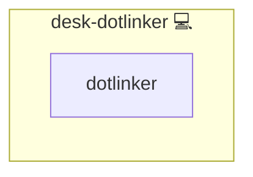

# Dotlinker

## Description

This Ansible role ensures the `doli` (dotlinker) CLI is installed (via `pkgmgr`)
and applies dotlinker mappings provided by the calling role.

The role is intentionally generic: it does not know anything about Nextcloud or other apps.
It can be included multiple times from different roles, each time with a different set of mappings.

## Overview

This role installs and applies dotlinker (doli) mappings (generic role).

## Cosmos

The diagram places Dotlinker in the Infinito.Nexus cosmos: the components it deploys (capabilities), the central services it consumes (dependencies), and its outward reach (federation and bridged external networks).



Solid `1:1` edges are fixed relationships; dashed `0..1` edges are conditional (enabled only in matching deployments). Node markers show the role's deploy modes (💻 host, 🐳 compose, 🐝 swarm); ❌ marks a service that is explicitly turned off.

## Features

- **Automated provisioning:** Configured by Ansible without manual steps.

## Quick Setup

### Development

Clone, set up the workstation, and deploy Dotlinker onto the local stack:

```bash
git clone https://github.com/infinito-nexus/core.git
cd core
make onboard
make compose-deploy mode=reinstall apps=desk-dotlinker full_cycle=false
```

### Production

Run the published image to provision the inventory and deploy Dotlinker to a managed server (the mounted volume persists the inventory between the two runs):

```bash
docker run --rm -it \
  -v "$PWD/inventories:/etc/infinito.nexus/inventories" \
  ghcr.io/infinito-nexus/core/debian \
  infinito administration inventory provision /etc/infinito.nexus/inventories/prod \
  --inventory-file /etc/infinito.nexus/inventories/prod/devices.yml \
  --host <your-server> \
  --vars-file inventories/<env>/default.yml \
  --include 'desk-dotlinker'

docker run --rm -it \
  -v "$PWD/inventories:/etc/infinito.nexus/inventories" \
  ghcr.io/infinito-nexus/core/debian \
  infinito administration deploy dedicated /etc/infinito.nexus/inventories/prod/devices.yml \
  --password-file /etc/infinito.nexus/inventories/prod/.password \
  --id desk-dotlinker \
  --diff \
  -vv
```

## Usage

Call this role via `include_role` and pass mappings through `dotlinker_mappings`:

- `name`: unique mapping id
- `backend`: `cloud` or `chezmoi`
- `src`: source path (original location)
- `dest`: destination path (required for `cloud`)

The role will register mappings using `doli add` and can optionally run `doli pull`.

## Variables

- `dotlinker_user` (required): user to run `doli` as
- `dotlinker_config_path` (default: `~/.config/dotlinker/config.yaml`)
- `dotlinker_cli_name` (default: `doli`)
- `dotlinker_package_name` (default: `doli`)
- `dotlinker_replace` (default: `true`): pass `--replace` to `doli add`
- `dotlinker_apply` (default: `true`): run `doli pull` after adding mappings

## Credits

Implemented by **[Kevin Veen-Birkenbach](https://www.veen.world)**.
Part of the [Infinito.Nexus Project](https://s.infinito.nexus/code) and maintained by [Kevin Veen-Birkenbach](https://www.veen.world).
Licensed under the [Infinito.Nexus Community License (Non-Commercial)](https://s.infinito.nexus/license).
