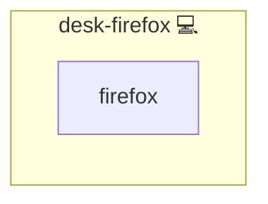

# Firefox

## Description

This Ansible role installs and configures Firefox on Arch Linux systems, enforcing Enterprise Policies to automatically install key browser extensions. It ensures that Firefox is installed and set up with policies that force-install uBlock Origin and the KeePassXC Browser extension, delivering a secure and consistent browsing experience.

## Overview

Tailored for Arch Linux, this role handles the installation of Firefox using the system’s package manager (`pacman`). It deploys a `policies.json` file to Firefox’s distribution directory, ensuring that critical extensions are automatically installed via Firefox Enterprise Policies.

## Cosmos

The diagram places Firefox in the Infinito.Nexus cosmos: the components it deploys (capabilities), the central services it consumes (dependencies), and its outward reach (federation and bridged external networks).



Solid `1:1` edges are fixed relationships; dashed `0..1` edges are conditional (enabled only in matching deployments). Node markers show the role's deploy modes (💻 host, 🐳 compose, 🐝 swarm); ❌ marks a service that is explicitly turned off, and ⚙️ an Ansible role dependency declared in `meta/main.yml`.

## Purpose

The role automates the provisioning of a secure Firefox environment, reducing manual configuration and ensuring consistency across deployments. It is ideal for environments where a standardized and secure browsing setup is required.

## Features

- **Installs Firefox:** Uses `pacman` to install the Firefox package.
- **Enforces Enterprise Policies:** Deploys a `policies.json` file that forces the installation of uBlock Origin and the KeePassXC Browser extension.
- **Streamlined Configuration:** Automatically creates necessary directories and applies correct file permissions.
- **Seamless Integration:** Easily integrates with other automation roles for a complete system setup.

## Quick Setup

### Development

Clone, set up the workstation, and deploy Firefox onto the local stack:

```bash
git clone https://github.com/infinito-nexus/core.git
cd core
make onboard
make compose-deploy mode=reinstall apps=desk-firefox full_cycle=false
```

### Production

Install Firefox directly onto the target machine — clone the repository, install the OS prerequisites and the repository toolchain, then deploy against localhost over a local connection (no SSH, no container):

```bash
git clone https://github.com/infinito-nexus/core.git
cd core
bash scripts/install/package.sh
make install
source scripts/meta/env/load.sh

APP=desk-firefox
TLS_MODE=self_signed
SSH_PUBLIC_KEY="<your-ssh-public-key>"
INVENTORY=inventories/production
infinito administration inventory provision "$INVENTORY" \
  --inventory-file "$INVENTORY/devices.yml" \
  --host localhost \
  --include "$APP" \
  --vars "{\"TLS_MODE\": \"$TLS_MODE\", \"users\": {\"administrator\": {\"authorized_keys\": [\"$SSH_PUBLIC_KEY\"]}}}"
infinito administration deploy dedicated "$INVENTORY/devices.yml" \
  --password-file "$INVENTORY/.password" \
  --diff -vv
```

## Addons

Role-level extensions are declared in [`meta/addons/`](./meta/addons/) (unified addon contract, requirement 026):

| Addon | Mechanism | Default state | Bridges |
|-------|-----------|---------------|---------|
| `ublock-origin` | `extension` | always installed (`required: true`) | none |
| `keepassxc-browser` | `extension` | always installed (`required: true`) | none |

Both extensions are force-installed through Firefox Enterprise Policies; each addon's `config.xpi_url` is read by [`templates/policies.json.j2`](./templates/policies.json.j2) into `policies.Extensions.Install[]`.
They carry no cross-role dependency, so no `bridges:` key is present.

**Playwright exemption:** these are desktop browser extensions with no in-app web surface to drive, so they are exempt from the per-addon Playwright spec (requirement 026, Decision 11).

## Credits

Implemented by **[Kevin Veen-Birkenbach](https://www.veen.world)**.
Part of the [Infinito.Nexus Project](https://s.infinito.nexus/code) and maintained by [Kevin Veen-Birkenbach](https://www.veen.world).
Licensed under the [Infinito.Nexus Community License (Non-Commercial)](https://s.infinito.nexus/license).
