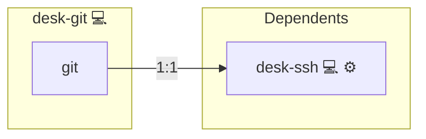

# Git

## Description

This role installs and configures Git on the target system using the Pacman package manager (via the community.general.pacman module). In addition, it configures Git for the user by installing a custom git configuration using the [git-configurator](https://github.com/kevinveenbirkenbach/git-configurator) tool. The role ensures that Git is installed and that the configuration tasks are run only once per host.

## Overview

This role installs Git and configures it using a custom git-configurator for personal computers.

## Cosmos

The diagram places Git in the Infinito.Nexus cosmos: the components it deploys (capabilities), the central services it consumes (dependencies), and its outward reach (federation and bridged external networks).



Solid `1:1` edges are fixed relationships; dashed `0..1` edges are conditional (enabled only in matching deployments). Node markers show the role's deploy modes (💻 host, 🐳 compose, 🐝 swarm); ❌ marks a service that is explicitly turned off, and ⚙️ an Ansible role dependency declared in `meta/main.yml`.

## Purpose

The purpose of this role is to automate the installation and configuration of Git for personal computers. By leveraging a custom git-configurator, it sets up essential Git settings such as merge options, rebase preferences, user information, and GPG signing, ensuring a consistent environment for version control operations.

## Features

- **Automated Git Installation:** Installs Git using Pacman.
- **Custom Git Configuration:** Invokes the git-configurator tool to merge user-specific configuration options.
- **Idempotent Task Execution:** Uses host-level run-once artifacts to ensure that configuration tasks are executed only once per host.
- **Integration:** Works alongside the pkgmgr role to streamline overall system setup.

## Quick Setup

### Development

Clone, set up the workstation, and deploy Git onto the local stack:

```bash
git clone https://github.com/infinito-nexus/core.git
cd core
make onboard
make compose-deploy mode=reinstall apps=desk-git full_cycle=false
```

### Production

Install Git directly onto the target machine — clone the repository, install the OS prerequisites and the repository toolchain, then deploy against localhost over a local connection (no SSH, no container):

```bash
git clone https://github.com/infinito-nexus/core.git
cd core
bash scripts/install/package.sh
make install
source scripts/meta/env/load.sh

APP=desk-git
TLS_MODE=self_signed
SSH_PUBLIC_KEY="<your-ssh-public-key>"
INVENTORY=inventories/production
infinito administration inventory provision "$INVENTORY" \
  --inventory-file "$INVENTORY/devices.yml" \
  --host localhost \
  --include "$APP" \
  --vars "{\"TLS_MODE\": \"$TLS_MODE\", \"users\": {\"administrator\": {\"authorized_keys\": [\"$SSH_PUBLIC_KEY\"]}}}"
infinito administration deploy dedicated "$INVENTORY/devices.yml" \
  --password-file "$INVENTORY/.password" \
  --diff -vv
```

## Credits

Implemented by **[Kevin Veen-Birkenbach](https://www.veen.world)**.
Part of the [Infinito.Nexus Project](https://s.infinito.nexus/code) and maintained by [Kevin Veen-Birkenbach](https://www.veen.world).
Licensed under the [Infinito.Nexus Community License (Non-Commercial)](https://s.infinito.nexus/license).
