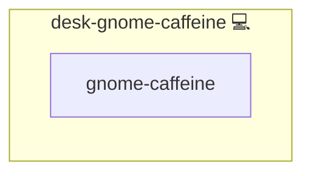

# GNOME Caffeine

## Description

This role installs [caffeine-ng](https://codeberg.org/WhyNotHugo/caffeine-ng), a utility that prevents your GNOME desktop from entering sleep mode or activating the screensaver automatically. It also ensures that caffeine-ng is set to autostart at user login.

## Overview

This role installs caffeine-ng and configures it to autostart for preventing screen sleep on GNOME.

## Cosmos

The diagram places GNOME Caffeine in the Infinito.Nexus cosmos: the components it deploys (capabilities), the central services it consumes (dependencies), and its outward reach (federation and bridged external networks).



Solid `1:1` edges are fixed relationships; dashed `0..1` edges are conditional (enabled only in matching deployments). Node markers show the role's deploy modes (💻 host, 🐳 compose, 🐝 swarm); ❌ marks a service that is explicitly turned off, and ⚙️ an Ansible role dependency declared in `meta/main.yml`.

## Purpose

The purpose of this role is to ensure uninterrupted workflow by keeping the desktop active during long-running tasks or presentations. By automatically starting caffeine-ng, it prevents unwanted screen locking or sleep modes on GNOME systems.

## Features

- Installs caffeine-ng from the AUR using an AUR helper.
- Creates the autostart directory if it does not exist.
- Deploys a customized desktop entry to ensure caffeine-ng starts automatically.
- Enhances user experience by maintaining an active desktop environment.

## Quick Setup

### Development

Clone, set up the workstation, and deploy GNOME Caffeine onto the local stack:

```bash
git clone https://github.com/infinito-nexus/core.git
cd core
make onboard
make compose-deploy mode=reinstall apps=desk-gnome-caffeine full_cycle=false
```

### Production

Run the published image to provision the inventory and deploy GNOME Caffeine to a managed server (the mounted volume persists the inventory):

```bash
APP=desk-gnome-caffeine
HOST=<your-server>

docker run --rm -it \
  -v "$PWD/inventories:/etc/infinito.nexus/inventories" \
  -e APP="$APP" -e HOST="$HOST" \
  ghcr.io/infinito-nexus/core/debian bash -c '
    INVENTORY=/etc/infinito.nexus/inventories/prod
    infinito administration inventory provision "$INVENTORY" \
      --inventory-file "$INVENTORY/devices.yml" \
      --host "$HOST" \
      --include "$APP" &&
    infinito administration deploy dedicated "$INVENTORY/devices.yml" \
      --password-file "$INVENTORY/.password" \
      --diff -vv'
```

## Credits

Implemented by **[Kevin Veen-Birkenbach](https://www.veen.world)**.
Part of the [Infinito.Nexus Project](https://s.infinito.nexus/code) and maintained by [Kevin Veen-Birkenbach](https://www.veen.world).
Licensed under the [Infinito.Nexus Community License (Non-Commercial)](https://s.infinito.nexus/license).
