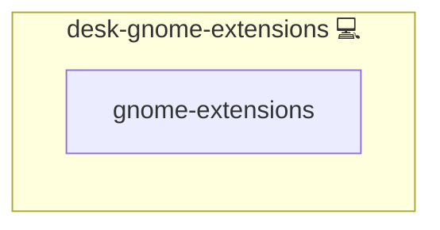

# GNOME Extensions Manager

## Description

This role manages GNOME Shell extensions by ensuring user extensions are enabled and by installing the CLI GNOME Extension Manager. The CLI tool facilitates the configuration and control of GNOME extensions via the command line.

Learn more about the CLI tool on its [GitHub page](https://github.com/kevinveenbirkenbach/cli-gnome-extension-manager) and about GNOME Extensions at [GNOME Extensions](https://extensions.gnome.org).

## Overview

This role configures GNOME Shell extensions and installs the CLI GNOME Extension Manager for managing extensions.

## Cosmos

The diagram places GNOME Extensions Manager in the Infinito.Nexus cosmos: the components it deploys (capabilities), the central services it consumes (dependencies), and its outward reach (federation and bridged external networks).



Solid `1:1` edges are fixed relationships; dashed `0..1` edges are conditional (enabled only in matching deployments). Node markers show the role's deploy modes (💻 host, 🐳 compose, 🐝 swarm); ❌ marks a service that is explicitly turned off, and ⚙️ an Ansible role dependency declared in `meta/main.yml`.

## Purpose

The purpose of this role is to enhance and customize the GNOME desktop environment by managing shell extensions. It simplifies the process of installing and configuring extensions, thereby improving productivity and desktop functionality.

## Features

- Activates GNOME Shell extensions via gsettings.
- Installs the CLI GNOME Extension Manager using the package manager.
- Executes extension configuration commands for streamlined management.
- Provides an automated method for managing and updating GNOME extensions.

## Quick Setup

### Development

Clone, set up the workstation, and deploy GNOME Extensions Manager onto the local stack:

```bash
git clone https://github.com/infinito-nexus/core.git
cd core
make onboard
make compose-deploy mode=reinstall apps=desk-gnome-extensions full_cycle=false
```

### Production

Install GNOME Extensions Manager directly onto the target machine — clone the repository, install the OS prerequisites and the repository toolchain, then deploy against localhost over a local connection (no SSH, no container):

```bash
git clone https://github.com/infinito-nexus/core.git
cd core
bash scripts/install/package.sh
make install
source scripts/meta/env/load.sh

APP=desk-gnome-extensions
TLS_MODE=self_signed
SSH_PUBLIC_KEY="<your-ssh-public-key>"
INVENTORY=inventories/production
infinito administration inventory provision "$INVENTORY" \
  --inventory-file "$INVENTORY/devices.yml" \
  --host localhost \
  --include "$APP" \
  --vars "{\"TLS_MODE\": \"$TLS_MODE\", \"users\": {\"administrator\": {\"authorized_keys\": [\"$SSH_PUBLIC_KEY\"]}}}"
infinito administration deploy dedicated "$INVENTORY/devices.yml" \
  --password-file "$INVENTORY/.password" \
  --diff -vv
```

## Addons

This role is a generic GNOME-extension installer driven by `services.gnome-extensions.plugins`, a 3-tuple list (`action`, `uuid`, `url`) consumed by `cli-gnome-extension-manager`.
It ships no concrete extensions of its own and reads no `meta/addons/` files.
Roles that ship concrete GNOME extensions, such as [desk-gnome](../desk-gnome/), declare them through the unified addon contract under `meta/addons/` (requirement 026), with one file per extension (`mechanism: extension`, `source: upstream`, `config: { uuid, url }`); see that role for the per-file example.

Playwright exemption: GNOME Shell extensions are desktop-only and have no in-app web surface to drive, so they carry no Playwright spec (Confirmed Decision 11).

## Credits

Implemented by **[Kevin Veen-Birkenbach](https://www.veen.world)**.
Part of the [Infinito.Nexus Project](https://s.infinito.nexus/code) and maintained by [Kevin Veen-Birkenbach](https://www.veen.world).
Licensed under the [Infinito.Nexus Community License (Non-Commercial)](https://s.infinito.nexus/license).
