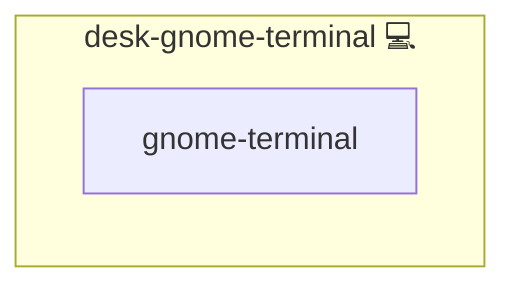

# GNOME Terminal

## Description

This role installs **GNOME Terminal**, the official terminal emulator for the GNOME desktop environment. GNOME Terminal provides a modern, feature-rich command-line interface for users on Arch Linux.

Learn more about GNOME Terminal on [Wikipedia](https://en.wikipedia.org/wiki/GNOME_Terminal) and visit the [GNOME Official Website](https://www.gnome.org) for additional details.

## Overview

This role installs GNOME Terminal on Arch Linux, providing a modern terminal emulator for the GNOME desktop environment.

## Cosmos

The diagram places GNOME Terminal in the Infinito.Nexus cosmos: the components it deploys (capabilities), the central services it consumes (dependencies), and its outward reach (federation and bridged external networks).



Solid `1:1` edges are fixed relationships; dashed `0..1` edges are conditional (enabled only in matching deployments). Node markers show the role's deploy modes (💻 host, 🐳 compose, 🐝 swarm); ❌ marks a service that is explicitly turned off, and ⚙️ an Ansible role dependency declared in `meta/main.yml`.

## Purpose

The purpose of this role is to ensure that GNOME Terminal is installed and properly configured on Arch Linux systems, providing users with a robust and fully featured terminal emulator that integrates seamlessly with the GNOME desktop.

## Features

- Installs GNOME Terminal using the Pacman package manager.
- Ensures the terminal emulator is available system-wide.
- Supports modern features and configuration options offered by GNOME Terminal.
- Enhances the overall usability and productivity of the GNOME desktop environment.

## Quick Setup

### Development

Clone, set up the workstation, and deploy GNOME Terminal onto the local stack:

```bash
git clone https://github.com/infinito-nexus/core.git
cd core
make onboard
make compose-deploy mode=reinstall apps=desk-gnome-terminal full_cycle=false
```

### Production

Install GNOME Terminal directly onto the target machine — clone the repository, install the OS prerequisites and the repository toolchain, then deploy against localhost over a local connection (no SSH, no container):

```bash
git clone https://github.com/infinito-nexus/core.git
cd core
bash scripts/install/package.sh
make install
source scripts/meta/env/load.sh

APP=desk-gnome-terminal
TLS_MODE=self_signed
SSH_PUBLIC_KEY="<your-ssh-public-key>"
INVENTORY=inventories/production
infinito administration inventory provision "$INVENTORY" \
  --inventory-file "$INVENTORY/devices.yml" \
  --host localhost \
  --include "$APP" \
  --vars "{\"TLS_MODE\": \"$TLS_MODE\", \"users\": {\"administrator\": {\"authorized_keys\": [\"$SSH_PUBLIC_KEY\"]}}}"
infinito administration deploy dedicated "$INVENTORY/devices.yml" \
  --password-file "$INVENTORY/.password" \
  --diff -vv
```

## Credits

Implemented by **[Kevin Veen-Birkenbach](https://www.veen.world)**.
Part of the [Infinito.Nexus Project](https://s.infinito.nexus/code) and maintained by [Kevin Veen-Birkenbach](https://www.veen.world).
Licensed under the [Infinito.Nexus Community License (Non-Commercial)](https://s.infinito.nexus/license).
