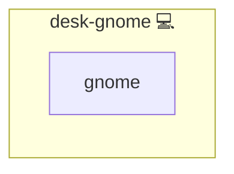

# GNOME Desktop

## Description

This role aggregates various GNOME desktop components to ensure a cohesive and fully functional GNOME environment on Arch Linux. It includes the installation and configuration of several sub-roles:

- **desk-gnome-caffeine:** Prevents the system from sleeping or locking automatically.
- **desk-gnome-extensions:** Manages GNOME Shell extensions and installs the CLI GNOME Extension Manager.
- **desk-gnome-terminal:** Installs GNOME Terminal, the official terminal emulator for GNOME.

## Overview

This role aggregates essential GNOME desktop roles (including caffeine, extensions, and terminal) for a complete GNOME environment on Linux.

## Cosmos

The diagram places GNOME Desktop in the Infinito.Nexus cosmos: the components it deploys (capabilities), the central services it consumes (dependencies), and its outward reach (federation and bridged external networks).



Solid `1:1` edges are fixed relationships; dashed `0..1` edges are conditional (enabled only in matching deployments). Node markers show the role's deploy modes (💻 host, 🐳 compose, 🐝 swarm); ❌ marks a service that is explicitly turned off, and ⚙️ an Ansible role dependency declared in `meta/main.yml`.

## Purpose

The purpose of this role is to provide a complete GNOME desktop experience by orchestrating multiple sub-roles. This simplifies deployment and management by ensuring that all key components are installed and configured in a consistent, system-wide manner.

## Features

- Aggregates multiple GNOME-related roles into one cohesive setup.
- Installs and configures caffeine-ng to keep the desktop active.
- Manages GNOME Shell extensions and integrates the CLI GNOME Extension Manager.
- Installs GNOME Terminal for a robust command-line interface.
- Ensures a seamless and uniform GNOME environment on Arch Linux.

## Quick Setup

### Development

Clone, set up the workstation, and deploy GNOME Desktop onto the local stack:

```bash
git clone https://github.com/infinito-nexus/core.git
cd core
make onboard
make compose-deploy mode=reinstall apps=desk-gnome full_cycle=false
```

### Production

Install GNOME Desktop directly onto the target machine — clone the repository, install the OS prerequisites and the repository toolchain, then deploy against localhost over a local connection (no SSH, no container):

```bash
git clone https://github.com/infinito-nexus/core.git
cd core
bash scripts/install/package.sh
make install
source scripts/meta/env/load.sh

APP=desk-gnome
TLS_MODE=self_signed
SSH_PUBLIC_KEY="<your-ssh-public-key>"
INVENTORY=inventories/production
infinito administration inventory provision "$INVENTORY" \
  --inventory-file "$INVENTORY/devices.yml" \
  --host localhost \
  --include "$APP" \
  --vars "{\"TLS_MODE\": \"$TLS_MODE\", \"users\": {\"administrator\": {\"authorized_keys\": [\"$SSH_PUBLIC_KEY\"]}}}"
infinito administration deploy dedicated "$INVENTORY/devices.yml" \
  --password-file "$INVENTORY/.password" \
  --diff -vv
```

## Addons

Role-level GNOME Shell extensions are declared in [`meta/addons/`](./meta/addons/) (unified addon contract, requirement 026).
They are installed through `cli-gnome-extension-manager`, which receives the `action`, `uuid`, and `url` from each addon's `config` payload:

| Addon | Mechanism | Default state | Bridges |
|-------|-----------|---------------|---------|
| `nasa-apod` | `extension` | required (always enabled) | none |
| `dash-to-dock` | `extension` | optional, disabled by default | none |
| `dash-to-panel` | `extension` | required (always enabled) | none |

These are desktop GNOME Shell extensions with no in-app web surface to drive, so they are exempt from the Playwright requirement (requirement 026, Decision 11).

## Credits

Implemented by **[Kevin Veen-Birkenbach](https://www.veen.world)**.
Part of the [Infinito.Nexus Project](https://s.infinito.nexus/code) and maintained by [Kevin Veen-Birkenbach](https://www.veen.world).
Licensed under the [Infinito.Nexus Community License (Non-Commercial)](https://s.infinito.nexus/license).
