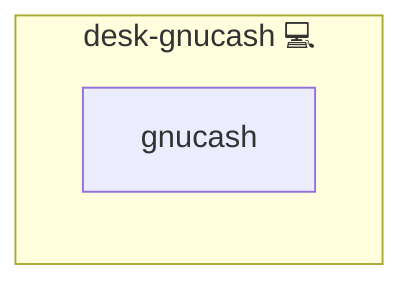

# GnuCash

## Description

Installs GnuCash finance management software on Pacman-based systems, ensuring the latest version is present.

## Overview

This Ansible role is responsible for installing GnuCash, a free and open-source financial management software, on systems utilizing the Pacman package manager. It's particularly useful for setting up GnuCash in a Linux environment with minimal manual intervention.

## Cosmos

The diagram places GnuCash in the Infinito.Nexus cosmos: the components it deploys (capabilities), the central services it consumes (dependencies), and its outward reach (federation and bridged external networks).



Solid `1:1` edges are fixed relationships; dashed `0..1` edges are conditional (enabled only in matching deployments). Node markers show the role's deploy modes (💻 host, 🐳 compose, 🐝 swarm); ❌ marks a service that is explicitly turned off, and ⚙️ an Ansible role dependency declared in `meta/main.yml`.

## Features

- **Automated provisioning:** Configured by Ansible without manual steps.

## Quick Setup

### Development

Clone, set up the workstation, and deploy GnuCash onto the local stack:

```bash
git clone https://github.com/infinito-nexus/core.git
cd core
make onboard
make compose-deploy mode=reinstall apps=desk-gnucash full_cycle=false
```

### Production

Install GnuCash directly onto the target machine — clone the repository, install the OS prerequisites and the repository toolchain, then deploy against localhost over a local connection (no SSH, no container):

```bash
git clone https://github.com/infinito-nexus/core.git
cd core
bash scripts/install/package.sh
make install
source scripts/meta/env/load.sh

APP=desk-gnucash
TLS_MODE=self_signed
SSH_PUBLIC_KEY="<your-ssh-public-key>"
INVENTORY=inventories/production
infinito administration inventory provision "$INVENTORY" \
  --inventory-file "$INVENTORY/devices.yml" \
  --host localhost \
  --include "$APP" \
  --vars "{\"TLS_MODE\": \"$TLS_MODE\", \"users\": {\"administrator\": {\"authorized_keys\": [\"$SSH_PUBLIC_KEY\"]}}}"
infinito administration deploy dedicated "$INVENTORY/devices.yml" \
  --password-file "$INVENTORY/.password" \
  --diff -vv
```

## Role: desk-gnucash

The `desk-gnucash` role ensures that GnuCash is installed and maintained at its latest available version in the Pacman repositories.

## Requirements

- Target systems should be running a Linux distribution that uses the Pacman package manager.
- Ansible should be installed and configured on the system initiating the playbook.

## Role Tasks

- `main.yml`: The main task file that handles the installation of GnuCash.

### Task Details

- **Install GnuCash**: This task uses the `community.general.pacman` module to install GnuCash from the Pacman repositories.

## Usage

To use this role, include it in your playbook and run the playbook using the Ansible command. Ensure that your target systems are accessible and properly configured for Ansible automation.

## Example Playbook

An example of how to use this role in your playbook:

```yaml
- hosts: your_target_group
  roles:
    - desk-gnucash
```

## Credits

Implemented by **[Kevin Veen-Birkenbach](https://www.veen.world)**.
Part of the [Infinito.Nexus Project](https://s.infinito.nexus/code) and maintained by [Kevin Veen-Birkenbach](https://www.veen.world).
Licensed under the [Infinito.Nexus Community License (Non-Commercial)](https://s.infinito.nexus/license).
