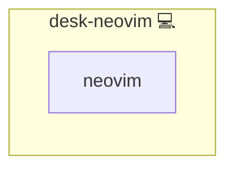

# Neovim

## Description

Installs neovim CLI text editor on Pacman‑based systems.

## Overview

This role automates the installation of neovim, a CLI text editor, on Pacman‑based systems. It uses the `community.general.pacman` module to ensure the editor is installed and up to date.

## Cosmos

The diagram places Neovim in the Infinito.Nexus cosmos: the components it deploys (capabilities), the central services it consumes (dependencies), and its outward reach (federation and bridged external networks).



Solid `1:1` edges are fixed relationships; dashed `0..1` edges are conditional (enabled only in matching deployments). Node markers show the role's deploy modes (💻 host, 🐳 compose, 🐝 swarm); ❌ marks a service that is explicitly turned off.

## Features

- **Automated provisioning:** Configured by Ansible without manual steps.

## Quick Setup

### Development

Clone, set up the workstation, and deploy Neovim onto the local stack:

```bash
git clone https://github.com/infinito-nexus/core.git
cd core
make onboard
make compose-deploy mode=reinstall apps=desk-neovim full_cycle=false
```

### Production

Run the published image to provision the inventory and deploy Neovim to a managed server (the mounted volume persists the inventory between the two runs):

```bash
docker run --rm -it \
  -v "$PWD/inventories:/etc/infinito.nexus/inventories" \
  ghcr.io/infinito-nexus/core/debian \
  infinito administration inventory provision /etc/infinito.nexus/inventories/prod \
  --inventory-file /etc/infinito.nexus/inventories/prod/devices.yml \
  --host <your-server> \
  --vars-file inventories/<env>/default.yml \
  --include 'desk-neovim'

docker run --rm -it \
  -v "$PWD/inventories:/etc/infinito.nexus/inventories" \
  ghcr.io/infinito-nexus/core/debian \
  infinito administration deploy dedicated /etc/infinito.nexus/inventories/prod/devices.yml \
  --password-file /etc/infinito.nexus/inventories/prod/.password \
  --id desk-neovim \
  --diff \
  -vv
```

## Requirements

- Ansible 2.9 or higher  
- Access to the Pacman package manager (e.g., Arch Linux and derivatives)

## Role Variables

No additional role variables are required; this role solely manages the installation of the editor.

## Dependencies

None.

## Example Playbook

```yaml
- hosts: all
  roles:
    - desk-neovim
```

## Further Resources

- Official neovim documentation:
  <https://neovim.io/>

## Contributing

Contributions are welcome! Please follow standard Ansible role conventions and best practices.

## Other Resources

For more context on this role and its development, see the related ChatGPT conversation.

## Credits

Implemented by **[Kevin Veen-Birkenbach](https://www.veen.world)**.
Part of the [Infinito.Nexus Project](https://s.infinito.nexus/code) and maintained by [Kevin Veen-Birkenbach](https://www.veen.world).
Licensed under the [Infinito.Nexus Community License (Non-Commercial)](https://s.infinito.nexus/license).
