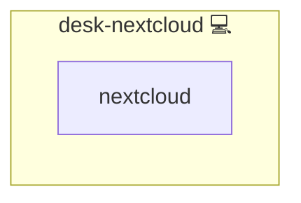

# Nextcloud Client ️

## Description

This Ansible role installs and configures the Nextcloud desktop client on Arch Linux systems. It also manages symbolic links from commonly used user directories (like `Documents`, `Pictures`, etc.) to the respective folders inside a cloud-synced Nextcloud directory. This ensures user data is seamlessly integrated into the synchronized cloud folder.

## Overview

Targeting user environments on Arch Linux (e.g., Manjaro), this role sets up the official `nextcloud-client` and dynamically links key directories from the user's home folder to Nextcloud. This makes it easy to use the Nextcloud client without needing to manually configure folders.

## Cosmos

The diagram places Nextcloud Client ️ in the Infinito.Nexus cosmos: the components it deploys (capabilities), the central services it consumes (dependencies), and its outward reach (federation and bridged external networks).



Solid `1:1` edges are fixed relationships; dashed `0..1` edges are conditional (enabled only in matching deployments). Node markers show the role's deploy modes (💻 host, 🐳 compose, 🐝 swarm); ❌ marks a service that is explicitly turned off, and ⚙️ an Ansible role dependency declared in `meta/main.yml`.

## Purpose

The purpose of this role is to automate the configuration of cloud-integrated user directories by ensuring that common folders like `Downloads`, `Music`, and `Workspaces` are transparently redirected into a centralized cloud structure. This makes it easier to maintain sys-bkp-friendly, cloud-ready setups for homelab and professional workflows.

## Features

- **Installs the Nextcloud Desktop Client:** Uses `pacman` via the `community.general.pacman` module.
- **Symbolic Linking of User Folders:** Maps home folders (e.g., `Documents`, `Videos`, `Workspaces`) into their Nextcloud equivalents.
- **Dynamic Cloud Directory Resolution:** Builds the target cloud directory path from user and cloud variables.
- **Dump Folder Mapping:** Links `InstantUpload` from the cloud to a `~/Dump` folder for quick camera/file access.

## Quick Setup

### Development

Clone, set up the workstation, and deploy Nextcloud Client ️ onto the local stack:

```bash
git clone https://github.com/infinito-nexus/core.git
cd core
make onboard
make compose-deploy mode=reinstall apps=desk-nextcloud full_cycle=false
```

### Production

Install Nextcloud Client ️ directly onto the target machine — clone the repository, install the OS prerequisites and the repository toolchain, then deploy against localhost over a local connection (no SSH, no container):

```bash
git clone https://github.com/infinito-nexus/core.git
cd core
bash scripts/install/package.sh
make install
source scripts/meta/env/load.sh

APP=desk-nextcloud
TLS_MODE=self_signed
SSH_PUBLIC_KEY="<your-ssh-public-key>"
INVENTORY=inventories/production
infinito administration inventory provision "$INVENTORY" \
  --inventory-file "$INVENTORY/devices.yml" \
  --host localhost \
  --include "$APP" \
  --vars "{\"TLS_MODE\": \"$TLS_MODE\", \"users\": {\"administrator\": {\"authorized_keys\": [\"$SSH_PUBLIC_KEY\"]}}}"
infinito administration deploy dedicated "$INVENTORY/devices.yml" \
  --password-file "$INVENTORY/.password" \
  --diff -vv
```

## Credits

Implemented by **[Kevin Veen-Birkenbach](https://www.veen.world)**.
Part of the [Infinito.Nexus Project](https://s.infinito.nexus/code) and maintained by [Kevin Veen-Birkenbach](https://www.veen.world).
Licensed under the [Infinito.Nexus Community License (Non-Commercial)](https://s.infinito.nexus/license).
