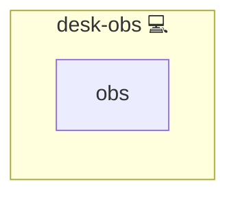

# OBS Studio

## Description

[OBS Studio](https://obsproject.com/) is a free, open-source application for video recording and live streaming, widely used for screencasts, broadcasting, and content creation.

## Overview

This role installs the OBS Studio desktop application on Pacman-based workstations through the system package manager.
It targets the desktop tier and does not configure scenes, capture devices, or streaming profiles.

## Cosmos

The diagram places OBS Studio in the Infinito.Nexus cosmos: the components it deploys (capabilities), the central services it consumes (dependencies), and its outward reach (federation and bridged external networks).



Solid `1:1` edges are fixed relationships; dashed `0..1` edges are conditional (enabled only in matching deployments). Node markers show the role's deploy modes (💻 host, 🐳 compose, 🐝 swarm); ❌ marks a service that is explicitly turned off, and ⚙️ an Ansible role dependency declared in `meta/main.yml`.

## Features

- **Streaming and recording:** Provides the upstream OBS Studio binary for both live broadcasting and local recording.
- **Pacman integration:** Installs the `obs-studio` package via the standard system package manager.
- **Workstation scope:** Targets the desktop tier (`desk-*`) and stays out of server inventories.
- **No state changes beyond install:** Does not enable services or write per-user OBS configuration.

## Quick Setup

### Development

Clone, set up the workstation, and deploy OBS Studio onto the local stack:

```bash
git clone https://github.com/infinito-nexus/core.git
cd core
make onboard
make compose-deploy mode=reinstall apps=desk-obs full_cycle=false
```

### Production

Run the published image to provision the inventory and deploy OBS Studio to a managed server (the mounted volume persists the inventory):

```bash
APP=desk-obs
HOST=<your-server>

docker run --rm -it \
  -v "$PWD/inventories:/etc/infinito.nexus/inventories" \
  -e APP="$APP" -e HOST="$HOST" \
  ghcr.io/infinito-nexus/core/debian bash -c '
    INVENTORY=/etc/infinito.nexus/inventories/prod
    infinito administration inventory provision "$INVENTORY" \
      --inventory-file "$INVENTORY/devices.yml" \
      --host "$HOST" \
      --include "$APP" &&
    infinito administration deploy dedicated "$INVENTORY/devices.yml" \
      --password-file "$INVENTORY/.password" \
      --diff -vv'
```

## Further Resources

- [OBS Studio](https://obsproject.com/)
- [OBS Studio knowledge base](https://obsproject.com/kb/)

## Credits

Implemented by **[Kevin Veen-Birkenbach](https://www.veen.world)**.
Part of the [Infinito.Nexus Project](https://s.infinito.nexus/code) and maintained by [Kevin Veen-Birkenbach](https://www.veen.world).
Licensed under the [Infinito.Nexus Community License (Non-Commercial)](https://s.infinito.nexus/license).
