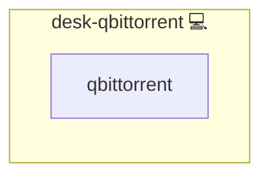

# QBittorrent

## Description

Installs the qBittorrent torrent client via AUR on Arch Linux.

## Overview

This README is for the `desk-qbittorrent` role within the `infinito` repository. This role is specifically crafted for installing qBittorrent, a popular open-source torrent client, on personal computers.

## Cosmos

The diagram places QBittorrent in the Infinito.Nexus cosmos: the components it deploys (capabilities), the central services it consumes (dependencies), and its outward reach (federation and bridged external networks).



Solid `1:1` edges are fixed relationships; dashed `0..1` edges are conditional (enabled only in matching deployments). Node markers show the role's deploy modes (💻 host, 🐳 compose, 🐝 swarm); ❌ marks a service that is explicitly turned off, and ⚙️ an Ansible role dependency declared in `meta/main.yml`.

## Features

- **Automated provisioning:** Configured by Ansible without manual steps.

## Quick Setup

### Development

Clone, set up the workstation, and deploy QBittorrent onto the local stack:

```bash
git clone https://github.com/infinito-nexus/core.git
cd core
make onboard
make compose-deploy mode=reinstall apps=desk-qbittorrent full_cycle=false
```

### Production

Install QBittorrent directly onto the target machine — clone the repository, install the OS prerequisites and the repository toolchain, then deploy against localhost over a local connection (no SSH, no container):

```bash
git clone https://github.com/infinito-nexus/core.git
cd core
bash scripts/install/package.sh
make install
source scripts/meta/env/load.sh

APP=desk-qbittorrent
TLS_MODE=self_signed
SSH_PUBLIC_KEY="<your-ssh-public-key>"
INVENTORY=inventories/production
infinito administration inventory provision "$INVENTORY" \
  --inventory-file "$INVENTORY/devices.yml" \
  --host localhost \
  --include "$APP" \
  --vars "{\"TLS_MODE\": \"$TLS_MODE\", \"users\": {\"administrator\": {\"authorized_keys\": [\"$SSH_PUBLIC_KEY\"]}}}"
infinito administration deploy dedicated "$INVENTORY/devices.yml" \
  --password-file "$INVENTORY/.password" \
  --diff -vv
```

## Role Tasks

The `main.yml` file in the `desk-qbittorrent` role includes the following task:

1. **Install Torrent Software**:
   - This task uses the `kewlfft.aur.aur` module with `yay` as the AUR helper to install `qbittorrent`, a widely-used, free, and easy-to-use torrent client.

## Dependencies

This role depends on:

- **sys-aur**: Ensures that an Arch User Repository (AUR) helper is installed, which is necessary for installing packages like `qbittorrent` that are not available in the standard repositories.

## Purpose and Usage

The `desk-qbittorrent` role is tailored for users who require a reliable and user-friendly torrent client for downloading and sharing files via the BitTorrent protocol. qBittorrent is known for its balance of features, simplicity, and minimal impact on system resources.

## Prerequisites

- **Ansible**: Required for running this role.
- **Arch Linux-based System**: The role is designed with Arch Linux distributions in mind, leveraging AUR helpers for package installation.

## Running the Role

To utilize this role:

1. Clone the `infinito` repository.
2. Navigate to the `roles/desk-qbittorrent` directory.
3. Execute the role using Ansible, ensuring you have the required system permissions for package installation.

## Customization

This role is primarily focused on installing qBittorrent, but it can be customized to include additional configurations or related software packages as needed.

## Support and Contributions

For support, feedback, or contributions, such as enhancing the role or adding additional torrent-related functionality, please open an issue or submit a pull request in the `infinito` repository. Contributions that enhance the usability or features of qBittorrent within this role are highly appreciated.

## Credits

Implemented by **[Kevin Veen-Birkenbach](https://www.veen.world)**.
Part of the [Infinito.Nexus Project](https://s.infinito.nexus/code) and maintained by [Kevin Veen-Birkenbach](https://www.veen.world).
Licensed under the [Infinito.Nexus Community License (Non-Commercial)](https://s.infinito.nexus/license).
