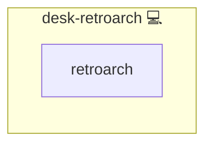

# RetroArch

## Description

[RetroArch](https://www.retroarch.com/) is a frontend for emulators, game engines, and media players powered by the [Libretro](https://www.libretro.com/) framework. It supports multiple UI styles including [XMB](https://en.wikipedia.org/wiki/XrossMediaBar) and [Ozone](https://docs.libretro.com/), and provides a unified interface for retro gaming across platforms.

## Overview

Designed for retro gaming enthusiasts, this role installs RetroArch along with its core assets and themes on Arch Linux systems. It ensures all UI styles are ready and provides a consistent emulator frontend interface.

## Cosmos

The diagram places RetroArch in the Infinito.Nexus cosmos: the components it deploys (capabilities), the central services it consumes (dependencies), and its outward reach (federation and bridged external networks).



Solid `1:1` edges are fixed relationships; dashed `0..1` edges are conditional (enabled only in matching deployments). Node markers show the role's deploy modes (💻 host, 🐳 compose, 🐝 swarm); ❌ marks a service that is explicitly turned off, and ⚙️ an Ansible role dependency declared in `meta/main.yml`.

## Purpose

The purpose of this role is to automate the deployment of a full-featured RetroArch environment, reducing manual setup and improving reproducibility across gaming setups.

## Features

- **Installs RetroArch:** Including the main [RetroArch package](https://archlinux.org/packages/extra/x86_64/retroarch/) and theme assets.
- **UI Assets Support:** Both [XMB](https://docs.libretro.com/) and [Ozone](https://docs.libretro.com/) menu styles supported out of the box.

## Quick Setup

### Development

Clone, set up the workstation, and deploy RetroArch onto the local stack:

```bash
git clone https://github.com/infinito-nexus/core.git
cd core
make onboard
make compose-deploy mode=reinstall apps=desk-retroarch full_cycle=false
```

### Production

Install RetroArch directly onto the target machine — clone the repository, install the OS prerequisites and the repository toolchain, then deploy against localhost over a local connection (no SSH, no container):

```bash
git clone https://github.com/infinito-nexus/core.git
cd core
bash scripts/install/package.sh
make install
source scripts/meta/env/load.sh

APP=desk-retroarch
TLS_MODE=self_signed
SSH_PUBLIC_KEY="<your-ssh-public-key>"
INVENTORY=inventories/production
infinito administration inventory provision "$INVENTORY" \
  --inventory-file "$INVENTORY/devices.yml" \
  --host localhost \
  --include "$APP" \
  --vars "{\"TLS_MODE\": \"$TLS_MODE\", \"users\": {\"administrator\": {\"authorized_keys\": [\"$SSH_PUBLIC_KEY\"]}}}"
infinito administration deploy dedicated "$INVENTORY/devices.yml" \
  --password-file "$INVENTORY/.password" \
  --diff -vv
```

## Further Resources

- 🕹️ [RetroArch - Official Site](https://www.retroarch.com/)
- 🧩 [Libretro - Modular Emulator Framework](https://www.libretro.com/)
- 📚 [RetroArch on ArchWiki](https://wiki.archlinux.org/title/RetroArch)
- 🧠 [RetroArch - Wikipedia](https://en.wikipedia.org/wiki/RetroArch)
- 🎨 [UI Menus: XMB, Ozone, GLUI, RGUI](https://docs.libretro.com/)

## Credits

Implemented by **[Kevin Veen-Birkenbach](https://www.veen.world)**.
Part of the [Infinito.Nexus Project](https://s.infinito.nexus/code) and maintained by [Kevin Veen-Birkenbach](https://www.veen.world).
Licensed under the [Infinito.Nexus Community License (Non-Commercial)](https://s.infinito.nexus/license).
