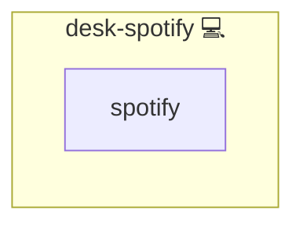

# Spotify

## Description

This Ansible role installs the [Spotify](https://www.spotify.com/) desktop client on Arch Linux systems using the [AUR (Arch User Repository)](https://aur.archlinux.org/packages/spotify/).

## Overview

Spotify is a digital music streaming service that gives you access to millions of songs and podcasts. Since it is not available in the official Arch repositories, this role uses an AUR helper (like [`yay`](https://github.com/Jguer/yay)) to install the package.

## Cosmos

The diagram places Spotify in the Infinito.Nexus cosmos: the components it deploys (capabilities), the central services it consumes (dependencies), and its outward reach (federation and bridged external networks).



Solid `1:1` edges are fixed relationships; dashed `0..1` edges are conditional (enabled only in matching deployments). Node markers show the role's deploy modes (💻 host, 🐳 compose, 🐝 swarm); ❌ marks a service that is explicitly turned off, and ⚙️ an Ansible role dependency declared in `meta/main.yml`.

## Purpose

To automate the installation of Spotify on Arch-based systems while ensuring proper handling of AUR-related tasks through a dedicated helper role.

## Features

- 🎧 Installs the official [Spotify AUR package](https://aur.archlinux.org/packages/spotify)
- 🛠 Uses `yay` (or other helper) via [`kewlfft.aur`](https://github.com/kewlfft/ansible-aur) Ansible module
- 🔗 Declares dependency on `sys-aur` for seamless integration

## Quick Setup

### Development

Clone, set up the workstation, and deploy Spotify onto the local stack:

```bash
git clone https://github.com/infinito-nexus/core.git
cd core
make onboard
make compose-deploy mode=reinstall apps=desk-spotify full_cycle=false
```

### Production

Install Spotify directly onto the target machine — clone the repository, install the OS prerequisites and the repository toolchain, then deploy against localhost over a local connection (no SSH, no container):

```bash
git clone https://github.com/infinito-nexus/core.git
cd core
bash scripts/install/package.sh
make install
source scripts/meta/env/load.sh

APP=desk-spotify
TLS_MODE=self_signed
SSH_PUBLIC_KEY="<your-ssh-public-key>"
INVENTORY=inventories/production
infinito administration inventory provision "$INVENTORY" \
  --inventory-file "$INVENTORY/devices.yml" \
  --host localhost \
  --include "$APP" \
  --vars "{\"TLS_MODE\": \"$TLS_MODE\", \"users\": {\"administrator\": {\"authorized_keys\": [\"$SSH_PUBLIC_KEY\"]}}}"
infinito administration deploy dedicated "$INVENTORY/devices.yml" \
  --password-file "$INVENTORY/.password" \
  --diff -vv
```

## Requirements

- The `sys-aur` role must be applied before using this role.
- An AUR helper like `yay` must be available on the system.

## Dependencies

This role depends on:

- [`sys-aur`](../sys-aur) – provides and configures an AUR helper like `yay`

## Credits

Implemented by **[Kevin Veen-Birkenbach](https://www.veen.world)**.
Part of the [Infinito.Nexus Project](https://s.infinito.nexus/code) and maintained by [Kevin Veen-Birkenbach](https://www.veen.world).
Licensed under the [Infinito.Nexus Community License (Non-Commercial)](https://s.infinito.nexus/license).
