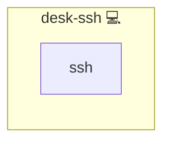

# SSH Agent

## Description

[SSH (Secure Shell)](https://en.wikipedia.org/wiki/Secure_Shell) is a cryptographic network protocol for operating network services securely over an unsecured network. The [OpenSSH](https://www.openssh.com/) project provides the reference implementation, including `ssh-agent` for managing authentication keys.

## Overview

This role is intended for Manjaro/Arch systems where `gnome-keyring` no longer reliably manages `ssh-agent` due to changes in behavior under Wayland. It works by deploying a `systemd --user` service, making SSH Agent integration predictable and independent of graphical environment quirks.

## Cosmos

The diagram places SSH Agent in the Infinito.Nexus cosmos: the components it deploys (capabilities), the central services it consumes (dependencies), and its outward reach (federation and bridged external networks).



Solid `1:1` edges are fixed relationships; dashed `0..1` edges are conditional (enabled only in matching deployments). Node markers show the role's deploy modes (💻 host, 🐳 compose, 🐝 swarm); ❌ marks a service that is explicitly turned off.

## Purpose

The purpose of this role is to automate the provisioning of SSH agent capabilities and synchronize the `.ssh` directory from a Git repository. This enables users to access private repositories or authenticate with remote servers immediately after login.

## Features

- **Clones a remote SSH config repository** into `~/.ssh` using the `desk-git` role.
- **Deploys and enables a systemd user service** for `ssh-agent`.
- **Ensures environment compatibility** by injecting the `SSH_AUTH_SOCK` variable into either `.bash_profile` or `.profile`.
- **Fails gracefully** with an optional debug message if the Git repository is unreachable.
- **KeePassXC ready**: Ensures compatibility with password managers that support SSH agent integration.

## Quick Setup

### Development

Clone, set up the workstation, and deploy SSH Agent onto the local stack:

```bash
git clone https://github.com/infinito-nexus/core.git
cd core
make onboard
make compose-deploy mode=reinstall apps=desk-ssh full_cycle=false
```

### Production

Run the published image to provision the inventory and deploy SSH Agent to a managed server (the mounted volume persists the inventory between the two runs):

```bash
docker run --rm -it \
  -v "$PWD/inventories:/etc/infinito.nexus/inventories" \
  ghcr.io/infinito-nexus/core/debian \
  infinito administration inventory provision /etc/infinito.nexus/inventories/prod \
  --inventory-file /etc/infinito.nexus/inventories/prod/devices.yml \
  --host <your-server> \
  --vars-file inventories/<env>/default.yml \
  --include 'desk-ssh'

docker run --rm -it \
  -v "$PWD/inventories:/etc/infinito.nexus/inventories" \
  ghcr.io/infinito-nexus/core/debian \
  infinito administration deploy dedicated /etc/infinito.nexus/inventories/prod/devices.yml \
  --password-file /etc/infinito.nexus/inventories/prod/.password \
  --id desk-ssh \
  --diff \
  -vv
```

## Credits

Implemented by **[Kevin Veen-Birkenbach](https://www.veen.world)**.
Part of the [Infinito.Nexus Project](https://s.infinito.nexus/code) and maintained by [Kevin Veen-Birkenbach](https://www.veen.world).
Licensed under the [Infinito.Nexus Community License (Non-Commercial)](https://s.infinito.nexus/license).
