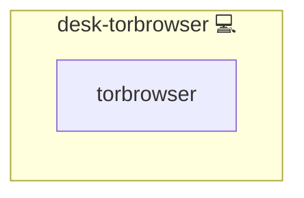

# Torbrowser

## Description

This Ansible role installs and configures the Tor service and the Tor Browser Launcher, providing a privacy-focused web browsing environment on Pacman-based Linux distributions.

## Overview

The `desk-torbrowser` role uses the `community.general.pacman` module to:

1. Install **tor** (the core Tor network service)  
2. Install **torbrowser-launcher** (the launcher for Tor Browser)  

## Cosmos

The diagram places Torbrowser in the Infinito.Nexus cosmos: the components it deploys (capabilities), the central services it consumes (dependencies), and its outward reach (federation and bridged external networks).



Solid `1:1` edges are fixed relationships; dashed `0..1` edges are conditional (enabled only in matching deployments). Node markers show the role's deploy modes (💻 host, 🐳 compose, 🐝 swarm); ❌ marks a service that is explicitly turned off, and ⚙️ an Ansible role dependency declared in `meta/main.yml`.

## Features

* Idempotent installation of Tor and Tor Browser Launcher  
* Ensures the Tor service is available for anonymous network traffic  
* Simplifies first-time setup of Tor Browser  

## Quick Setup

### Development

Clone, set up the workstation, and deploy Torbrowser onto the local stack:

```bash
git clone https://github.com/infinito-nexus/core.git
cd core
make onboard
make compose-deploy mode=reinstall apps=desk-torbrowser full_cycle=false
```

### Production

Run the published image to provision the inventory and deploy Torbrowser to a managed server (the mounted volume persists the inventory):

```bash
APP=desk-torbrowser
HOST=<your-server>

docker run --rm -it \
  -v "$PWD/inventories:/etc/infinito.nexus/inventories" \
  -e APP="$APP" -e HOST="$HOST" \
  ghcr.io/infinito-nexus/core/debian bash -c '
    INVENTORY=/etc/infinito.nexus/inventories/prod
    infinito administration inventory provision "$INVENTORY" \
      --inventory-file "$INVENTORY/devices.yml" \
      --host "$HOST" \
      --include "$APP" &&
    infinito administration deploy dedicated "$INVENTORY/devices.yml" \
      --password-file "$INVENTORY/.password" \
      --diff -vv'
```

## Further Resources

* [Tor Project documentation](https://www.torproject.org/)
* [Infinito.Nexus GitHub repository](https://s.infinito.nexus/code)

## Credits

Implemented by **[Kevin Veen-Birkenbach](https://www.veen.world)**.
Part of the [Infinito.Nexus Project](https://s.infinito.nexus/code) and maintained by [Kevin Veen-Birkenbach](https://www.veen.world).
Licensed under the [Infinito.Nexus Community License (Non-Commercial)](https://s.infinito.nexus/license).
