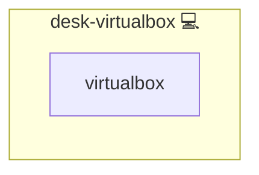

# Virtual Box

## Description

```bash
 sudo pacman -S virtualbox "$(pacman -Qsq "^linux" | grep "^linux[0-9]*[-rt]*$" | awk '{print $1"-virtualbox-host-modules"}' ORS=' ')" &&
 sudo vboxreload &&
 pamac build virtualbox-ext-oracle &&
 sudo gpasswd -a "$USER" vboxusers || exit 1
 echo "Keep in mind to install the guest additions in the virtualized system. See https://wiki.manjaro.org/index.php?title=VirtualBox" # nocheck: url; wiki.manjaro.org returns 404 transiently, the page is reachable interactively
```

## Overview

This role installs and configures VirtualBox and its kernel modules on Pacman-based systems, including extension packs and user group setup.

## Cosmos

The diagram places Virtual Box in the Infinito.Nexus cosmos: the components it deploys (capabilities), the central services it consumes (dependencies), and its outward reach (federation and bridged external networks).



Solid `1:1` edges are fixed relationships; dashed `0..1` edges are conditional (enabled only in matching deployments). Node markers show the role's deploy modes (💻 host, 🐳 compose, 🐝 swarm); ❌ marks a service that is explicitly turned off.

## Features

- **Automated provisioning:** Configured by Ansible without manual steps.

## Quick Setup

### Development

Clone, set up the workstation, and deploy Virtual Box onto the local stack:

```bash
git clone https://github.com/infinito-nexus/core.git
cd core
make onboard
make compose-deploy mode=reinstall apps=desk-virtualbox full_cycle=false
```

### Production

Run the published image to provision the inventory and deploy Virtual Box to a managed server (the mounted volume persists the inventory between the two runs):

```bash
docker run --rm -it \
  -v "$PWD/inventories:/etc/infinito.nexus/inventories" \
  ghcr.io/infinito-nexus/core/debian \
  infinito administration inventory provision /etc/infinito.nexus/inventories/prod \
  --inventory-file /etc/infinito.nexus/inventories/prod/devices.yml \
  --host <your-server> \
  --vars-file inventories/<env>/default.yml \
  --include 'desk-virtualbox'

docker run --rm -it \
  -v "$PWD/inventories:/etc/infinito.nexus/inventories" \
  ghcr.io/infinito-nexus/core/debian \
  infinito administration deploy dedicated /etc/infinito.nexus/inventories/prod/devices.yml \
  --password-file /etc/infinito.nexus/inventories/prod/.password \
  --id desk-virtualbox \
  --diff \
  -vv
```

## Credits

Implemented by **[Kevin Veen-Birkenbach](https://www.veen.world)**.
Part of the [Infinito.Nexus Project](https://s.infinito.nexus/code) and maintained by [Kevin Veen-Birkenbach](https://www.veen.world).
Licensed under the [Infinito.Nexus Community License (Non-Commercial)](https://s.infinito.nexus/license).
