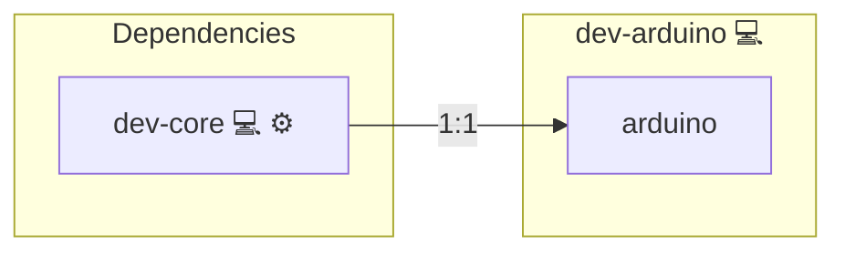

# Arduino Development Utilities

## Description

This Ansible role installs everything needed for Arduino development on Arch Linux. It includes the official Arduino IDE, documentation, and user group configurations to enable serial port access for uploading code to boards.

Learn more at the [Arduino Project Website](https://www.arduino.cc/), [Arch Wiki - Arduino](https://wiki.archlinux.org/title/Arduino), and on [Wikipedia](https://en.wikipedia.org/wiki/Arduino).

## Overview

Building upon the general developer persona, this role focuses on embedded and microcontroller development. It ensures that the system has the correct packages and permissions to work with Arduino boards via USB.

## Cosmos

The diagram places Arduino Development Utilities in the Infinito.Nexus cosmos: the components it deploys (capabilities), the central services it consumes (dependencies), and its outward reach (federation and bridged external networks).

Solid `1:1` edges are fixed relationships; dashed `0..1` edges are conditional (enabled only in matching deployments). Node markers show the role's deploy modes (💻 host, 🐳 compose, 🐝 swarm); ❌ marks a service that is explicitly turned off, and ⚙️ an Ansible role dependency declared in `meta/main.yml`.

## Purpose

The role enables a ready-to-use Arduino development setup by installing necessary tools and configuring user permissions for serial access.

## Features

- **Installs Arduino IDE & Docs:** Provides GUI and offline references.
- **User Group Configuration:** Adds the developer to `uucp` and `lock` groups for serial communication.
- **Persona Integration:** Extends `dev-core` with embedded-specific tools.

## Credits

Implemented by **[Kevin Veen-Birkenbach](https://www.veen.world)**.
Part of the [Infinito.Nexus Project](https://s.infinito.nexus/code) and maintained by [Kevin Veen-Birkenbach](https://www.veen.world).
Licensed under the [Infinito.Nexus Community License (Non-Commercial)](https://s.infinito.nexus/license).
