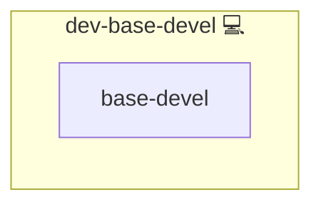

# Base Development Toolchain

## Description

Base development toolchains provide the core build tools (compilers, linkers, make, etc.) required to compile software from source. Common examples include `base-devel` on Arch Linux, `build-essential` on Debian/Ubuntu, and `@development-tools` on Fedora/CentOS.

## Overview

This role installs distro-specific equivalents of core build tooling so systems are ready for compiling software from source. After deploying this role, all common build dependencies are available on the system.

## Cosmos

The diagram places Base Development Toolchain in the Infinito.Nexus cosmos: the components it deploys (capabilities), the central services it consumes (dependencies), and its outward reach (federation and bridged external networks).

Solid `1:1` edges are fixed relationships; dashed `0..1` edges are conditional (enabled only in matching deployments). Node markers show the role's deploy modes (💻 host, 🐳 compose, 🐝 swarm); ❌ marks a service that is explicitly turned off, and ⚙️ an Ansible role dependency declared in `meta/main.yml`.

## Features

- Installs distro-specific base development packages:
  - Archlinux: `base-devel`
  - Debian/Ubuntu: `build-essential`
  - Fedora/CentOS: `@development-tools`
- Ensures your system is ready for software compilation and development

## Further Resources

- [Arch Linux: base-devel package](https://archlinux.org/packages/core/any/base-devel/)
- [Debian package: build-essential](https://packages.debian.org/stable/build-essential)
- [DNF groups: development-tools](https://dnf.readthedocs.io/en/latest/command_ref.html#group-command)

## Credits

Implemented by **[Kevin Veen-Birkenbach](https://www.veen.world)**.
Part of the [Infinito.Nexus Project](https://s.infinito.nexus/code) and maintained by [Kevin Veen-Birkenbach](https://www.veen.world).
Licensed under the [Infinito.Nexus Community License (Non-Commercial)](https://s.infinito.nexus/license).
