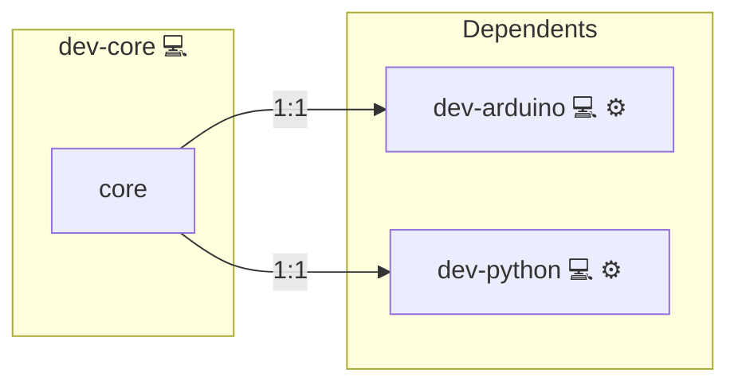

# Development Utilities

## Description

[Visual Studio Code](https://code.visualstudio.com/) is a powerful source code editor with a wide plugin ecosystem, supporting development workflows across many languages and platforms. See also the [Arch Wiki - Development Tools](https://wiki.archlinux.org/title/Category:Development) and general [Software Engineering](https://en.wikipedia.org/wiki/Software_engineering) on Wikipedia.

## Overview

This role builds upon core workstation and package management components to deliver a clean, editor-ready base for developers. It installs core tools and editors necessary to begin building, editing, and managing source code projects.

## Cosmos

The diagram places Development Utilities in the Infinito.Nexus cosmos: the components it deploys (capabilities), the central services it consumes (dependencies), and its outward reach (federation and bridged external networks).

Solid `1:1` edges are fixed relationships; dashed `0..1` edges are conditional (enabled only in matching deployments). Node markers show the role's deploy modes (💻 host, 🐳 compose, 🐝 swarm); ❌ marks a service that is explicitly turned off, and ⚙️ an Ansible role dependency declared in `meta/main.yml`.

## Purpose

To reduce setup time and ensure consistency across developer workstations, this role prepares a functional and extensible foundation for software engineering work.

## Features

- **Installs Visual Studio Code:** A powerful code editor with a wide plugin ecosystem.
- **Extensible Design:** Acts as a base layer for more specific development stacks (e.g., web, Python, embedded).
- **Persona Integration:** Serves as a reusable foundation for developer-focused workstation bundles.

## Credits

Implemented by **[Kevin Veen-Birkenbach](https://www.veen.world)**.
Part of the [Infinito.Nexus Project](https://s.infinito.nexus/code) and maintained by [Kevin Veen-Birkenbach](https://www.veen.world).
Licensed under the [Infinito.Nexus Community License (Non-Commercial)](https://s.infinito.nexus/license).
