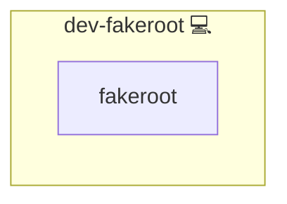

# Fakeroot

## Description

This Ansible role installs **fakeroot** for the current Linux distribution. Fakeroot enables non-privileged users to simulate root-level file manipulations, making it ideal for building packages or performing file operations that normally require root permissions.

Learn more about fakeroot on the [Debian Wiki](https://wiki.debian.org/FakeRoot) and [fakeroot on Debian](https://packages.debian.org/stable/fakeroot).

## Overview

This role automates the installation of fakeroot via the OS package manager, ensuring that users can simulate superuser operations without requiring elevated privileges.

## Cosmos

The diagram places Fakeroot in the Infinito.Nexus cosmos: the components it deploys (capabilities), the central services it consumes (dependencies), and its outward reach (federation and bridged external networks).

Solid `1:1` edges are fixed relationships; dashed `0..1` edges are conditional (enabled only in matching deployments). Node markers show the role's deploy modes (💻 host, 🐳 compose, 🐝 swarm); ❌ marks a service that is explicitly turned off, and ⚙️ an Ansible role dependency declared in `meta/main.yml`.

## Purpose

The purpose of this role is to automate the installation of fakeroot so that users can simulate superuser operations without requiring elevated privileges. This is particularly useful in development environments and during package building processes.

## Features

- **Automated Installation:** Installs fakeroot via the OS package manager.
- **Idempotent Execution:** Ensures that fakeroot is installed and remains up to date.
- **Simplified Setup:** Minimizes manual installation steps for environments where fakeroot is required.

## Credits

Implemented by **[Kevin Veen-Birkenbach](https://www.veen.world)**.
Part of the [Infinito.Nexus Project](https://s.infinito.nexus/code) and maintained by [Kevin Veen-Birkenbach](https://www.veen.world).
Licensed under the [Infinito.Nexus Community License (Non-Commercial)](https://s.infinito.nexus/license).
