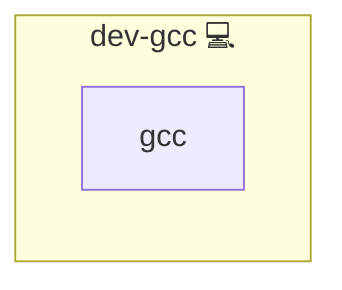

# GCC

## Description

This Ansible role installs the GNU Compiler Collection (GCC) on Arch Linux systems. GCC is a standard compiler suite supporting C, C++, and other programming languages. It is a core component for compiling and building software from source.

Learn more about GCC on [Wikipedia](https://en.wikipedia.org/wiki/GNU_Compiler_Collection), the [official GCC homepage](https://gcc.gnu.org/), and the [Arch Linux Wiki](https://wiki.archlinux.org/title/GCC).

## Overview

Tailored for Arch Linux, this role installs GCC and optionally sets up additional development utilities. It ensures the package is installed via the system package manager and ready to compile code in a variety of programming languages.

## Cosmos

The diagram places GCC in the Infinito.Nexus cosmos: the components it deploys (capabilities), the central services it consumes (dependencies), and its outward reach (federation and bridged external networks).

Solid `1:1` edges are fixed relationships; dashed `0..1` edges are conditional (enabled only in matching deployments). Node markers show the role's deploy modes (💻 host, 🐳 compose, 🐝 swarm); ❌ marks a service that is explicitly turned off, and ⚙️ an Ansible role dependency declared in `meta/main.yml`.

## Purpose

The purpose of this role is to automate the provisioning of a development-ready environment by ensuring the GCC toolchain is properly installed and available.

## Features

- **Installs GCC:** Uses `pacman` to install the `gcc` package.
- **Minimal Setup:** No unnecessary dependencies are installed.
- **Reusable Role:** Can be used as a foundational component for software development, CI/CD pipelines, and build environments.

## Credits

Implemented by **[Kevin Veen-Birkenbach](https://www.veen.world)**.
Part of the [Infinito.Nexus Project](https://s.infinito.nexus/code) and maintained by [Kevin Veen-Birkenbach](https://www.veen.world).
Licensed under the [Infinito.Nexus Community License (Non-Commercial)](https://s.infinito.nexus/license).
