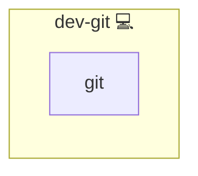

# Git

## Description

This Ansible role installs Git on the target system using the Pacman package manager. It ensures that Git is installed only once, even when the role is applied to multiple hosts or executed in a multi-task scenario.

## Overview

Designed for Arch Linux systems, this role leverages the `pacman` module to install Git. It uses a fact (`run_once_dev_git`) to control task execution, ensuring that the Git installation is performed only once per run.

## Cosmos

The diagram places Git in the Infinito.Nexus cosmos: the components it deploys (capabilities), the central services it consumes (dependencies), and its outward reach (federation and bridged external networks).

Solid `1:1` edges are fixed relationships; dashed `0..1` edges are conditional (enabled only in matching deployments). Node markers show the role's deploy modes (💻 host, 🐳 compose, 🐝 swarm); ❌ marks a service that is explicitly turned off, and ⚙️ an Ansible role dependency declared in `meta/main.yml`.

## Purpose

The purpose of this role is to automate the installation of Git in a consistent and idempotent manner. It is especially useful in environments where Git is a prerequisite for further automation or development tasks.

## Features

- **Git Installation:** Uses the Pacman package manager to install Git.
- **Idempotent Execution:** Sets a fact to guarantee that the installation tasks are executed only once.
- **Optimized Deployment:** Suitable for use in multi-host environments to avoid redundant installations.

## Credits

Implemented by **[Kevin Veen-Birkenbach](https://www.veen.world)**.
Part of the [Infinito.Nexus Project](https://s.infinito.nexus/code) and maintained by [Kevin Veen-Birkenbach](https://www.veen.world).
Licensed under the [Infinito.Nexus Community License (Non-Commercial)](https://s.infinito.nexus/license).
