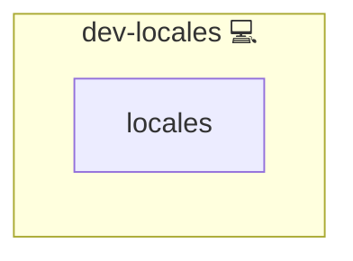

# Locales

This Ansible role manages the system locale configuration by deploying `locale.gen` and `locale.conf`, then generating the requested locales.

## Description

- Copies your `locale.gen` template to `/etc/locale.gen`  
- Copies your `locale.conf` template to `/etc/locale.conf`  
- Runs `locale-gen` to generate and activate configured locales  

## Overview

1. **Template deployment**  
   - `locale.gen`: uncomment or specify the locales you need  
   - `locale.conf`: sets `LANG` and `LANGUAGE` environment variables  
2. **Locale generation**  
   - Executes the `locale-gen` command (requires privilege escalation)  
3. **Idempotency**  
   - Templates are only reapplied if changed  
   - `locale-gen` only re-runs when the template changes

## Cosmos

The diagram places Locales in the Infinito.Nexus cosmos: the components it deploys (capabilities), the central services it consumes (dependencies), and its outward reach (federation and bridged external networks).

Solid `1:1` edges are fixed relationships; dashed `0..1` edges are conditional (enabled only in matching deployments). Node markers show the role's deploy modes (💻 host, 🐳 compose, 🐝 swarm); ❌ marks a service that is explicitly turned off, and ⚙️ an Ansible role dependency declared in `meta/main.yml`.

## Features

- Full control over uncommented locales in `locale.gen`
- Simple override via templates in your role directory
- Works on any system supporting `locale-gen`

## Credits

Implemented by **[Kevin Veen-Birkenbach](https://www.veen.world)**.
Part of the [Infinito.Nexus Project](https://s.infinito.nexus/code) and maintained by [Kevin Veen-Birkenbach](https://www.veen.world).
Licensed under the [Infinito.Nexus Community License (Non-Commercial)](https://s.infinito.nexus/license).
