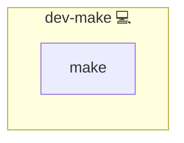

# Make Installation

## Description

This Ansible role installs GNU Make on Arch Linux systems using the Pacman package manager. GNU Make is a build automation tool that automatically builds executable programs and libraries from source code by reading files called Makefiles.

Learn more about GNU Make on the [GNU Make Homepage](https://www.gnu.org/software/make/).

## Overview

This role ensures that GNU Make is installed on the target system. It is intended for environments where automated build processes or custom software compilation are required.

## Cosmos

The diagram places Make Installation in the Infinito.Nexus cosmos: the components it deploys (capabilities), the central services it consumes (dependencies), and its outward reach (federation and bridged external networks).

Solid `1:1` edges are fixed relationships; dashed `0..1` edges are conditional (enabled only in matching deployments). Node markers show the role's deploy modes (💻 host, 🐳 compose, 🐝 swarm); ❌ marks a service that is explicitly turned off, and ⚙️ an Ansible role dependency declared in `meta/main.yml`.

## Purpose

The purpose of this role is to provide an automated, idempotent installation of GNU Make, ensuring that the tool is available system-wide for building software. It is ideal for developers and system administrators who require a reliable build system.

## Features

- **Installs GNU Make:** Uses Pacman to install the `make` package.
- **Idempotent Execution:** Ensures that Make is installed only once.
- **System-Wide Availability:** Makes GNU Make available for all users on the system.

## Credits

Implemented by **[Kevin Veen-Birkenbach](https://www.veen.world)**.
Part of the [Infinito.Nexus Project](https://s.infinito.nexus/code) and maintained by [Kevin Veen-Birkenbach](https://www.veen.world).
Licensed under the [Infinito.Nexus Community License (Non-Commercial)](https://s.infinito.nexus/license).
