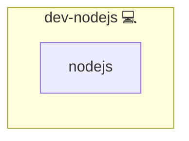

# Node.js

## Description

This Ansible role installs Node.js on the target system using the native package manager.

## Overview

Optimized for Archlinux and Debian-based systems, this role ensures the presence of Node.js for use in Node-based applications or scripts. It serves as a foundational role for projects that depend on Node.js runtimes or utilities like Puppeteer.

## Cosmos

The diagram places Node.js in the Infinito.Nexus cosmos: the components it deploys (capabilities), the central services it consumes (dependencies), and its outward reach (federation and bridged external networks).

Solid `1:1` edges are fixed relationships; dashed `0..1` edges are conditional (enabled only in matching deployments). Node markers show the role's deploy modes (💻 host, 🐳 compose, 🐝 swarm); ❌ marks a service that is explicitly turned off, and ⚙️ an Ansible role dependency declared in `meta/main.yml`.

## Features

- **Node.js Installation:** Installs the latest Node.js version available via the system's package manager.
- **Idempotent Execution:** Ensures Node.js is only installed when missing.

## License

Infinito.Nexus Community License (Non-Commercial)
[https://s.infinito.nexus/license](https://s.infinito.nexus/license)

## Credits

Implemented by **[Kevin Veen-Birkenbach](https://www.veen.world)**.
Part of the [Infinito.Nexus Project](https://s.infinito.nexus/code) and maintained by [Kevin Veen-Birkenbach](https://www.veen.world).
Licensed under the [Infinito.Nexus Community License (Non-Commercial)](https://s.infinito.nexus/license).
