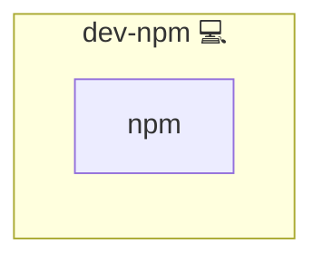

# npm

## Description

This Ansible role installs npm and optionally runs `npm ci` within a given project directory. It is intended to streamline dependency installation for Node.js applications.

## Overview

Designed for use in Node-based projects, this role installs npm and can execute a clean install (`npm ci`) to ensure consistent dependency trees.

## Cosmos

The diagram places npm in the Infinito.Nexus cosmos: the components it deploys (capabilities), the central services it consumes (dependencies), and its outward reach (federation and bridged external networks).



Solid `1:1` edges are fixed relationships; dashed `0..1` edges are conditional (enabled only in matching deployments). Node markers show the role's deploy modes (💻 host, 🐳 compose, 🐝 swarm); ❌ marks a service that is explicitly turned off, and ⚙️ an Ansible role dependency declared in `meta/main.yml`.

## Features

- **npm Installation:** Ensures the `npm` package manager is installed.
- **Optional Project Setup:** Runs `npm ci` in a specified folder to install exact versions from `package-lock.json`.
- **Idempotent:** Skips `npm ci` if no folder is configured.

## Configuration

Set `npm_project_folder` to a directory containing `package.json` and `package-lock.json`:

```yaml
vars:
  npm_project_folder: /opt/scripts/my-node-project/
```

## License

Infinito.Nexus Community License (Non-Commercial)
[https://s.infinito.nexus/license](https://s.infinito.nexus/license)

## Credits

Implemented by **[Kevin Veen-Birkenbach](https://www.veen.world)**.
Part of the [Infinito.Nexus Project](https://s.infinito.nexus/code) and maintained by [Kevin Veen-Birkenbach](https://www.veen.world).
Licensed under the [Infinito.Nexus Community License (Non-Commercial)](https://s.infinito.nexus/license).
