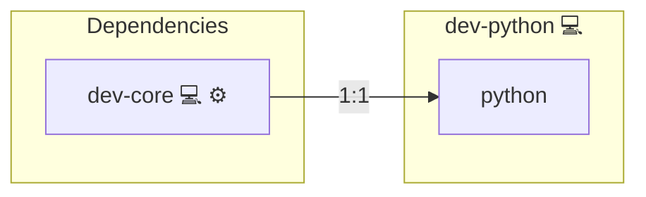

# Python Development Utilities

## Description

This Ansible role sets up a Python development environment on Arch Linux. It includes Python itself, the `pip` package manager, and builds on the general developer persona to support scripting, application development, data science, and more.

Learn more at the [Python Official Site](https://www.python.org/), the [Arch Wiki - Python](https://wiki.archlinux.org/title/Python), and [Wikipedia – Python](https://en.wikipedia.org/wiki/Python_(programming_language)).

## Overview

This role provides the essential tooling for Python developers, enabling immediate use of `python` and `pip` from the command line. It supports both general-purpose scripting and advanced software engineering workflows.

## Cosmos

The diagram places Python Development Utilities in the Infinito.Nexus cosmos: the components it deploys (capabilities), the central services it consumes (dependencies), and its outward reach (federation and bridged external networks).

Solid `1:1` edges are fixed relationships; dashed `0..1` edges are conditional (enabled only in matching deployments). Node markers show the role's deploy modes (💻 host, 🐳 compose, 🐝 swarm); ❌ marks a service that is explicitly turned off, and ⚙️ an Ansible role dependency declared in `meta/main.yml`.

## Purpose

To simplify and standardize the provisioning of Python-ready environments for developers, students, data scientists, and automation engineers.

## Features

- **Installs Python and Pip:** Ensures the interpreter and package manager are available.
- **Prefers Python 3.11+:** Installs Python 3.11+ where available and makes it the default via `/usr/local/bin/python3` and `/usr/local/bin/pip3`.
- **Persona Integration:** Extends `dev-core` with Python-specific tools.
- **Foundation for Further Stacks:** Ideal starting point for Flask, Django, scientific computing, and automation.

Supported distro families in the installer script:

- Arch Linux
- Debian
- Ubuntu
- Fedora
- CentOS / RHEL

## Customization

Easily extend this role with:

- Python virtualenv tools (`python-virtualenv`, `pyenv`)
- Popular libraries (`numpy`, `requests`, `flask`)
- Framework-specific roles (e.g., `dev-python-django`)

## Credits

Implemented by **[Kevin Veen-Birkenbach](https://www.veen.world)**.
Part of the [Infinito.Nexus Project](https://s.infinito.nexus/code) and maintained by [Kevin Veen-Birkenbach](https://www.veen.world).
Licensed under the [Infinito.Nexus Community License (Non-Commercial)](https://s.infinito.nexus/license).
